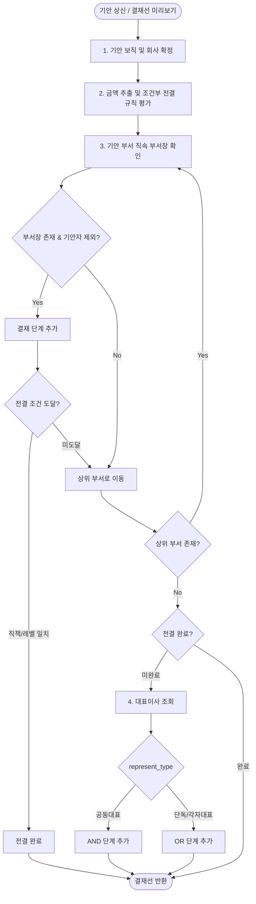

# 전자결재 시스템 (Electronic Approval System) — 구현 현황 및 개선 로드맵

> 최초 작성: 2026-08-18
> **최종 업데이트: 2026-08-21 (17종 전용 폼 완성 + STATIC 단일 아키텍처 리팩토링 + Flutter 앱 기안 기능)**
> 작성자: Antigravity AI

---

## 1. 현재 구현 현황

### 1-1. 백엔드 (`app/django/approval/` 및 `company/`)

| 파일 | 상태 | 비고 |
|------|------|------|
| `approval/models/document_type.py` | ✅ 완료 | `DocCategory`, `ApprovalPolicyRule`, ~~`form_type`~~, `form_template_key` **단일 키 통합** |
| `company/models.py` | ✅ 완료 | `StaffAssignment` (보직/겸직/대표권), `Department.save()` 자동 레벨 계산 |
| `approval/models/document.py` | ✅ 완료 | `drafter_assignment` (기안 보직 연결), `doc_number` null 허용 |
| `approval/services/route_builder.py` | ✅ 완료 | **조직도 기반 동적 결재선 + 금액별 조건부 전결 규칙 평가 엔진** |
| `approval/admin.py` | ✅ 완료 | `DocCategoryAdmin`, `ApprovalPolicyRuleInline`, ~~`form_type`~~ 제거 완료 |
| `approval/tasks.py` | ✅ 완료 | Celery: FCM 푸시 알림, WeasyPrint PDF 생성 |
| `approval/templates/approval/pdf_document.html` | ✅ 완료 | PDF 출력용 HTML 양식 |
| `approval/fixtures/approval_document_types.json` | ✅ 완료 | **17종 문서 유형 `form_template_key` 기반 시드 데이터 정비** |
| `apiV1/serializers/company.py` (`StaffAssignmentSerializer`) | ✅ 완료 | **`id`, `company_name`, `position_name` 필드 명시 추가 (Flutter 연동 호환성 수정)** |
| `apiV1/serializers/approval.py` | ✅ 완료 | `DocumentTypeSerializer`에서 ~~`form_type`~~, ~~`form_schema`~~ 제거 |

### 1-2. API 엔드포인트

| Method | Endpoint | 기능 |
|--------|----------|------|
| `GET` | `/api/v1/approval-doc-category/` | 결재 카테고리 목록 |
| `GET` | `/api/v1/approval-doc-type/` | 활성 문서 유형 목록 |
| `GET` | `/api/v1/approval-doc-type/for_draft/` | 기안 가능한 문서 유형만 필터링 |
| `GET/POST` | `/api/v1/approval-document/` | 문서 목록 / 임시저장 기안 생성 |
| `GET/PATCH/DELETE` | `/api/v1/approval-document/{id}/` | 문서 상세/수정/삭제 |
| `GET` | `/api/v1/approval-document/my_assignments/` | 기안자의 주보직/겸직 목록 |
| `GET` | `/api/v1/approval-document/preview_route/` | 실시간 결재선 미리보기 |
| `POST` | `/api/v1/approval-document/{id}/submit/` | 상신 (동적 결재선 자동 생성) |
| `POST` | `/api/v1/approval-document/{id}/act/` | 승인 / 반려 / 의견 |
| `POST` | `/api/v1/approval-document/{id}/cancel/` | 기안 취소 |
| `GET` | `/api/v1/approval-document/my_pending/` | 내 결재 대기함 |
| `GET` | `/api/v1/approval-document/my_drafted/` | 내 기안함 |
| `GET` | `/api/v1/approval-document/my_approved/` | 내 결재 문서함 |

### 1-3. 프론트엔드 웹 (`app/vue/src/`)

| 파일 | 상태 | 비고 |
|------|------|------|
| `store/types/approval.ts` | ✅ 완료 | ~~`form_type`~~, ~~`form_schema`~~ 제거 → `form_template_key` 단일화 |
| `views/approval/forms/index.ts` | ✅ 완료 | **`STATIC_FORM_REGISTRY` 17종 전체 등록 완료** |
| `views/approval/forms/GeneralProposalForm.vue` | ✅ 완료 | 일반품의 |
| `views/approval/forms/OfficialLetterForm.vue` | ✅ 완료 | 공문 발신 |
| `views/approval/forms/LeaveApplicationForm.vue` | ✅ 완료 | 휴가/연차 신청 |
| `views/approval/forms/BusinessTripForm.vue` | ✅ 완료 | 출장 신청 |
| `views/approval/forms/OvertimeWorkForm.vue` | ✅ 완료 | 연장/휴일근무 신청 |
| `views/approval/forms/HrAppointmentForm.vue` | ✅ 완료 | 인사발령 |
| `views/approval/forms/HrRequestForm.vue` | ✅ 완료 | 인사 관련 신청 |
| `views/approval/forms/PurchaseOrderForm.vue` | ✅ 완료 | 구매품의 (품목/수량/단가/세액 자동계산) |
| `views/approval/forms/ExpenseReportForm.vue` | ✅ 완료 | 지출결의 (지출내역 그리드, 계좌정보) |
| `views/approval/forms/ExpenseSettlementForm.vue` | ✅ 완료 | 경비 정산 |
| `views/approval/forms/AdvancePaymentForm.vue` | ✅ 완료 | 선급금/가지급금 신청 |
| `views/approval/forms/ContractProposalForm.vue` | ✅ 완료 | 계약품의 |
| `views/approval/forms/ContractChangeForm.vue` | ✅ 완료 | 계약 변경/해지 |
| `views/approval/forms/LegalReviewForm.vue` | ✅ 완료 | 법무 검토 |
| `views/approval/forms/BusinessReviewForm.vue` | ✅ 완료 | 사업검토 (수지분석, 사업성 KPI) |
| `views/approval/forms/BusinessApprovalForm.vue` | ✅ 완료 | 사업추진 승인 (예산집행, 의결사항) |
| `views/approval/forms/ProjectDecisionForm.vue` | ✅ 완료 | 프로젝트 주요 의사결정 (대안 비교표) |
| ~~`views/approval/forms/DynamicSchemaForm.vue`~~ | 🗑️ 레거시 | STATIC 단일 아키텍처 전환 후 미사용 |
| `views/approval/components/DocumentForm.vue` | ✅ 완료 | **DYNAMIC 분기 제거 → STATIC_FORM_REGISTRY 직접 매칭으로 단순화** |
| `views/approval/components/DocumentDetail.vue` | ✅ 완료 | **DYNAMIC schema 블록 제거, 17종 맞춤 상세 뷰 완성** |
| `views/approval/components/PendingList.vue` | ✅ 완료 | 결재 대기함 |
| `views/approval/components/DraftedList.vue` | ✅ 완료 | 기안함 |
| `views/approval/components/ApprovedList.vue` | ✅ 완료 | 결재 문서함 (PDF 다운로드) |

### 1-4. 모바일 앱 (`app/flutter/lib/features/approval/`)

| 파일 | 상태 | 비고 |
|------|------|------|
| `data/models/approval_model.dart` | ✅ 완료 | **`@JsonKey(readValue: ...)` 헬퍼로 `pk`/`id`, `company`(String/int 혼용) 방어 역직렬화** |
| `data/models/approval_model.freezed.dart` | ✅ 완료 | build_runner 코드 생성 완료 |
| `data/models/approval_model.g.dart` | ✅ 완료 | build_runner 코드 생성 완료 |
| `data/approval_repository.dart` | ✅ 완료 | **모든 list 응답 파싱에 `(res.data is List) ? ... : res.data['results']` 방어 처리** |
| `providers/approval_providers.dart` | ✅ 완료 | `myAssignmentsProvider`, `forDraftDocTypesProvider` 연동 |
| `presentation/approval_main_screen.dart` | ✅ 완료 | **TabBar `labelColor` → `accentApproval` (다크모드 가시성 개선)** |
| `presentation/approval_draft_screen.dart` | ✅ 완료 | **17종 전 양식 기안 폼 + 결재선 실시간 미리보기** |
| `presentation/approval_detail_screen.dart` | ✅ 완료 | **17종 전 양식 상세 뷰 렌더링** |
| `presentation/widgets/` | ✅ 완료 | doc_card, pdf_helper, route_timeline, action_bottom_sheet |
| `core/theme/app_colors_extension.dart` | ✅ 완료 | **다크모드 `accentApprovalDeep`: `#78350F` → `#FCD34D` (탭 텍스트 가시성)** |
| `core/constants/app_colors.dart` | ✅ 완료 | 동일하게 `accentApprovalDeep` 업데이트 |

---

## 2. STATIC 단일 폼 아키텍처 (리팩토링 완료)

이전의 DYNAMIC/STATIC 하이브리드 구조에서 **`form_template_key` 단일 키 기반 STATIC 전용 폼 아키텍처**로 완전 전환:

```
[DocumentType.form_template_key]
   └── STATIC_FORM_REGISTRY (Vue) / normKey switch (Flutter)
         ├─ GENERAL             일반품의
         ├─ OFFICIAL_LETTER     공문 발신
         ├─ LEAVE               휴가/연차 신청
         ├─ BUSINESS_TRIP       출장 신청
         ├─ OVERTIME            연장/휴일근무 신청
         ├─ HR_APPOINTMENT      인사발령
         ├─ HR_REQUEST          인사 관련 신청
         ├─ PURCHASE            구매품의
         ├─ EXPENSE             지출결의
         ├─ EXPENSE_SETTLEMENT  경비 정산
         ├─ ADVANCE             선급금/가지급금
         ├─ CONTRACT            계약품의
         ├─ CONTRACT_CHANGE     계약 변경/해지
         ├─ LEGAL_REVIEW        법무 검토
         ├─ BUSINESS_REVIEW     사업검토 (수지분석)
         ├─ BUSINESS_APPROVAL   사업추진 승인
         └─ PROJECT_DECISION    프로젝트 주요 의사결정
```

> ⚠️ **마이그레이션 필요**: `form_type`, `form_schema` 컬럼 제거에 대한 DB 마이그레이션을 수동으로 생성/적용해야 합니다.
> ```bash
> python manage.py makemigrations approval
> python manage.py migrate approval
> ```

---

## 3. 자동 결재선 생성 엔진 (Route Builder)

`app/django/approval/services/route_builder.py` — 기안자 보직, 금액, 전결 정책, 임원 정보를 종합하여 실시간으로 최적 결재 단계를 자동 생성합니다.



---

## 4. 전자결재 사용자 조건 및 관리자 운영 체크리스트 (Onboarding & Administration)

전자결재 시스템이 정상 작동하려면 **계정 권한(Workspace) + 인사 정보(Staff) + 조직 보직(StaffAssignment)** 3개 레이어가 유기적으로 연결되어야 합니다. 신규 직원 채용, 인사 발령, 부서 이동 시 관리자는 아래 체크리스트를 준수해야 합니다.

### 4-1. 사용자의 전자결재 이용 3대 필수 조건

```
[계정 (User)] ──① 본사 워크스페이스(type='1') 멤버──▶ [전자결재 메뉴 노출 (auth: isStaff)]
      │
      └──② Staff (직원 정보 등록)
             │
             └──③ StaffAssignment (부서/직책 발령) ──▶ [기안 양식 로드 & 자동 결재선 산출]
```

1. **본사관리 워크스페이스(`type='1'`) 멤버 소속 (`work.Member`)**
   - **효과**: 백엔드 `UserSerializer`가 `is_hq_staff: true`를 반환하고, Vue 사이드바(`_nav.ts`)의 `auth: 'isStaff'` 조건을 통과하여 **`전자 결재 관리` 메뉴(대기함/기안함/문서함)가 화면에 노출**됩니다.
2. **직원 정보 등록 (`company.Staff`)**
   - **효과**: 시스템 계정(`User`)과 실제 인사 정보가 1:1 매핑(`Staff.user = user`)되어 직위(`Position`), 입사일, 재직 상태(`status='1'`)가 바인딩됩니다.
3. **보직/발령 등록 (`company.StaffAssignment`)**
   - **효과**:
     - `DocumentType.for_draft` API에서 소속 부서/직책에 허용된 기안 양식만 필터링되어 제공됩니다.
     - 상신 시 `build_dynamic_approval_route`가 기안자의 부서(`Department`) $\to$ 상위 부서 $\to$ 대표이사로 이어지는 **조직도 결재선을 자동 생성**합니다. *(보직 미등록 시 결재선 0단계 에러로 상신 차단)*

---

### 4-2. 관리자 시나리오별 운영 체크리스트

#### 📌 시나리오 A: 신규 직원 채용 / 온보딩 (New Hire)
- [ ] **Step 1. 계정 생성 및 본사 워크스페이스 멤버 추가**
  - 메뉴: `업무 관리` $\to$ `본사관리 워크스페이스` $\to$ `멤버 관리`
  - 작업: 신규 사용자(`User`)를 멤버로 추가 (전자결재 메뉴 활성화).
- [ ] **Step 2. 직원 인사 정보 등록**
  - 메뉴: `인사 조직 관리` $\to$ `인사 관리` $\to$ `직원 정보`
  - 작업: `Staff` 생성 (사용자 계정 매핑, 직위 `Position`, 입사일 입력).
- [ ] **Step 3. 주보직(StaffAssignment) 발령 등록**
  - 메뉴: `인사 조직 관리` $\to$ `직원 상세` $\to$ `보직 추가`
  - 작업: 소속 부서(`Department`), 직책(`DutyTitle`, 팀원인 경우 빈값/기본값), `is_primary=True` 설정.

#### 📌 시나리오 B: 부서 이동 / 직책 승진 / 겸직 발령 (Transfer & Promotion)
- [ ] **부서장 임명/변경 시 (중요 ⭐️)**
  - 메뉴: `인사 조직 관리` $\to$ `조직 관리` $\to$ `부서 관리`
  - 작업: 해당 부서의 책임자(`Department.manager`) 필드가 신임 부서장으로 지정되어 있는지 확인. *(결재선 추적 엔진이 부서의 `manager`를 1차 결재자로 탐색하므로 필수)*
- [ ] **주보직 부서 이동 시**
  - 작업: 신규 부서 보직을 `is_primary=True`로 저장 (기존 주보직은 자동으로 `is_primary=False` 전환됨).
- [ ] **겸직(다중 부서 소속) 발령 시**
  - 작업: 겸직할 부서 및 직책을 `is_primary=False`로 추가 등록 $\to$ 기안 시 작성자가 기안 보직을 선택 가능.

#### 📌 시나리오 C: 부재 / 출장 / 퇴사 처리 (Absence & Offboarding)
- [ ] **휴가/출장 시 결재 위임 (대결)**
  - 메뉴: `전자 결재 관리` $\to$ `결재 위임 관리` (`ApprovalDelegation`)
  - 작업: 위임 기간(시작일~종료일), 대결자(`delegatee`) 지정 $\to$ 대결자가 원 결재자 대신 결재 승인 가능.
- [ ] **퇴사 처리 시**
  - 작업 1: 퇴사자가 결재 대기 중인 결재선이 있는 경우 대결자 지정 또는 관리자 권한으로 선처리.
  - 작업 2: `Staff.status`를 `4 (퇴직)`으로 변경하고 계정(`User.is_active=False`) 비활성화.

---

## 5. 해결된 버그 및 개선 이력

| # | 유형 | 제목 | 상태 |
|---|------|------|------|
| 1 | 🐛 | `doc_number` UNIQUE constraint 위반 | ✅ |
| 2 | 🐛 | `get_full_name()` AttributeError | ✅ |
| 3 | 🐛 | 신입 직원 기안 시 자동 승인 문제 | ✅ |
| 4 | ✨ | `Department.level` 자동 계산 | ✅ |
| 5 | ✨ | 금액별 조건부 전결 정책 엔진 | ✅ |
| 6 | ✨ | 17종 STATIC 전용 폼 완성 | ✅ |
| 7 | ✨ | 완료 문서함 (ApprovedList) | ✅ |
| 8 | ✨ | 다중 파일 첨부 및 S3 저장 연동 | ✅ |
| 9 | ✨ | 참조자(공람) 지정 및 알림 연동 | ✅ |
| 10 | ✨ | 결재 알림 배지 (사이드바 실시간) | ✅ |
| 11 | ✨ | 웹 SSE 실시간 스트림 알림 엔진 | ✅ |
| 12 | ✨ | `form_type`/`form_schema` 제거, `form_template_key` 단일화 | ✅ |
| 13 | 🐛 | Flutter `type 'Null' is not a subtype of type 'int'` (보직 조회 오류) | ✅ |
| 14 | 🐛 | Flutter 전자결재 탭 활성화 텍스트 다크모드 가시성 | ✅ |
| 15 | ✨ | 워크플로우/권한/대결/채번 백엔드 통합 API 테스트 13종 완성 | ✅ |

---

## 6. 향후 확장 권장 항목 (P2)

- 사용자별 수신 채널(웹/모바일/이메일) On/Off 설정 UI 및 Celery HTML 이메일 알림 연동
- Flutter `approval_draft_screen.dart` `value` → `initialValue` 마이그레이션 (deprecated 경고 제거)
- Flutter `approval_pdf_helper.dart` `Share.shareXFiles` → `SharePlus.instance.share()` 마이그레이션

---

## 7. 관련 파일 위치 참조

```
app/django/
├── approval/
│   ├── models/
│   │   ├── document_type.py           # DocCategory, DocumentType(form_template_key), ApprovalPolicyRule
│   │   └── document.py
│   ├── services/route_builder.py      # 동적 결재선 평가 엔진
│   ├── fixtures/approval_document_types.json  # 17종 시드 데이터
│   └── admin.py
├── apiV1/
│   ├── serializers/
│   │   ├── approval.py                # form_type/form_schema 제거
│   │   └── company.py                 # StaffAssignmentSerializer (id, position_name 추가)
│   └── views/approval.py

app/vue/src/
├── store/types/approval.ts            # form_template_key 단일화
└── views/approval/
    ├── forms/                         # 17종 전용 폼 + index.ts REGISTRY
    └── components/
        ├── DocumentForm.vue           # STATIC_FORM_REGISTRY 직접 매칭
        ├── DocumentDetail.vue         # 17종 맞춤 상세 뷰
        ├── PendingList.vue / DraftedList.vue / ApprovedList.vue

app/flutter/lib/features/approval/
├── data/
│   ├── models/approval_model.dart     # @JsonKey readValue 방어 역직렬화
│   └── approval_repository.dart       # list 파싱 방어 처리
└── presentation/
    ├── approval_main_screen.dart      # TabBar accentApproval (다크모드)
    ├── approval_draft_screen.dart     # 17종 기안 폼
    └── approval_detail_screen.dart    # 17종 상세 뷰

app/flutter/lib/core/
├── constants/app_colors.dart          # accentApprovalDeep: #FCD34D
└── theme/app_colors_extension.dart   # 다크 accentApprovalDeep: #FCD34D
```
