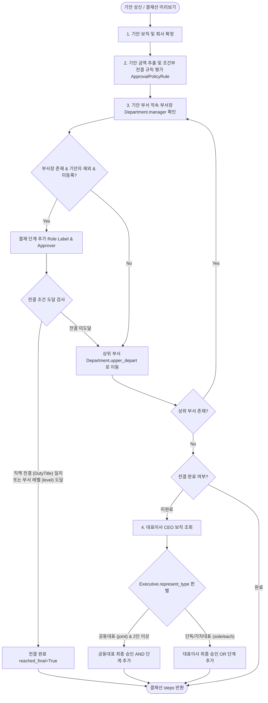

# 전자결재 시스템 (Electronic Approval System) — 구현 현황 및 개선 로드맵

> 최초 작성: 2026-08-18
> **최종 업데이트: 2026-08-20 (DYNAMIC / STATIC 하이브리드 전용 폼 시스템 연동)**
> 작성자: Antigravity AI

---

## 1. 현재 구현 현황

### 1-1. 백엔드 (`app/django/approval/` 및 `company/`)

| 파일 | 상태 | 비고 |
|------|------|------|
| `approval/models/document_type.py` | ✅ 완료 | `DocCategory`, `ApprovalPolicyRule`, `form_type`(`DYNAMIC`/`STATIC`), `form_template_key` 추가 |
| `company/models.py` | ✅ 완료 | `StaffAssignment` (보직/겸직/대표권), `Department.save()` 자동 레벨 계산 |
| `approval/models/document.py` | ✅ 완료 | `drafter_assignment` (기안 보직 연결), `doc_number` null 허용 |
| `approval/services/route_builder.py` | ✅ 완료 | **조직도 기반 동적 결재선 + 금액별 조건부 전결 규칙 평가 엔진** |
| `approval/admin.py` | ✅ 완료 | `DocCategoryAdmin`, `ApprovalPolicyRuleInline`, `form_type` 관리 |
| `approval/tasks.py` | ✅ 완료 | Celery: FCM 푸시 알림, WeasyPrint PDF 생성 |
| `approval/templates/approval/pdf_document.html` | ✅ 완료 | PDF 출력용 HTML 양식 |
| `approval/migrations/0005_...` | ✅ 완료 | `form_type`, `form_template_key` DB 반영 완료 |

### 1-2. API (`app/django/apiV1/`)

| 파일 | 상태 | 비고 |
|------|------|------|
| `serializers/approval.py` | ✅ 완료 | `DocCategorySerializer`, `ApprovalPolicyRuleSerializer`, `form_type`/`form_template_key` 직렬화 |
| `views/approval.py` | ✅ 완료 | `DocCategoryViewSet`, `for_draft` 권한 필터링, `preview_route` 실시간 금액 연동 |

#### API 엔드포인트

| Method | Endpoint | 기능 |
|--------|----------|------|
| `GET` | `/api/v1/approval-doc-category/` | 결재 카테고리 목록 (인사/근태, 회계/자금 등) |
| `GET` | `/api/v1/approval-doc-type/` | 활성 문서 유형 목록 |
| `GET` | `/api/v1/approval-doc-type/for_draft/` | 기안자의 소속 부서/직책에 따라 기안 가능한 문서 유형만 필터링 |
| `GET/POST` | `/api/v1/approval-document/` | 문서 목록 / 임시저장 기안 생성 |
| `GET/PATCH/DELETE` | `/api/v1/approval-document/{id}/` | 문서 상세/수정/삭제 |
| `GET` | `/api/v1/approval-document/my_assignments/` | 기안자의 주보직/겸직 목록 조회 |
| `GET` | `/api/v1/approval-document/preview_route/` | 문서유형/보직/금액(amount) 기준 실시간 결재선 미리보기 |
| `POST` | `/api/v1/approval-document/{id}/submit/` | 상신 (동적 결재선 자동 생성 + 결재 알림) |
| `POST` | `/api/v1/approval-document/{id}/act/` | 승인 / 반려 / 의견 |
| `POST` | `/api/v1/approval-document/{id}/cancel/` | 기안 취소 |
| `GET` | `/api/v1/approval-document/my_pending/` | 내 결재 대기함 |
| `GET` | `/api/v1/approval-document/my_drafted/` | 내 기안함 |
| `GET` | `/api/v1/approval-document/my_approved/` | **내 결재 문서함 (내가 결재에 참여하여 승인 완료된 문서 목록)** |

### 1-3. 프론트엔드 (`app/vue/src/`)

| 파일 | 상태 | 비고 |
|------|------|------|
| `store/types/approval.ts` | ✅ 완료 | `form_type`, `form_template_key` 인터페이스 확장 |
| `views/approval/forms/index.ts` | ✅ 완료 | **`STATIC_FORM_REGISTRY` 컴포넌트 레지스트리** |
| `views/approval/forms/LeaveApplicationForm.vue` | ✅ 완료 | **휴가/연차 전용 폼 (일수 자동계산, 대행자, 비상연락처)** |
| `views/approval/forms/ExpenseReportForm.vue` | ✅ 완료 | **지출결의서 전용 폼 (지출내역 그리드, 금액 자동합산, 계좌정보)** |
| `views/approval/forms/PurchaseOrderForm.vue` | ✅ 완료 | **구매품의서 전용 폼 (품목/수량/단가/공급가액/부가세 계산)** |
| `views/approval/forms/DynamicSchemaForm.vue` | ✅ 완료 | **관리자 정의 JSON Schema 기반 동적 폼** |
| `views/approval/components/DocumentForm.vue` | ✅ 완료 | **하이브리드 폼 분기 + 카테고리 optgroup + 금액별 실시간 전결 연동** |
| `views/approval/components/DocumentDetail.vue` | ✅ 완료 | **STATIC / DYNAMIC 양식별 맞춤 상세 뷰** |
| `views/approval/components/PendingList.vue` | ✅ 완료 | 결재 대기함 |
| `views/approval/components/DraftedList.vue` | ✅ 완료 | 기안함 |
| `views/approval/components/ApprovedList.vue` | ✅ 완료 | **결재 문서함 (승인 완료된 결재 참여 문서 목록 + PDF 다운로드)** |
| `views/approval/Index.vue` | ✅ 완료 | 결재 대기함 / 기안함 / 결재 문서함 라우트 매핑 및 전환 |

---

## 2. DYNAMIC / STATIC 하이브리드 폼 아키텍처

```
[문서 유형 (DocumentType)]
   │
   ├── form_type = 'STATIC' ────► STATIC_FORM_REGISTRY 매칭
   │                               ├─ LEAVE_APPLICATION (휴가/연차 신청 폼)
   │                               ├─ EXPENSE_REPORT    (지출결의 품목 그리드 폼)
   │                               └─ PURCHASE_ORDER    (구매품의 공급가/세액 폼)
   │
   └── form_type = 'DYNAMIC' ───► DynamicSchemaForm.vue
                                   └─ form_schema JSON 기반 일반 폼 렌더링
```

* **데이터 일원화**: 양식 종류와 관계없이 백엔드에는 JSON 딕셔너리(`content`)로 저장되어 호환성 100% 유지.
* **실시간 결재선 연동**: 지출결의서나 구매품의서에서 테이블 행을 추가하고 금액을 입력하면, `amount` 합계가 자동 산출되어 **금액별 조건부 전결 결재선(`ApprovalPolicyRule`)에 즉각 반영**됨.

---

## 3. 자동 결재선(Dynamic Route Builder) 생성 엔진 및 전결 로직

`app/django/approval/services/route_builder.py`의 `build_dynamic_approval_route` 함수는 기안자의 보직(소속 부서/직책), 문서 내용(금액), 문서 유형의 전결 정책 및 회사 임원 정보를 종합하여 **실시간으로 최적의 결재 단계(`ApprovalStep`)를 자동 생성**합니다.



### 3-1. 결재선 빌드 4단계 메커니즘

#### ① 1단계: 기안 보직 및 회사 확정
* 기안자가 폼에서 명시적으로 선택한 보직(`drafter_assignment`) 또는 기본 주보직(`is_primary=True`)을 가져옵니다.
* 보직에 연결된 `Staff`의 `position`(직위), `duty`(직책), `department`(소속 부서)를 단일 쿼리로 최적화 로딩(`select_related('staff__position', 'duty', 'department')`)합니다.

#### ② 2단계: 기안 금액 자동 추출 및 전결 정책 평가
* 기안 문서의 JSON 딕셔너리(`content`)에서 `amount`, `total_amount`, `cost`, `price` 등의 필드를 정규화하여 금액을 자동 추출합니다.
* `ApprovalPolicyRule` 목록 중 해당 금액 구간(`min_amount` ~ `max_amount`)에 매칭되는 가장 우선순위(`priority`)가 높은 정책을 탐색합니다.
* 매칭된 정책에 따라 **유효 전결 직책(`effective_final_duty`)** 및 **유효 전결 부서 레벨(`effective_final_level`)**을 동적으로 결정합니다.

#### ③ 3단계: 부서 계층 트리 상향 순회 (직속 부서장 ➔ 상위 본부장)
* 기안 부서부터 시작하여 `current_dept.upper_depart`를 타고 최상위 부서까지 순회합니다.
* 각 부서의 책임자(`current_dept.manager`)를 조회하여, 기안자 본인이 아니고 중복되지 않은 경우 결재 단계(`role_label: '개발1팀 팀장'`)를 추가합니다.
* **전결 검사**:
  * 부서장의 직책이 유효 전결 직책과 일치하거나(`manager_duty.id == effective_final_duty.id`),
  * 부서의 계층 레벨이 유효 전결 레벨 이하(`current_dept.level <= effective_final_level`, 예: 1레벨 본부)에 도달하면 즉시 순회를 멈추고 전결 처리(`reached_final = True`)합니다.

#### ④ 4단계: 대표이사 최종 결재 단계 편성 (임원 거버넌스 연동)
* 전결 규정에 도달하지 못한 경우, 회사의 대표이사 보직자(`Q(duty__code='CEO') | Q(duty__name='대표이사')`)를 조회합니다.
* `Executive.represent_type`(대표권 형태)을 검사하여 결재 조건을 분기합니다:
  * **공동대표 (`joint`)**: `condition='AND'` (공동대표 전원의 승인이 있어야 문서 완료)
  * **단독대표 / 각자대표 (`sole` / `each`)**: `condition='OR'` (대표이사 중 1인 승인 시 즉시 완료)
* *예외 처리*: 기안자 본인이 대표이사인 경우 결재선 없이 즉시 승인(`STATUS_APPROVED`) 처리됩니다.

---

## 4. 해결된 버그 및 개선 이력

### 🐛 Bug #1 — `doc_number` UNIQUE constraint 위반 (해결)
- `doc_number` 필드 `null=True, default=None` 수정.

### 🐛 Bug #2 — `get_full_name()` AttributeError (해결)
- `Profile.name` 우선 조회 및 `select_related('drafter__profile')` 적용.

### 🐛 Bug #3 — 신입/일반 직원 기안 시 자동 승인되는 문제 (해결)
- 대표이사 본인 기안 시에만 자동 승인, 일반 직원은 400 에러로 차단.

### ✨ Feat #4 — `Department.level` 자동 계산 (해결)
- 프론트 수동 계산 제거 및 백엔드 `Department.save()`에서 상위 부서 기반 자동 산출 + 연쇄 갱신.

### ✨ Feat #5 — 결재 카테고리 및 금액별 조건부 전결 정책 (해결)
- `DocCategory`, `ApprovalPolicyRule` 신설 및 `route_builder.py` 실시간 금액 연동.

### ✨ Feat #6 — DYNAMIC / STATIC 하이브리드 폼 시스템 (해결)
- Vue 컴포넌트 레지스트리 및 전용 폼 3종(`LeaveApplication`, `ExpenseReport`, `PurchaseOrder`) 구축.

---

### ✨ Feat #7 — 완료 문서함 (ApprovedList) (해결)
- `views/approval/components/ApprovedList.vue` 생성 및 `GET /api/v1/approval-document/my_approved/` 연동 완료.

### ✨ Feat #8 — 다중 파일 첨부 및 S3 저장 연동 (해결)
- `ApprovalAttachment` 모델 신설 및 `get_approval_file_path` S3 안전 경로(`approval/attachments/%Y/%m/`) 연동.
- `DocumentForm.vue` 다중 파일 드래그/선택 및 삭제, `DocumentDetail.vue` 첨부파일 다운로드 카드 뷰 완성.

### ✨ Feat #9 — 참조자(공람) 지정 및 권한/알림 연동 (해결)
- `ApprovalDocument.observers` ManyToManyField 및 `GET /api/v1/approval-document/my_observed/` 엔드포인트 신설.
- `DocumentForm.vue` 사내 사용자 Autocomplete 다중 선택 Chips UI, `DocumentDetail.vue` 참조자 태그 표출.
- 최종 승인 시 참조자 대상 Celery 푸시/인앱 알림 자동 발송 (`notify_drafter_task`).

---

### ✨ Feat #10 — 결재 알림 배지 (Notification Badge) (해결)
- `_nav.ts` 및 `AppSidebarNav.ts` 동적 함수형 배지(`DynamicBadge`) 연동.
- `useApproval.pendingList.length` 실시간 감지 및 사이드바 `결재 대기함` / `전자 결재 관리`에 danger 배지 실시간 표출.
- 60초 주기 자동 갱신 및 승인/반려(`actDocument`) 시 즉시 실시간 동기화.

### ✨ Feat #11 — 웹 SSE 실시간 스트림 알림 엔진 (해결)
- `_utils/push_service.py` Redis Pub/Sub 채널(`user_notify_{id}`) 실시간 이벤트 브로드캐스팅 추가.
- `GET /api/v1/notifications/stream/` SSE 엔드포인트 구현 (JWT 인증, 20초 Heartbeat, graceful cleanup).
- Nginx Ingress (`configmap.yaml`) 및 Docker (`public.conf`) `proxy_buffering off` 전용 스트림 라우팅 구축.
- Vue 3 `useSSE.ts` Composable + `DefaultLayout.vue` 연동 ➔ 결재/업무 이벤트 수신 시 사이드바 배지 즉시 갱신 및 인앱 토스트 알림.

---

## 5. 향후 확장 권장 항목 (P2)

- 사용자별 수신 채널(웹/모바일/이메일) On/Off 개인 설정 UI 및 Celery HTML 이메일 알림 연동

---

## 6. 관련 파일 위치 참조

```
app/django/
├── approval/
│   ├── models/
│   │   ├── document_type.py      # DocCategory, DocumentType(form_type, form_template_key), ApprovalPolicyRule
│   │   └── document.py           # ApprovalDocument (drafter_assignment 연결)
│   ├── services/
│   │   └── route_builder.py      # 동적 결재선 및 조건부 전결 정책 평가 엔진
│   ├── admin.py
│   └── migrations/
│       ├── 0004_doccategory_alter_documenttype_options_and_more.py
│       └── 0005_documenttype_form_template_key_and_more.py
├── apiV1/
│   ├── serializers/approval.py
│   └── views/approval.py

app/vue/src/
├── store/
│   ├── types/approval.ts
│   └── pinia/approval.ts
└── views/approval/
    ├── forms/                    # ⭐ 하이브리드 폼 모듈
    │   ├── index.ts              # STATIC_FORM_REGISTRY
    │   ├── DynamicSchemaForm.vue # JSON Schema 동적 폼
    │   ├── LeaveApplicationForm.vue # 휴가/연차 전용 폼
    │   ├── ExpenseReportForm.vue    # 지출결의 전용 폼
    │   └── PurchaseOrderForm.vue    # 구매품의 전용 폼
    └── components/
        ├── DocumentForm.vue      # 하이브리드 폼 기안 작성
        ├── DocumentDetail.vue    # 하이브리드 폼 맞춤 상세 뷰
        ├── PendingList.vue       # 결재 대기함
        └── DraftedList.vue       # 기안함
```
