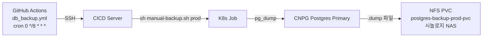
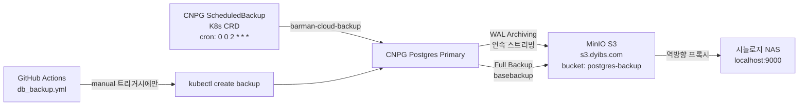

# CNPG S3 백업 마이그레이션 분석 및 리팩토링 계획

## 현재 상태 (AS-IS)

### 1. 기존 백업 아키텍처 (NFS pg_dump 방식)



**문제점:**
- `pg_dump` (논리적 백업)이므로 **PITR(Point-In-Time Recovery) 불가**
- 8시간 간격 백업 → 최대 8시간치 데이터 유실 리스크
- NFS에 누적된 `.dump` 파일 수동 관리 필요 (`mtime +2` 삭제 로직)
- GitHub Actions 크론 + SSH → CICD 서버 의존성 강함
- `backup-cronjob.yaml`의 NFS CronJob과 `manual-backup.sh`의 역할이 중복

### 2. values-prod-custom.yaml 현재 상태 분석

```yaml
cnpg:
  backup:
    enabled: false   # ❌ 비활성화 상태!
    s3:
      enabled: true  # S3 설정은 있으나 backup.enabled=false로 인해 미적용
      bucket: "postgres-backup"
      region: "ap-northeast-2"
      endpoint: "https://s3.dyibs.com"  # MinIO 리버스 프록시
      accessKeyId: "austin"
      secretAccessKey: "$Sc1965112"
```

**핵심 문제:**
- `backup.enabled: false` + `backup.s3.enabled: true` **불일치 상태**
- `cluster.yaml` L151: `{{- if and .Values.backup.enabled .Values.backup.s3.enabled }}` 조건으로 인해 실제 barmanObjectStore 및 ScheduledBackup이 **전혀 생성되지 않는 상태**
- `secrets.yaml` L53: S3 Secret 역시 동일 조건으로 **미생성**
- 즉, 현재 CNPG S3 백업은 설정만 있고 실제로는 동작하지 않음

---

## 목표 상태 (TO-BE)

### 신형 CNPG Barman S3 백업 아키텍처



**장점:**
- **WAL 연속 아카이빙** → PITR 지원 (1초 단위 복구 가능)
- **30일 보존 정책** 자동 관리 (오래된 백업 자동 삭제)
- GitHub Actions/SSH/CICD 서버 의존성 제거 가능
- `backup-cronjob.yaml` NFS CronJob → 폐기 가능

---

## 적용 완료된 변경 사항 (2026-07-24)

| 순위 | 파일 | 변경 내용 | 상태 |
|------|------|----------|------|
| 1 | `values-prod-custom.yaml` | `backup.enabled: true` + 6필드 스케줄 + `cronJobEnabled: false` | ✅ 완료 |
| 2 | `charts/cnpg/values.yaml` | 기본 스케줄 6필드 수정 + `cronJobEnabled` 기본값 추가 | ✅ 완료 |
| 3 | `charts/cnpg/templates/_helpers.tpl` | `destinationPath` 빈 문자열 버그 수정 | ✅ 완료 |
| 4 | `charts/cnpg/templates/backup-cronjob.yaml` | `cronJobEnabled` 플래그 조건 추가 | ✅ 완료 |
| 5 | `.github/workflows/db_backup.yml` | 크론 제거 → 수동 트리거 전용 + `kubectl create backup` 방식 | ✅ 완료 |

---

## MinIO S3 연동 사전 확인 (2026-07-24 완료)

- [x] **버킷 생성**: `postgres-backup` 버킷 생성 완료
- [x] **접근 정책**: `austin` 계정 Read/Write/Delete 권한 확인 완료 (`mc` CLI 검증)
- [x] **HTTPS 인증서**: `https://s3.dyibs.com` TLS 정상 동작 확인
- [x] **경로 스타일 접근**: `endpointURL`만으로 MinIO Path-style 자동 호환

---

## 최종 values-prod-custom.yaml (cnpg 섹션)

```yaml
cnpg:
  enabled: true
  replication:
    instances: 3
  backup:
    enabled: true               # CNPG barmanObjectStore + ScheduledBackup 활성화
    schedule: "0 0 2 * * *"     # 매일 새벽 2시 (6필드 크론: 초 분 시 일 월 요일)
    retentionPolicy: "30d"      # 30일 보존
    nfs:
      enabled: true             # manual-backup.sh용 PV/PVC 유지
      cronJobEnabled: false     # S3 백업으로 대체, NFS CronJob 비활성화
    s3:
      enabled: true
      bucket: "postgres-backup"
      region: "ap-northeast-2"
      endpoint: "https://s3.dyibs.com"
      accessKeyId: "austin"
      secretAccessKey: "$Sc1965112"
```
