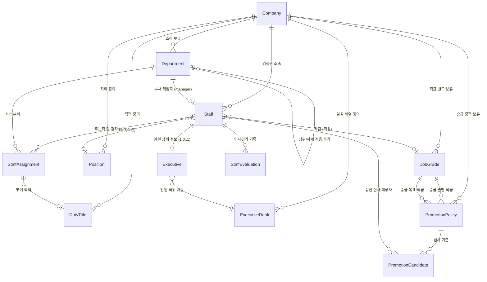
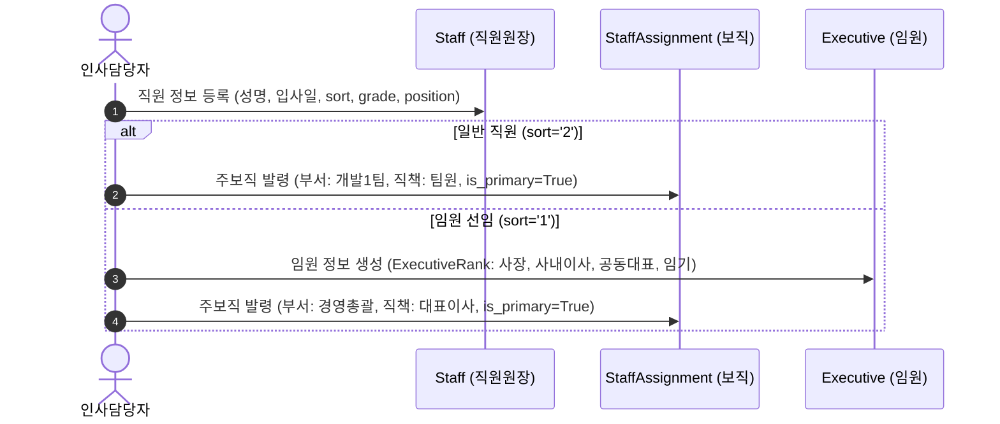
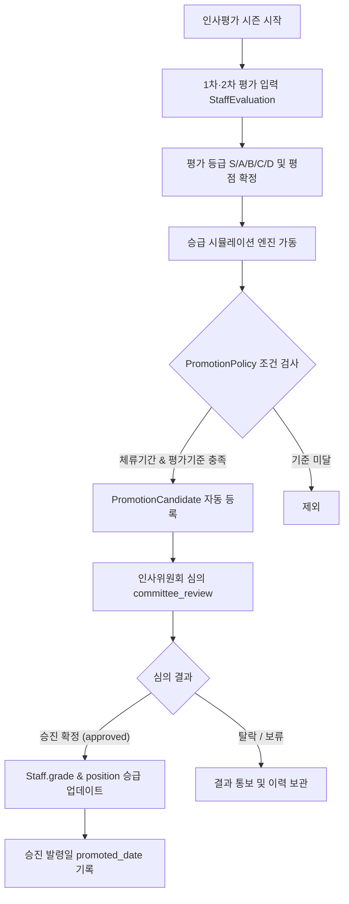

# 인사 관리 시스템 (HR Management System) — 아키텍처 및 프로세스 가이드

> 최초 작성: 2026-08-20  
> **최종 업데이트: 2026-08-20 (임원 관리, 승급 정책, 인사평가, 직책 코드 고도화 완료)**  
> 작성자: Antigravity AI  
> 대상 시스템: IBS (종합 건설·부동산 관리 시스템) `company` 앱 & `hrManage` 모듈

---

## 1. 아키텍처 개요 및 설계 원칙

IBS 인사 관리 시스템은 부동산 시행 및 건설사의 **조직 유연성(TF, 겸직)**과 **법적 거버넌스(임원 등기, 대표권)**, 그리고 **체계적인 역량 기반 인사 운영(직급, 직위, 승급 정책, 평가)**을 완벽히 수용하도록 설계되었습니다.

### 핵심 설계 원칙

1. **신분(Identity/Rank)과 직무(Role/Assignment)의 완전 분리**
   - **신분**: 사람(`Staff`)에게 1개만 귀속되는 개인의 자격·등급 (직원: 직급 `JobGrade` + 직위 `Position`, 임원: `Executive` + 임원직위 `ExecutiveRank`).
   - **직무/배치**: `StaffAssignment`를 통해 1인 다보직(주보직 1개 + 겸직 N개)을 유연하게 발령.
2. **소수 임원 데이터의 정규화 (1:0..1 역참조 구조)**
   - 대다수 일반 직원의 테이블 비대화(Wide Column & NULL 낭비)를 방지하기 위해, 임원 전용 메타데이터(상법상 지위, 등기 여부, 대표권 형태, 임기)는 `Executive` 모델로 분리하고 역참조(`staff.executive`)로 연동.
3. **코드 체계 기반의 불변 비즈니스 로직**
   - 직책명(`DutyTitle.name`)이나 직급명 변경에 시스템 로직이 깨지지 않도록 불변의 코드(`code`: `CEO`, `HQ_HEAD`, `TEAM_LEADER`, `G1~G6`, `E1~E7`)를 도입하여 전자결재 전결 및 권한 로직의 안정성 확보.
4. **객관적 기준에 의한 승진 자동화 (Promotion Simulation)**
   - `JobGrade` 체류기간, `PromotionPolicy` 승급 요건, `StaffEvaluation` 평가 실적이 결합되어 승진 심사 대상자 자동 추출 및 발령 이력 관리 지원.

---

## 2. 도메인 모델 체계 (Data Model Matrix)

| 번호 | 모델명 (`Model`) | 성격 | 주요 필드 및 역할 |
|:---:|:---|:---|:---|
| **01** | `Company` | 법인/회사 | 회사 기본 정보, 사업자등록번호, 기본 회사 여부(`is_default`) |
| **02** | `Logo` | 회사 로고 | 법인 심볼 및 CI 이미지 관리 |
| **03** | `Department` | 조직/부서 | 계층형 부서 트리 (`upper_depart`), 자동 레벨 산출 (`level`), 부서장 (`manager`) |
| **04** | `JobGrade` | 직급 밴드 | 커리어 등급 (`code`: G1~G6), 역할 정의, 최소 체류년수 (`min_promotion_years`) |
| **05** | `Position` | 대내외 직위 | 대외 호칭/신분 (`name`: 사원, 대리, 과장, 차장, 부장 / 선임, 책임, 수석) |
| **06** | `DutyTitle` | 직책 정보 | 조직 내 역할 (`code`: CEO, HQ_HEAD 등, `name`: 대표이사, 본부장, 실장, 팀장) |
| **07** | `ExecutiveRank` | 임원 직위 | 임원 서열 체계 (`rank_order`, `code`: E1~E7, `name`: 이사, 상무, 전무, 부사장, 사장, 회장) |
| **08** | `Staff` | 인적 원장 | 직원 기본 인적사항, 계정 연동 (`user`), 신분 구분 (`sort`: '1' 임원 / '2' 직원), `position`, `grade` |
| **09** | `Executive` | 임원 거버넌스 | 임원 법적 지위 (`director_type`: 사내/사외이사 등), `is_registered`, `represent_type` (단독/공동/각자), 임기 (`term_start`~`term_end`) |
| **10** | `StaffAssignment` | 배치/보직 | 1:N 부서 및 직책 발령 (`department`, `duty`, `is_primary`: 주보직 여부, `assigned_tasks`) |
| **11** | `PromotionPolicy` | 승급 기준 정책 | 직급 간 승급 요건 (`current_grade` ➔ `target_grade`, `min_years`, 최소 평가점수/등급, 결격사유) |
| **12** | `StaffEvaluation` | 인사 평가 | 연도/반기별 평가 원장 (`eval_year`, `eval_period`, `grade`: S/A/B/C/D, `score`, 1·2차 평가자) |
| **13** | `PromotionCandidate`| 승급 심사/발령 | 승급 심사 대상 (`eval_year`, `tenure_years`, `avg_eval_score`, `status`: 후보/추천/승진확정/탈락, `promoted_date`) |

---

## 3. 엔티티 관계도 (ERD & Architecture Diagram)

---

## 4. 인사 핵심 프로세스 (Lifecycle Workflows)

### 4-1. 신규 입사 및 보직 발령 프로세스

### 4-2. 겸직 및 부서 이동 (Transfer & Dual Assignment)

* **주보직(`is_primary=True`)**: 직원의 기본 소속 및 기본 결재선 부서. 시스템 저장 시 동일 직원의 기존 주보직은 자동으로 `is_primary=False`로 전환되어 **직원당 1개의 주보직 무결성** 유지.
* **겸직(`is_primary=False`)**: TF팀 참여, 프로젝트 현장소장 겸임 등 다중 부서 배치 지원.

### 4-3. 연간 인사평가 및 승진 심사/발령 프로세스

### 4-4. 전자결재(Approval) 연동 프로세스

1. **기안자 보직 선택**: 기안자는 본인의 주보직 또는 겸직 중 하나를 선택하여 기안 (`drafter_assignment`).
2. **부서 트리 상향 순회**: 기안 부서의 직속 `manager` ➔ 상위 부서 `manager`로 자동 결재선(`ApprovalStep`) 빌드.
3. **전결 규정 판별**: `DutyTitle.code` 또는 `Department.level`을 기준으로 전결 직책 도달 시 결재선 자동 마감.
4. **대표이사 결재**: 전결 미달 시 `Executive.represent_type`을 검사하여 단독대표(`OR`) 또는 공동대표(`AND` 전원 승인) 단계 자동 편성.

---

## 5. 소스 코드 구현 맵 (Codebase Implementation Map)

### 5-1. Django 백엔드

| 모듈 | 파일 경로 | 주요 역할 |
|:---|:---|:---|
| **Models** | [models.py](file:///Users/austinkho/Git/Pro/ibs/app/django/company/models.py) | 전체 13개 인사/조직 도메인 모델 정의 및 비즈니스 무결성 규칙 |
| **Admin** | [admin.py](file:///Users/austinkho/Git/Pro/ibs/app/django/company/admin.py) | Django Admin CRUD, 인라인(`ExecutiveInline`, `StaffAssignmentInline`), 필터 |
| **Serializers** | [serializers/company.py](file:///Users/austinkho/Git/Pro/ibs/app/django/apiV1/serializers/company.py) | REST API DTO 직렬화, 주보직 자동 동기화, 역참조 매핑 |
| **Views** | [views/company.py](file:///Users/austinkho/Git/Pro/ibs/app/django/apiV1/views/company.py) | ViewSet 및 `IbsModulePermission` 권한 제어, 필터셋 |
| **URLs** | [urls.py](file:///Users/austinkho/Git/Pro/ibs/app/django/apiV1/urls.py) | API 엔드포인트 라우터 등록 |
| **Excel Export** | [exports/excel.py](file:///Users/austinkho/Git/Pro/ibs/app/django/company/exports/excel.py) | 직급, 직책, 부서, 임직원 목록 엑셀 내보내기 |
| **Approval Link**| [route_builder.py](file:///Users/austinkho/Git/Pro/ibs/app/django/approval/services/route_builder.py) | 직책 코드(`CEO`) 및 공동대표 기반 전자결재선 자동 생성 |

### 5-2. Vue 프론트엔드

| 모듈 | 파일 경로 | 주요 역할 |
|:---|:---|:---|
| **TypeScript Types** | [types/company.ts](file:///Users/austinkho/Git/Pro/ibs/app/vue/src/store/types/company.ts) | 백엔드 모델과 100% 일치하는 TypeScript 인터페이스 및 유니온 타입 |
| **Pinia Store** | [pinia/company.ts](file:///Users/austinkho/Git/Pro/ibs/app/vue/src/store/pinia/company.ts) | 13개 도메인 상태 관리, CRUD 비동기 액션, 페이징 계산 |
| **직급 관리 UI** | [Grade/](file:///Users/austinkho/Git/Pro/ibs/app/vue/src/views/hrManage/Grade) | 직급 코드(G1~G6), 체류년수, 승급 기준 관리 UI |
| **직책 관리 UI** | [Duty/](file:///Users/austinkho/Git/Pro/ibs/app/vue/src/views/hrManage/Duty) | 직책 코드(`code`), 직책명, 설명 관리 UI |
| **직원 관리 UI** | [Staff/](file:///Users/austinkho/Git/Pro/ibs/app/vue/src/views/hrManage/Staff) | 직원 인적사항 및 직급/직위/부서/직책 통합 등록 UI |
| **조직도 UI** | [OrgChart/](file:///Users/austinkho/Git/Pro/ibs/app/vue/src/views/hrManage/OrgChart) | 부서 트리 및 부서원/부서장 시각화 조직도 |

---

## 6. 향후 확장 추천 과제 (Next Milestones)

1. **승진 대상자 자동 추출(시뮬레이션) 화면 구현**
   - 매년 말 승진 시즌에 `PromotionPolicy`와 `StaffEvaluation`을 기반으로 승급 후보자를 원클릭으로 추출하고 심의하는 전용 대시보드 구축.
2. **임원 임기 만료 알림 (D-30 / D-60)**
   - `Executive.term_end`를 모니터링하여 임기 만료 예정 임원에 대한 Celery 스케줄러 기반 이메일/알림 연동.
3. **인사 발령 이력 타임라인 (Staff Timeline)**
   - 승진, 부서 이동, 겸직 해제 등 직원의 모든 이력을 타임라인 형태로 시각화.
