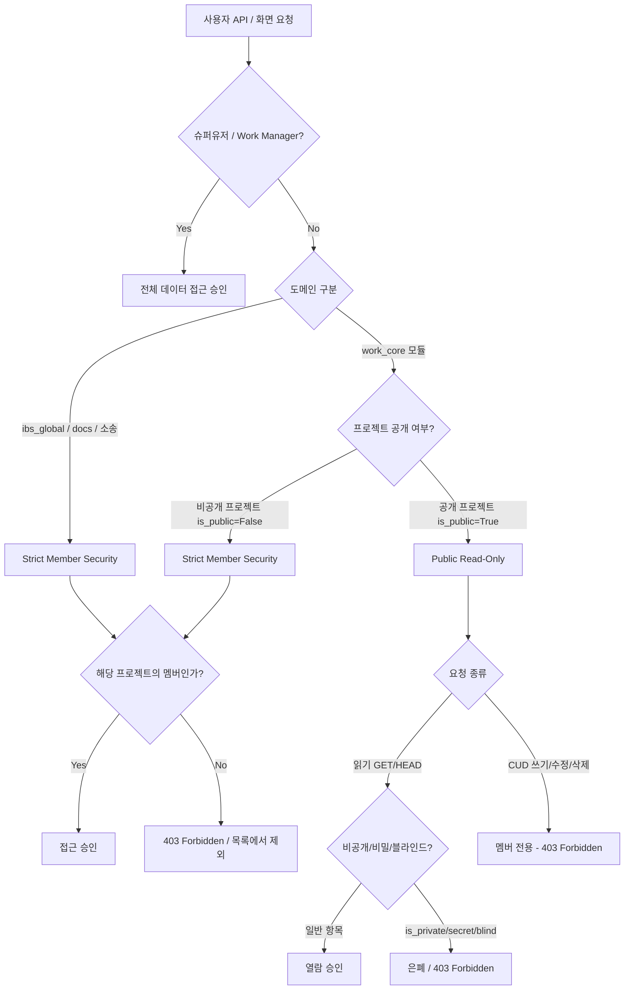

# IBS 시스템 프로젝트 권한 & 모듈별 공개 정책 (Security & Access Control Policy)

본 문서는 **IBS 건설 관리 시스템**의 `work_core` (협업/업무 도메인) 및 `ibs_global` (회계/계약/수납/자금/분양 도메인)에 적용된 **프로젝트 권한 및 모듈별 행 단위 데이터 보안(Row-Level Security) 정책**을 정의합니다.

---

## 1. 개요 및 보안 아키텍처 원칙

IBS 시스템은 **건설 프로젝트(현장)**를 중심으로 권한과 데이터가 관리됩니다. 
프로젝트의 공개 여부(`IssueProject.is_public`)와 유저의 프로젝트 멤버십(`IssueProject.members`)에 따라 데이터 접근 수준이 아래 두 가지 기조로 명확히 분리됩니다.

---

## 2. 모듈별 공개 및 접근 권한 상세 정책

### 🔐 2.1 `ibs_global` 및 민감 도메인 — Strict Member Security (엄격한 멤버 전용)

프로젝트가 공개(`is_public=True`) 상태라 할지라도 **기업의 재무, 계약, 회계, 수납, 분양 유니트 및 소송 데이터는 엄격히 멤버십 가입자에게만 접근을 허용**하며, BOLA(IDOR) 악의적 API 파라미터 변조까지 백엔드 DB QuerySet 레벨에서 차단합니다.

| 도메인 / 앱 | 관련 모듈 / 리소스 | 공개 프로젝트(is_public=True) 접근 정책 | 비공개 프로젝트(is_public=False) 접근 정책 |
| :--- | :--- | :--- | :--- |
| **`project`** | 프로젝트(현장), 예산(수입/지출), 부지(Site), 소유자, 부지계약 | **멤버 전용** (`members__user=user`) | **멤버 전용** |
| **`contract`** | 차수, 분양 계약(`Contract`), 계약자, 양도양수, 해약 | **멤버 전용** (`members__user=user`) | **멤버 전용** |
| **`payment`** | 차수별 분양가, 납부서 순서, 수납 내역(`ContractPayment`), 연체이율 | **멤버 전용** (`members__user=user`) | **멤버 전용** |
| **`ledger`** | 프로젝트 통장, 현장 회계 계정, 현장 캐시플로우/출금 거래 내역 | **멤버 전용** (`members__user=user`) | **멤버 전용** |
| **`items`** | 동/호수 유니트(`HouseUnit`), 타입, 층별타입, 옵션 품목 | **멤버 전용** (`members__user=user`) | **멤버 전용** |
| **`docs`** | 문서(`Document`), 기밀문서, 소송 사건(`LawsuitCase`), 문서 첨부파일 | **멤버 전용** (`issue_project__members__user=user`) | **멤버 전용** |

> [!IMPORTANT]
> **문서(`docs`) 모듈의 이중적 분류**:  
> 문서 모듈에는 소송 서류(`LawsuitCase`), 지출 증빙, 계약서 등 법률/재무 민감 문서가 포함되어 있으므로 `ibs_global` 보안 기조(Strict Member)를 적용하여 비멤버 접근을 원천 차단합니다.

---

### 🌐 2.2 `work_core` 영역 — Public Read-Only with Private Guard (전사 읽기 개방 + 비공개 보호)

현장 업무의 협업 및 전사 정보 공유를 위해 **공개 프로젝트의 일반 리소스에 대해서는 비멤버 직원에게도 기본 읽기(Read-Only) 권한을 전사적으로 개방**합니다.

| 모듈 / 리소스 | 공개 프로젝트 (`is_public=True`) 정책 | 비공개 프로젝트 (`is_public=False`) 정책 | 비공개 가드 (Private Guard) |
| :--- | :--- | :--- | :--- |
| **`news`** (공지) | 전직원 읽기 허용 (`news.read`) / CUD는 멤버 전용 | 멤버 전용 | - |
| **`issue`** (업무) | 전직원 읽기 허용 (`issue.read`) / CUD는 멤버 전용 | 멤버 전용 | `is_private=True` (비공개 업무/댓글)는 비멤버 및 일반 직원에게 **100% 은폐** |
| **`meeting`** (회의록) | 전직원 읽기 허용 (`meeting.read`) / CUD는 멤버 전용 | 멤버 전용 | 비공개 회의록은 **100% 은폐** |
| **`forum`** (게시판) | 전직원 읽기 허용 (`forum.read`) / CUD는 멤버 전용 | 멤버 전용 | `is_secret=True` (비밀글), `is_blind=True` (숨김) 항목 **은폐** |
| **`calendar`** (캘린더) | 전직원 일정 조회 허용 (`calendar.read`) | 멤버 전용 | 비공개 업무 및 회의 일정 **은폐** |
| **`logging`** (활동 로그) | 전직원 활동 이력 조회 허용 (`activity.read`) | 멤버 전용 | 비공개 업무/댓글 연관 이력 **은폐** |

---

## 3. 구현 세부사항 (Implementation Details)

### 3.1 백엔드 Django REST Framework (DRF)
- **RLS (Row-Level Security) QuerySet**:
  - `ibs_global` & `docs`: `queryset.filter(project__issue_project__members__user=user)` (또는 `members__user=user`)
  - `work_core`: `queryset.filter(Q(project__is_public=True) | Q(project__members__user=user))` + `is_private=False` 가드 조건
- **Object-Level Permission (`work_perms.py`)**:
  - `NewsPermission`, `ForumPermission`, `IssuePermission`, `MeetingPermission` 등에서 `request.method in permissions.SAFE_METHODS` 이고 `project.is_public == True` 이면 단일 객체 조회를 승인.

### 3.2 프론트엔드 Vue 3 / Pinia (`work_permission.ts`)
- `usePermission` 스토어의 `can(code, projectIdentifier)` 메서드:
  - 대상 프로젝트가 `is_public === true` 이고 요청된 권한 코드가 **`*.read` (읽기 권한)**인 경우 멤버가 아니더라도 **`true`**를 반환하여 UI 상의 경고창 없이 자연스러운 Read-Only UX 제공.

---

## 4. 검증 상태

- **Backend System Check**: Django `manage.py check` **0 Errors**
- **Frontend Type Check**: `pnpm type-check` (vue-tsc) **0 Errors**
