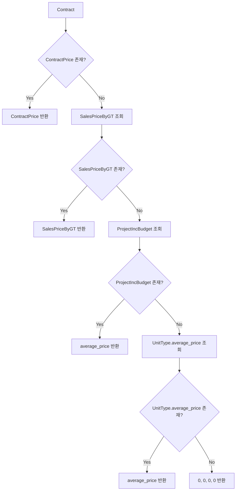
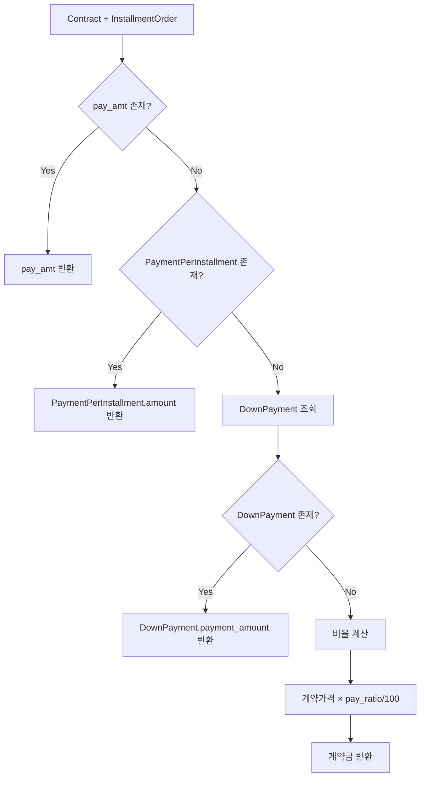

# 계약 가격 및 계약금 산출 로직 가이드

이 문서는 IBS 시스템에서 공급가격(계약가격)과 계약금을 산출하는 로직을 설명합니다.

## 개요

계약가격과 계약금 산출은 여러 단계의 우선순위 로직을 통해 처리되며, 각 단계별로 다른 데이터 소스를 참조합니다.

## 주요 함수

### 1. `get_contract_price()` - 계약가격 산출

#### 함수 시그니처

```python
def get_contract_price(contract, houseunit=None, is_set=False):
    """
    Args:
        contract: Contract 인스턴스
        houseunit: HouseUnit 인스턴스 (선택적)
        is_set: 쓰기 모드 플래그 (True: 참조가격만 사용)

    Returns:
        tuple: (price, price_build, price_land, price_tax) 또는 (0, 0, 0, 0)
    """
```

#### 우선순위 로직

**읽기 모드 (is_set=False)**:

1. **ContractPrice** - 개별 계약의 직접 입력된 가격 참조 - 계약별 가격 설정 시
2. **SalesPriceByGT** - 차수별/타입별/층타입별 표준 공급 가격 - 공급 가격 설정 시
3. **ProjectIncBudget.average_price** - 차수별/타입별 평균 예산 가격 (가격만) - 수입 예산 설정 시
4. **UnitType.average_price** - 타입별 평균가격 (가격만) - 타입만 설정 시
5. **(0, 0, 0, 0)** - 기본값

**쓰기 모드 (is_set=True)**:

1. **SalesPriceByGT** - 공급 가격 설정 시 개별 계약에 등록
2. **ProjectIncBudget.average_price** - 수입 예산 설정 시
3. **UnitType.average_price** - 타입만 설정 시
4. **(0, 0, 0, 0)**

#### 조회 조건

- **SalesPriceByGT**: `order_group` + `unit_type` + `unit_floor_type` - 차수 + 타입 + 층별 타입
- **ProjectIncBudget**: `order_group` + `unit_type` - 차수 + 타입
- **UnitType**: `unit_type` - 타입

### 2. `get_down_payment()` - 계약금 산출

#### 함수 시그니처

```python
def get_down_payment(contract, installment_order):
    """
    Args:
        contract: Contract 인스턴스
        installment_order: InstallmentPaymentOrder 인스턴스 (pay_sort='1')

    Returns:
        int: 계약금 금액 또는 None
    """
```

#### 우선순위 로직

1. **InstallmentPaymentOrder.pay_amt**
    - `pay_amt` 모든 타입 공통 납부금액 최우선 적용

2. **PaymentPerInstallment** - 개별 설정된 회차별 납부 금액
    - `SalesPriceByGT` + `InstallmentPaymentOrder` 조합으로 조회

3. **DownPayment** - 차수별/타입별 설정된 회당 납부 계약금
    - `order_group` + `unit_type`으로 조회

4. **InstallmentPaymentOrder.pay_ratio** - 납부 회차 테이블에 등록된 납부 비율 * 가격 계산 (중도금의 경우 기본 10%)
    - 계약가격 × (비율 / 100)

## 데이터 흐름도



## 계약금 산출 흐름도



## 성능 최적화

### 권장 쿼리 최적화

```python
# get_contract_price 최적화
Contract.objects.select_related(
    'contractprice', 'project', 'order_group', 'unit_type',
    'key_unit__houseunit__floor_type'
).prefetch_related('project__projectincbudget_set')

# get_down_payment 최적화
Contract.objects.select_related('order_group', 'unit_type')
```

## 실제 사용 예시

### 1. 기본 계약가격 조회

```python
from _utils.contract_price import get_contract_price

contract = Contract.objects.get(id=1)
price, price_build, price_land, price_tax = get_contract_price(contract)

print(f"총 공급가격: {price:,}원")
print(f"건축비: {price_build:,}원")
print(f"토지비: {price_land:,}원")
print(f"부가세: {price_tax:,}원")
```

### 2. 계약금 조회

```python
from _utils.contract_price import get_down_payment

contract = Contract.objects.get(id=1)
installment_order = InstallmentPaymentOrder.objects.get(
    project=contract.project,
    pay_sort='1'  # 계약금
)

down_payment = get_down_payment(contract, installment_order)
print(f"계약금: {down_payment:,}원")
```

### 3. 전체 납부 계획 조회

```python
from _utils.contract_price import get_contract_payment_plan

contract = Contract.objects.get(id=1)
payment_plan = get_contract_payment_plan(contract)

for item in payment_plan:
    installment = item['installment_order']
    amount = item['amount']
    source = item['source']

    print(f"{installment.pay_name}: {amount:,}원 ({source})")
```

## 주요 모델 관계

### 계약가격 관련 모델

- **Contract** ← **ContractPrice** (1:1)
- **SalesPriceByGT** (차수별/타입별 공급가격)
- **ProjectIncBudget** (프로젝트 예산)
- **UnitType** (타입별 평균가격)

### 계약금 관련 모델

- **PaymentPerInstallment** ← **SalesPriceByGT** (N:1)
- **PaymentPerInstallment** ← **InstallmentPaymentOrder** (N:1)
- **DownPayment** (차수별/타입별 계약금)

## 주의사항

### 1. 예외 처리

- 모든 함수는 적절한 예외 처리를 포함
- `AttributeError`, `TypeError`, `ValueError` 등을 처리
- 실패 시 기본값 반환 (0 또는 None)

### 2. 데이터 무결성

- 계약금은 `pay_sort='1'` 조건 필수
- 중도금은 `pay_sort='2'`, 잔금은 `pay_sort='3'`
- `unit_floor_type` 매칭 시 null 값 고려

### 3. 성능 고려사항

- 대량 조회 시 select_related/prefetch_related 사용
- 캐싱 메커니즘 활용 (`get_contract_payment_plan`)
- N+1 쿼리 문제 방지

## 관련 파일

- `/app/django/_utils/contract_price.py` - 핵심 로직
- `/app/django/payment/models.py` - 결제 관련 모델
- `/app/django/contract/models.py` - 계약 관련 모델