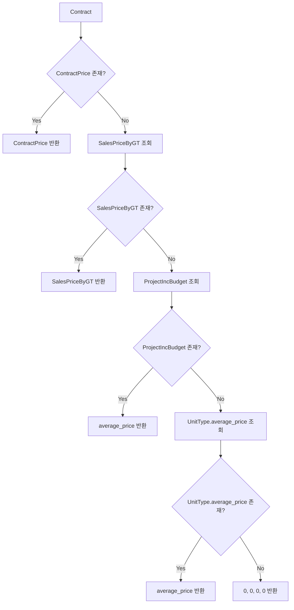
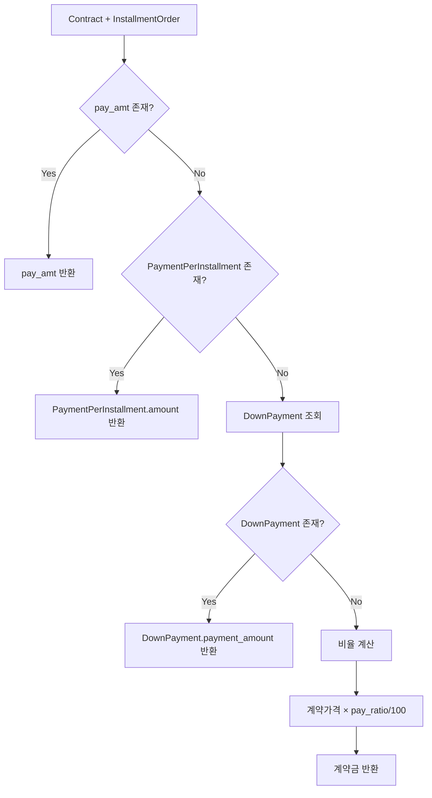

# 계약 가격 및 계약금 산출 로직 가이드

이 문서는 IBS 시스템에서 공급가격(계약가격)과 계약금을 산출하는 로직을 설명합니다.

## 개요

분양(공급)계약 가격과 계약금 산출은 여러 단계의 우선순위 로직을 통해 처리되며, 각 단계별로 다른 데이터 소스를 참조합니다.

## 주요 함수

### 1. `get_contract_price()` - 계약가격 산출

#### 함수 시그니처

```python
def get_contract_price(contract, houseunit=None, is_set=False):
    """
    Args:
        contract: Contract 인스턴스
        houseunit: HouseUnit 인스턴스 (선택적)
        is_set: 쓰기 모드 플래그 (True: 참조가격만 사용)

    Returns:
        tuple: (price, price_build, price_land, price_tax) 또는 (0, 0, 0, 0)
    """
```

#### 우선순위 로직

**읽기 모드 (is_set=False)**:

1. **ContractPrice** - 개별 계약의 직접 입력된 가격 참조 - 계약별 가격 설정 시 (기준 공급가와 동일)
2. **SalesPriceByGT** - 차수별/타입별/층타입별 표준 공급 가격 - 기준 공급 가격 설정 시
3. **ProjectIncBudget.average_price** - 차수별/타입별 평균 예산 가격 (가격만) - 수입 예산 설정 시
4. **UnitType.average_price** - 타입별 평균가격 (가격만) - 타입만 설정 시
5. **(0, 0, 0, 0)** - 기본값

**쓰기 모드 (is_set=True)**:

1. **SalesPriceByGT** - 기준 공급 가격 설정 시 -> 개별 계약에 등록
2. **ProjectIncBudget.average_price** - 수입 예산 설정 시
3. **UnitType.average_price** - 타입만 설정 시
4. **(0, 0, 0, 0)**

#### 조회 조건

- **SalesPriceByGT**: `order_group` + `unit_type` + `unit_floor_type` - 차수 + 타입 + 층별 타입
- **ProjectIncBudget**: `order_group` + `unit_type` - 차수 + 타입
- **UnitType**: `unit_type` - 타입

### 2. `get_payment_amount()` - 납부금액 산출 (통합 함수)

#### 함수 시그니처

```python
def get_payment_amount(contract, installment_order):
    """
    Args:
        contract: Contract 인스턴스
        installment_order: InstallmentPaymentOrder 인스턴스

    Returns:
        int: 납부 금액 또는 0
    """
```

#### 우선순위 로직

1. **계약금** (`pay_sort='1'`): `get_down_payment()` 함수 사용 (고정 금액 체크 포함)
2. **계약금 정산** (`pay_sort='4'`): `get_down_payment_settlement()` 동후 지정 후 적응 금액 정산
3. **고정 금액** (`pay_amt`): 기타 납부 유형의 고정 금액 최우선 적용
4. **중도금** (`pay_sort='2'`): 항상 `pay_ratio` 사용 (기본 10%)
5. **잔금** (`pay_sort='3'`): 총 가격에서 다른 납부액 차감
6. **기타 유형**: `pay_amt`/`pay_ratio` → `PaymentPerInstallment` → 0

### 2-1. `get_down_payment()` - 계약금 산출

#### 함수 시그니처

```python
def get_down_payment(contract, installment_order):
    """
    Args:
        contract: Contract 인스턴스
        installment_order: InstallmentPaymentOrder 인스턴스 (pay_sort='1')

    Returns:
        int: 계약금 금액 또는 None
    """
```

#### 우선순위 로직

1. **InstallmentPaymentOrder.pay_amt** - 고정 납부금액 최우선 적용

2. **PaymentPerInstallment** - 개별 설정된 회차별 납부 금액
    - `SalesPriceByGT` + `InstallmentPaymentOrder` 조합으로 조회
    - `unit_floor_type` 존재 시에만 조회 (필수 조건)

3. **DownPayment** - 차수별/타입별 설정된 회당 납부 계약금
    - `order_group` + `unit_type`으로 조회
    - `calculation_method`가 'ratio'인 경우 건너뜀 ⭐

4. **InstallmentPaymentOrder.pay_ratio** - 납부 비율 기반 계산 (기본 10%)
    - 계약가격 × (비율 / 100)

#### 계약금 계산 방식 제어 ⭐ (신규)

`InstallmentPaymentOrder.calculation_method` 필드로 제어:

- **'auto'** (기본): 기존 우선순위대로 처리
- **'ratio'**: DownPayment 건너뛰고 비율 계산 강제
- **'downpayment'**: DownPayment 우선 (명시적)

### 2-2. `get_down_payment_settlement()` - 계약금 정산 ⭐ (신규)

#### 함수 시그니처

```python
def get_down_payment_settlement(contract, installment_order):
    """
    조합원 모집 → 공급계약 전환 시 계약금 정산

    Args:
        contract: Contract 인스턴스
        installment_order: InstallmentPaymentOrder 인스턴스 (pay_sort='4')

    Returns:
        int: 정산 금액 (양수: 추가납부, 음수: 환급, 0: 정산불필요)
    """
```

#### 계산 로직

**공식**: `(목표 계약금 비율 × 현재 공급가) - 기납부 계약금 합계`

1. `installment_order.pay_ratio`에서 목표 비율 획득 (필수)
2. 현재 공급가격 조회 (`get_contract_price()`)
3. 목표 총 계약금 계산: `공급가 × (목표비율 / 100)`
4. 기납부 계약금 합계 조회 (`get_total_paid_down_payments()`)
5. 정산 금액 = 목표 총액 - 기납부 총액

#### 사용 시나리오

```python
# 계약금 정산 회차 생성
InstallmentPaymentOrder.objects.create(
    project=project,
    pay_sort='4',  # 계약금 정산
    pay_ratio=20.0,  # 목표: 총 계약금 20%
    pay_name='계약금 정산',
    pay_code=15  # 중도금 전에 실행
)
```

### 2-3. `get_total_paid_down_payments()` - 기납부 계약금 조회 ⭐ (신규)

#### 함수 시그니처

```python
def get_total_paid_down_payments(contract):
    """
    Args:
        contract: Contract 인스턴스

    Returns:
        int: 기납부 계약금 총액
    """
```

#### 계산 로직

`pay_sort='1'`인 모든 `InstallmentPaymentOrder`의 납부 예정 금액 합계

## 데이터 흐름도



## 계약금 산출 흐름도



## 성능 최적화

### 권장 쿼리 최적화

```python
# get_contract_price 최적화
Contract.objects.select_related(
    'contractprice', 'project', 'order_group', 'unit_type',
    'key_unit__houseunit__floor_type'
).prefetch_related('project__projectincbudget_set')

# get_down_payment 최적화
Contract.objects.select_related('order_group', 'unit_type')
```

## 실제 사용 예시

### 1. 기본 계약가격 조회

```python
from _utils.contract_price import get_contract_price

contract = Contract.objects.get(id=1)
price, price_build, price_land, price_tax = get_contract_price(contract)

print(f"총 공급가격: {price:,}원")
print(f"건축비: {price_build:,}원")
print(f"토지비: {price_land:,}원")
print(f"부가세: {price_tax:,}원")
```

### 2. 계약금 조회

```python
from _utils.contract_price import get_down_payment

contract = Contract.objects.get(id=1)
installment_order = InstallmentPaymentOrder.objects.get(
    project=contract.project,
    pay_sort='1'  # 계약금
)

down_payment = get_down_payment(contract, installment_order)
print(f"계약금: {down_payment:,}원")
```

### 3. 전체 납부 계획 조회

```python
from _utils.contract_price import get_contract_payment_plan

contract = Contract.objects.get(id=1)
payment_plan = get_contract_payment_plan(contract)

for item in payment_plan:
    installment = item['installment_order']
    amount = item['amount']
    source = item['source']

    print(f"{installment.pay_name}: {amount:,}원 ({source})")
```

### 4. 프로젝트 납부 요약 조회

```python
from _utils.contract_price import get_project_payment_summary
from project.models import Project
from contract.models import OrderGroup, UnitType

# 기본 프로젝트 요약
project = Project.objects.get(id=1)
summary = get_project_payment_summary(project)

print(f"총 계약 수: {summary['total_contracts']}")
print(f"총 납부 금액: {summary['grand_total']:,}원")

for installment_summary in summary['installment_summaries']:
    installment = installment_summary['installment_order']
    total_amount = installment_summary['total_amount']
    contract_count = installment_summary['contract_count']
    average_amount = installment_summary['average_amount']

    print(f"{installment.pay_name}:")
    print(f"  총액: {total_amount:,}원")
    print(f"  계약 수: {contract_count}개")
    print(f"  평균: {average_amount:,}원")

# 필터링된 프로젝트 요약
order_group = OrderGroup.objects.get(id=1)
unit_type = UnitType.objects.get(id=2)
filtered_summary = get_project_payment_summary(project, order_group, unit_type)
```

### 5. 다중 프로젝트 납부 요약 조회

```python
from _utils.contract_price import get_multiple_projects_payment_summary
from project.models import Project

# 여러 프로젝트 통합 요약
projects = Project.objects.filter(id__in=[1, 2, 3])
combined_summary = get_multiple_projects_payment_summary(projects)

print(f"총 프로젝트: {len(projects)}개")
print(f"총 계약 수: {combined_summary['total_contracts']}")
print(f"통합 총액: {combined_summary['grand_total']:,}원")

for installment_summary in combined_summary['installment_summaries']:
    installment = installment_summary['installment_order']
    total_amount = installment_summary['total_amount']
    source_breakdown = installment_summary['source_breakdown']

    print(f"{installment.pay_name}: {total_amount:,}원")
    print(f"  계산된 금액: {source_breakdown['calculated']:,}원")
    print(f"  개별 설정 금액: {source_breakdown['payment_per_installment']:,}원")

# 차수 및 타입별 필터링
order_group = OrderGroup.objects.get(id=1)
unit_type = UnitType.objects.get(id=2)
filtered_combined = get_multiple_projects_payment_summary(projects, order_group, unit_type)
```

### 6. API 엔드포인트 사용

#### 다중 프로젝트 납부 요약 API

```
GET /api/v1/contract/multi-project-payment-summary/
```

**필수 파라미터**:

- `projects`: 쉼표로 구분된 프로젝트 ID (예: `1,2,3`)

**선택적 파라미터**:

- `order_group`: 차수 그룹 ID
- `unit_type`: 유닛 타입 ID

**사용 예시**:

```
# 기본 사용
GET /api/v1/contract/multi-project-payment-summary/?projects=1,2,3

# 필터링 포함
GET /api/v1/contract/multi-project-payment-summary/?projects=1,2,3&order_group=1&unit_type=2
```

**응답 형식**:

```json
{
  "projects": [
    1,
    2,
    3
  ],
  "order_group": 1,
  "unit_type": 2,
  "installment_summaries": [
    {
      "installment_order": {
        ...
      },
      "total_amount": 5000000000,
      "contract_count": 100,
      "average_amount": 50000000,
      "source_breakdown": {
        "calculated": 4500000000,
        "payment_per_installment": 500000000
      }
    }
  ],
  "grand_total": 50000000000,
  "total_contracts": 100
}
```

## 주요 모델 관계

### 계약가격 관련 모델

- **Contract** ← **ContractPrice** (1:1)
- **SalesPriceByGT** (차수별/타입별 공급가격)
- **ProjectIncBudget** (프로젝트 예산)
- **UnitType** (타입별 평균가격)

### 계약금 관련 모델

- **PaymentPerInstallment** ← **SalesPriceByGT** (N:1)
- **PaymentPerInstallment** ← **InstallmentPaymentOrder** (N:1)
- **DownPayment** (차수별/타입별 계약금)

## 주의사항

### 1. 예외 처리

- 모든 함수는 적절한 예외 처리를 포함
- `AttributeError`, `TypeError`, `ValueError` 등을 처리
- 실패 시 기본값 반환 (0 또는 None)

### 2. 데이터 무결성

- 계약금은 `pay_sort='1'` 조건 필수
- 중도금은 `pay_sort='2'`, 잔금은 `pay_sort='3'`
- `unit_floor_type` 매칭 시 null 값 고려

### 3. 성능 고려사항

- 대량 조회 시 select_related/prefetch_related 사용
- 캐싱 메커니즘 활용 (`get_contract_payment_plan`)
- N+1 쿼리 문제 방지

## 관련 파일

- `/app/django/_utils/contract_price.py` - 핵심 로직
- `/app/django/payment/models.py` - 결제 관련 모델
- `/app/django/contract/models.py` - 계약 관련 모델