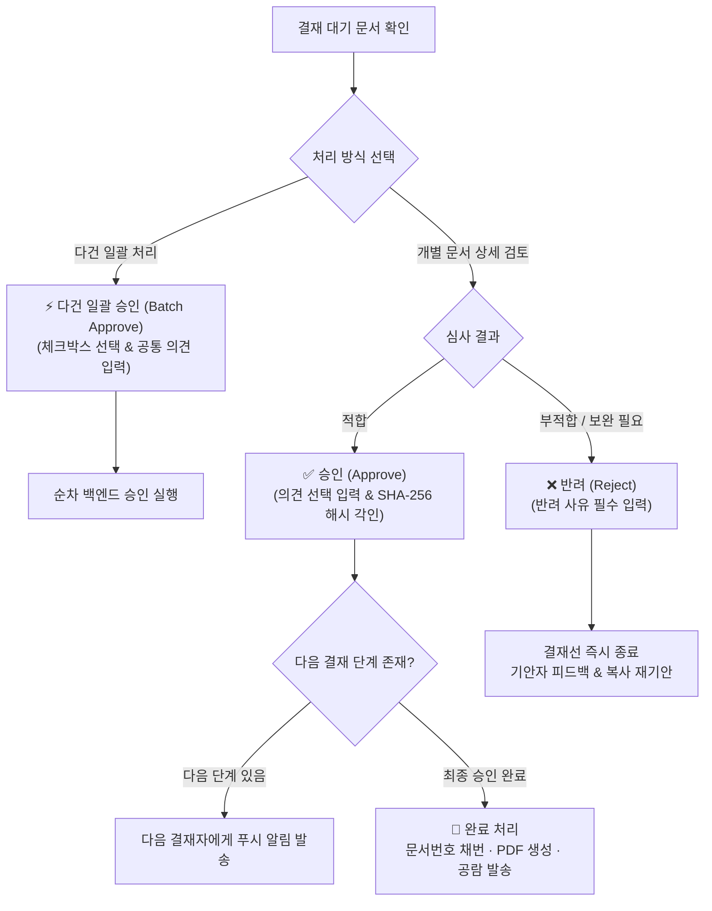

# 결재 처리 및 상신 관리 (Approval Actions)

> 결재선에 포함된 심사자는 문서를 검토한 후 **승인**, **반려**, 또는 여러 건의 대기 문서를 한 번에 처리하는 **다건 일괄 승인**을 수행할 수 있으며, 기안자는 1차 승인 전까지 자유롭게 **기안 회수**가 가능합니다.

## 1. 결재 액션 결정 흐름도

## 2. 단건 결재 승인 (Approve)

현재 결재 순번에 해당하는 결재자는 상세 화면 또는 대기 목록에서 문서를 승인합니다.

* **승인 의견 입력 (선택)**: 승인 코멘트나 당부 사항을 남길 수 있으며 결재 타임라인에 영구 기록됩니다.
* **전자 직인 및 무결성 해시 각인**: 승인 완료 시 결재 시점의 본문 데이터에 대한 **SHA-256 해시값**이 스냅샷되어 사후 위변조를 차단합니다.
* **대결(Proxy) 처리 표기**: 권한을 위임받은 대결자가 승인한 경우, 이력에 **`대결: 김철수 (원 결재자: 홍길동)`** 형태로 투명하게 명시됩니다.

## 3. 다건 일괄 승인 (Batch Approve)

반복적이고 정형화된 결재 건(지출결의서, 영수증 증빙, 정기 휴가원 등)이 다수 밀려있을 때 고속 처리를 지원합니다.

* **웹 환경 실행 방법**:
  1. [결재 대기함](/approval/boxes#결재-대기함-pending) 목록에서 상단 전체 선택 또는 개별 체크박스를 클릭합니다.
  2. 상단 액션바에 활성화되는 **`[선택 문서 일괄 승인 (N건)]`** 버튼을 클릭합니다.
  3. 확인 모달에서 대상 문서 목록(제목, 유형, 기안자)을 확인하고, 필요시 **공통 결재 의견**을 입력합니다.
  4. `[일괄 승인 실행]` 버튼을 누르면 실시간 프로그레스 바와 함께 순차적으로 승인 처리가 완료됩니다.
* **모바일(Flutter) 환경 실행 방법**:
  1. 대기함 상단의 체크 아이콘을 눌러 '선택 모드'로 전환합니다.
  2. 대기 카드를 복수 선택한 후 하단 `[일괄 승인]` 버튼을 누릅니다. (생체 인증 1회 후 자동 처리)

> **안전 권고사항**:
> 계약서 초안이나 대규모 투자 안건 등 법적·재무적 검토가 필요한 문서는 일괄 승인에서 제외하고, 반드시 상세 화면에서 내용을 면밀히 확인한 후 개별 승인하십시오.

## 4. 결재 반려 (Reject)

문서의 내용에 오류가 있거나 보완이 필요한 경우 결재를 기각합니다.

* **반려 사유(의견) 필수 입력**: 기안자가 원인을 명확히 파악할 수 있도록 반려 사유 입력을 필수로 강제합니다.
* **결재선 즉시 중단**: 반려 즉시 후속 결재 단계는 모두 취소되며, 문서 상태가 `반려 (rejected)`로 전환됩니다.
* **기안자 알림 & 재상신**: 기안자에게 즉시 반려 알림이 발송되며, 기안자는 반려된 문서를 기반으로 내용을 보완하여 새 문서로 재상신할 수 있습니다.

## 5. 기안 회수 (Cancel Submission)

기안자가 상신 후 오탈자를 발견했거나 급히 첨부 서류를 변경해야 할 때 결재를 취소하는 기능입니다.

| 구분 | 회수 가능 상태 | 회수 불가 상태 |
| :--- | :--- | :--- |
| **조건** | **1단계 결재자가 승인/반려하기 전** | **1단계 결재자가 이미 승인 완료했거나 최종 승인된 경우** |
| **처리 방법** | 문서 상세 화면에서 `[기안 회수]` 버튼 클릭 | 결재권자에게 구두 연락하여 '반려' 처리 요청 |
| **문서 상태** | 기존 결재선 초기화 $\to$ `임시저장 (draft)` 복귀 | 기존 결재 단계 유지 |
| **후속 조치** | 내용을 자유롭게 수정하거나 첨부파일을 변경 후 재상신 | 반려 완료 후 문서를 재작성하여 상신 |

## 6. 최종 승인 완료 시 자동 처리

최종 결재권자가 승인을 완료하면 백엔드에서 아래 3대 작업이 자동으로 처리됩니다.

1. **공식 문서 번호 원자적 채번**: `DocNumberSequence`에 의해 중복 없는 고유 번호(예: `BIZ-2026-0001`)가 즉시 발급됩니다.
2. **전자 직인 A4 PDF 생성**: 회사 직인, 기안자 정보, 결재자 서명 타임라인이 각인된 공식 PDF가 백그라운드(Celery)에서 자동 생성 및 보관됩니다.
3. **기안자 및 참조자(공람) 알림**: 기안자에게 최종 승인 알림이 발송되며, 지정된 참조자(`observers`)에게 공람 안내가 전달됩니다.
