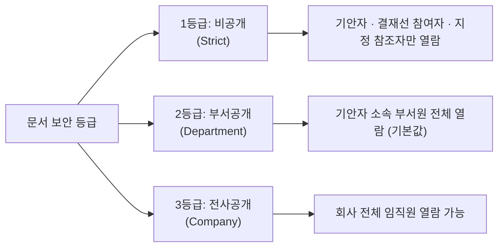

# 문서함 구분 및 다차원 검색 (Approval Boxes)

> **IBS 전자결재 문서함**은 사용자의 결재 참여 역할(대기자, 기안자, 결재 완료자, 전사 열람자)에 따라 문서를 체계적으로 분류하며, 다차원 복합 필터링과 다건 일괄 처리를 지원합니다.

## 1. 4대 결재 문서함 구성 및 특화 기능

| 문서함명 | 주요 대상 및 기준 | 전용 기능 및 특징 |
| :--- | :--- | :--- |
| **결재 대기함** `/approval/pending` | 내가 현재 결재해야 할 미결 문서 (대리 결재 대상 포함) | • 사이드바 실시간 미결 건수 레드 배지 • **다건 일괄 승인 (체크박스 선택 후 원클릭 승인)** • 단건 승인/반려 모달 처리 |
| **기안 문서함** `/approval/drafted` | 내가 작성한 모든 기안 문서 (임시저장, 진행중, 반려, 완료) | • 상태별(5종) 필터링 • 임시저장 건 즉시 상신 및 수정/삭제 • **1단계 심사 전 기안 회수(취소)** • 반려 문서 복사 기안 |
| **결재 문서함** `/approval/approved` | 내가 결재선에 참여하여 최종 승인 완료된 문서 | • 결재 참여 이력 및 타임라인 확인 • **공식 전자 직인 A4 PDF 다운로드 및 인쇄** • SHA-256 무결성 검증 |
| **전체 문서함** `/approval/all` | 보안등급 및 열람 권한을 보유한 회사 내 모든 결재 문서 | • **7대 다차원 복합 필터링** • 전사 결재 현황 모니터링 • 페이지네이션 지원 |

## 2. 5대 결재 상태(Status) 뱃지 기준

모든 문서함 목록에서는 문서의 진행 상황을 직관적으로 확인할 수 있도록 상태 뱃지가 표시됩니다.

| 상태명 | 뱃지 색상 | 영문 코드 | 설명 |
| :--- | :---: | :---: | :--- |
| **임시저장** | 회색 (`secondary`) | `draft` | 기안 작성 중인 상태로, 본인만 조회 및 수정/삭제 가능 (미채번) |
| **결재중** | 주황색 (`warning`) | `pending` | 상신 완료되어 현재 결재 순번의 결재자가 심사 중인 상태 |
| **승인완료** | 초록색 (`success`) | `approved` | 최종 승인권자까지 결재 완료되어 공식 문서번호 채번 및 PDF 생성된 상태 |
| **반려** | 빨간색 (`danger`) | `rejected` | 결재선 중 부적합 판정을 받아 사유와 함께 기각된 상태 |
| **취소 (회수)** | 짙은회색 (`dark`) | `cancelled` | 1차 결재 승인 전 기안자가 자진 회수하여 중단된 상태 |

## 3. 보안 등급별 열람 범위 (Row-Level Security)

전체 문서함 목록 및 검색 시 문서의 보안 등급에 따라 데이터베이스 레벨에서 열람 권한이 자동 통제됩니다.

## 4. 다차원 복합 검색 및 필터링

**전체 문서함** 및 각 목록 상단에는 대량의 문서 중에서 필요한 결재 건을 신속하게 찾을 수 있는 7대 필터 툴바가 제공됩니다:

* **카테고리 필터**: `일반/공통`, `인사/근태`, `회계/자금`, `계약/법무`, `사업/프로젝트` 등 대분류 선택
* **문서 유형 필터**: 카테고리 선택 시 해당 분류에 속한 세부 양식(예: `휴가신청서`, `지출결의서`)만 동적 필터링
* **진행 상태 필터**: `결재중`, `승인완료`, `반려`, `임시저장`, `취소` 단일 선택
* **보안 등급 필터**: `1등급 (비공개)`, `2등급 (부서공개)`, `3등급 (전사공개)`
* **소속 부서 필터**: 특정 부서에서 기안된 문서만 지정 조회 (전체 문서함)
* **기간 검색 (`DatePicker`)**: 기안일자 기준 시작일 ~ 종료일 범위 지정
* **키워드 통합 검색**: 문서 번호, 기안자 이름, 문서 제목을 포괄하는 실시간 텍스트 검색
