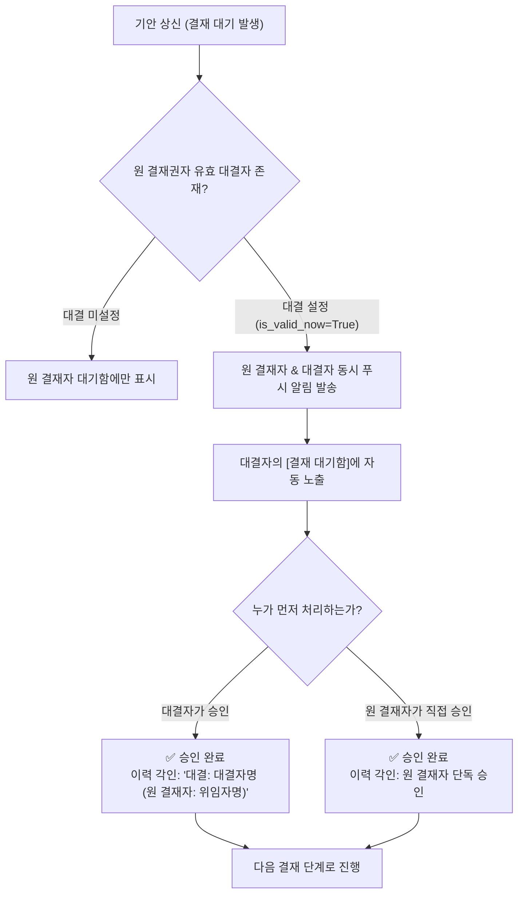

# 결재 위임 및 대결 관리 (Delegation)

> **결재 위임(대결·代決)**은 결재권자가 출장, 연차 휴가, 병가 등으로 자리를 비울 때 결재선 병목과 업무 지연을 방지하기 위해, 지정된 기간 동안 특정 직원에게 결재 권한을 공식 위임하는 기능입니다.

## 1. 대결 프로세스 및 시스템 동작

## 2. 결재 위임 설정 방법

1. 좌측 메뉴에서 **`전자 결재 관리` $\to`결재 위임 관리`**로 이동합니다.
2. 우측 상단의 **`[신규 대결자 지정]`** 버튼을 클릭합니다.
3. 모달 창에서 아래 4대 필수 항목을 입력하고 저장합니다:
   * **수임자 (대결자)**: 본인을 대신하여 결재 권한을 행사할 재직 직원을 검색하여 선택합니다.
   * **위임 시작일 / 종료일**: 대결 권한이 효력을 갖는 날짜 범위를 지정합니다.
   * **부재 및 위임 사유**: 출장, 해외 파견, 연차 휴가, 병가 등 구체적인 사유를 입력합니다.
   * **활성 여부 (`is_active`)**: 기본값은 활성 상태이며, 저장 즉시 적용됩니다.

## 3. 위임 목록 화면 및 3대 상태 구분

결재 위임 관리 화면에서는 **내가 위임한 내역(`본인`)**과 **내가 위임받은 내역(`수임(대결)`)**을 통합 관리합니다.

| 상태 배지 | 상태 설명 | 대결 권한 효력 |
| :--- | :--- | :---: |
| **`진행중 (유효)`** | 오늘 날짜가 위임 기간 내에 포함되어 있고 활성 상태 | **실시간 대결 가능** |
| **`대기 / 예정`** | 위임 시작일이 아직 도래하지 않은 예약 상태 | 효력 대기 |
| **`비활성 (해제)`** | 기간이 만료되었거나 토글로 일시정지된 상태 | 권한 차단 |

* **원터치 조기 해제 토글**: 출장에서 예정보다 일찍 복귀한 경우, 등록된 내역을 삭제할 필요 없이 목록의 **`[해제]`** 버튼을 누르면 대결 권한이 즉시 중단됩니다.
* **수정 및 삭제**: 위임 기간이나 대결자를 변경해야 할 경우 언제든지 모달에서 수정하거나 삭제할 수 있습니다.

## 4. 보안 및 감사 추적 (Audit Trail)

* **결재 이력 투명성**: 대결자가 결재(승인 또는 반려)를 수행하면, 전자결재 타임라인 및 생성되는 인쇄용 PDF 결재란에 **`대결: 홍길동 (원 결재자: 김팀장)`** 형태로 명백하게 기재되어 법적 책임을 명문화합니다.
* **중복 결재 차단**: 대결자가 이미 처리한 문서는 원 결재자가 중복으로 처리할 수 없으며, 반대로 원 결재자가 먼저 처리한 경우 대결자의 권한도 소멸합니다.
* **관리자 직권 등록**: 임직원의 급작스러운 사고나 병가로 본인이 직접 위임 설정을 할 수 없는 경우, **최고 슈퍼유저(`is_superuser`)**가 관리자 권한으로 특정 임직원의 대결자를 직권 지정하여 결재 중단을 방어할 수 있습니다.
