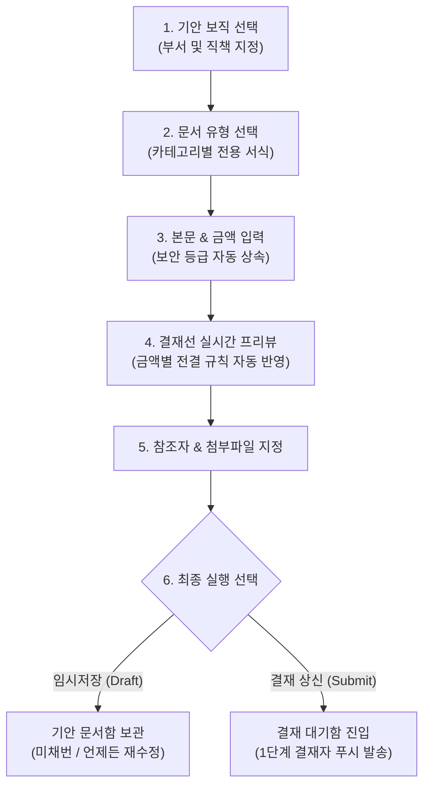

# 기안서 작성 및 상신 (Draft & Submit)

> **기안서 작성**은 임직원이 소속 부서의 권한과 직무에 맞는 양식을 선택하고, 전용 입력 서식과 증빙 자료를 첨부하여 조직도 결재선에 공식 품의 및 승인을 요청하는 전자결재의 시작 단계입니다.

## 1. 기안서 작성 단계별 가이드

### 1단계: 기안 보직 선택
기안자가 2개 이상의 부서에 겸직 중인 경우, 이번 결재를 상신할 **기안 보직(소속 부서 및 직책)**을 상단 셀렉트박스에서 선택합니다.
* 선택한 기안 보직에 따라 직속 팀장 및 상위 본부장의 결재선이 산출되며, 해당 보직에서 사용 권한이 부여된 문서 양식만 필터링됩니다.

### 2단계: 문서 유형(양식) 선택
카테고리별(업무품의, 인사/근태, 지출/구매, 계약/법무 등)로 분류된 17종 전용 서식 중 작성 목적에 맞는 양식을 선택합니다.

### 3단계: 기본 정보 및 전용 본문 작성
* **제목**: 결재 문서의 핵심 안건을 간결하고 명확하게 입력합니다.
* **보안 등급 (자동 상속)**:
  * 문서 유형을 선택하면 관리자가 지정한 기본 등급이 자동 적용되며, 필요시 변경할 수 있습니다:
  * `1등급 (비공개)`: 기안자, 결재선 참여자, 지정된 참조자만 열람 가능
  * `2등급 (부서공개)`: 기안자 소속 부서원 전체 열람 가능 (기본값)
  * `3등급 (전사공개)`: 회사 임직원 전체 열람 가능
* **양식별 전용 입력 서식**: 휴가 일수, 지출결의 금액 그리드, 계약 상대방 정보 등 각 서식별 특화 필드를 작성합니다.

### 4단계: 참조자(공람자) 지정 (선택)
* 결재 진행 및 최종 승인 완료 시 문서를 함께 열람하고 알림을 받아야 하는 임직원을 다중 검색하여 추가합니다.

### 5단계: 증빙 첨부파일 업로드
* 견적서, 계약서 초안, 영수증 증빙 등 관련 파일을 업로드합니다.
* 파일별 용량(KB/MB)이 자동 표출되며, 동일 파일의 중복 추가가 방지됩니다. 수정 모드에서는 기존 첨부파일의 개별 삭제도 지원합니다.

## 2. 결재선 실시간 미리보기 (Dynamic Route Preview)

화면 우측의 결재선 타임라인은 사용자가 입력하는 정보에 따라 **실시간(디바운스 200ms)**으로 자동 계산되어 반응합니다.

* **직속 상사 자동 추적**: 기안 보직을 변경하면 결재선이 해당 부서의 팀장과 상위 본부장으로 즉시 갱신됩니다.
* **금액별 전결 규정 자동 분기**: 지출결의서나 계약품의서 등에서 **금액을 입력하거나 변경하는 즉시**, 전결 정책(예: 100만 원 이하 팀장 전결, 1,000만 원 이하 본부장 전결)이 백엔드에서 실시간 평가되어 최종 승인권자 단계가 자동으로 축소/확장됩니다.

## 3. 임시저장 vs 결재 상신 (Submit)

| 구분 | 임시저장 (Save Draft) | 결재 상신 (Submit) |
| :--- | :--- | :--- |
| **문서 상태** | `임시저장 (draft)` | `결재 진행 중 (pending)` |
| **문서 번호** | 미채번 (null) | 미채번 (최종 승인 완료 시 공식 채번) |
| **타인 열람** | 기안자 본인만 열람 및 수정/삭제 가능 | 결재선 참여자 및 결재 대기자 열람 가능 |
| **결재선 생성** | 결재선이 확정 복사되지 않음 | 상신 시점의 조직도 결재선이 영구 동결되어 생성 |
| **알림 발송** | 발송되지 않음 | 1단계 결재자에게 모바일 푸시 및 웹 알림 발송 |

## 4. 기안 회수 (Cancel Submission) 정책

상신 완료 후 기안 내용에 오탈자가 발견되었거나 긴급히 서류를 보완해야 하는 경우:

* **회수 가능 조건**: **1단계 결재자가 아직 결재(승인 또는 반려)를 처리하기 전**이라면 기안자가 문서 상세 화면에서 언제든지 **`[기안 회수]`**를 실행할 수 있습니다.
* **회수 결과**: 문서 상태가 다시 **`임시저장 (draft)`**으로 되돌아가며, 기안자가 내용을 자유롭게 수정하거나 삭제한 뒤 재상신할 수 있습니다.
* **회수 불가**: 1단계 결재자가 이미 승인 또는 반려한 이후에는 임의 회수가 불가능하며, 결재권자에게 구두 요청하여 '반려' 처리 후 재기안해야 합니다.
