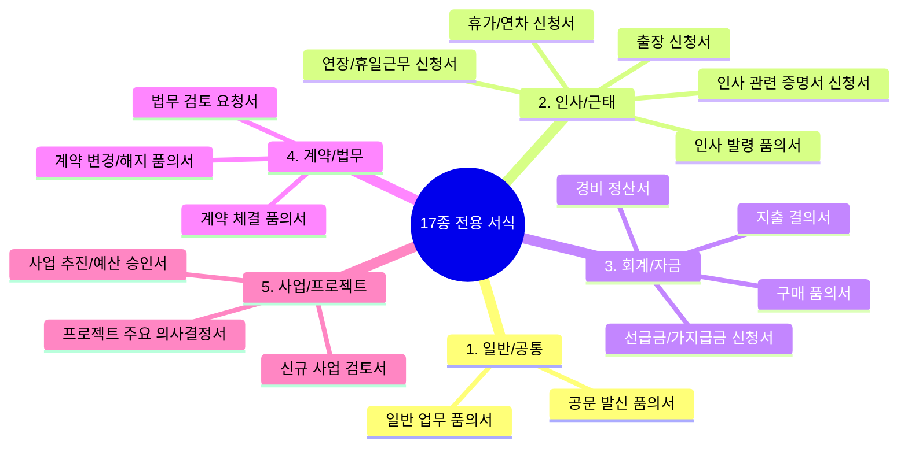

# 기안 양식 안내 (17종 전용 서식)

> **IBS 전자결재 시스템**은 단순 텍스트 입력을 넘어, 사내 업무 도메인(인사, 회계, 법무, 부동산 개발 사업 등)에 최적화된 **17종 전용 폼 컴포넌트**와 유연한 **동적 스키마 폼**을 제공합니다.

## 1. 17종 전용 서식 카테고리 구조

## 2. 일반 / 공통 카테고리 (2종)

| 양식명 (`key`) | 전결 평가 금액 | 주요 입력 항목 | 특징 및 자동 연동 |
| :--- | :---: | :--- | :--- |
| **일반 업무 품의서** `GENERAL` | `amount` (소요 예산) | 품의 목적, 주요 추진 내용, 기대 효과, 소요 예산 | 회사 전반의 일반 안건 승인을 위한 범용 표준 서식 |
| **공문 발신 품의서** `OFFICIAL_LETTER` | - | 수신처, 발신 명의, 시행 일자, 공문 본문, 첨부 증빙 | 최종 승인 완료 시 대외 공식 공문 일련번호 자동 채번 및 직인 날인 연동 |

## 3. 인사 / 근태 카테고리 (5종)

| 양식명 (`key`) | 주요 입력 항목 | 특징 및 자동 연동 |
| :--- | :--- | :--- |
| **휴가 / 연차 신청서** `LEAVE` | 휴가 구분(연차/반차/경조/공가/병가), 기간, 차감 일수, 비상연락처 | 반차(0.5일)/전일(1.0일) 선택에 따른 차감 일수 자동 계산 |
| **출장 신청서** `BUSINESS_TRIP` | 출장지, 출장 목적, 출장 기간, 숙박비·교통비·일비 예상 경비 | 출장 여비 규정에 따른 예상 경비 산출 |
| **연장 / 휴일근무 신청서** `OVERTIME` | 근무 일시, 사전 승인 사유, 예상 근무 시간 | 주 52시간 근태 관리 사전 승인 연동 |
| **인사 발령 품의서** `HR_APPOINTMENT` | 대상자, 발령 구분(승진/전보/보직 발령), 발령 부서 및 직책 | **최종 승인 완료 시 사내 인사 DB(`StaffAssignment`)에 보직 발령 자동 반영** |
| **인사 관련 신청서** `HR_REQUEST` | 신청 구분(재직/경력증명서, 교육 신청, 복리후생 지원 등), 신청 사유 | 각종 인사 총무 지원 요청 원스톱 처리 |

## 4. 회계 / 자금 카테고리 (4종)

| 양식명 (`key`) | 전결 평가 금액 | 주요 입력 항목 | 특징 및 자동 연동 |
| :--- | :---: | :--- | :--- |
| **구매 품의서** `PURCHASE` | `total_cost` (구입 총액) | 품목명, 규격, 수량, 단가, 공급가액, 부가세(VAT), 구입 목적 | 품목별 소계 및 공급가액/부가세(10%) 자동 계산 그리드 제공 |
| **지출 결의서** `EXPENSE` | `amount` (지출 금액) | 지출 회계 계정, 지급 대상자, 지급 기한, 입금 계좌정보, 세금계산서 증빙 | 본사 회계 시스템 및 프로젝트 자금 집행 전표 연동 |
| **경비 정산서** `EXPENSE_SETTLEMENT` | `settlement_amount` (정산 총액) | 영수증 사용 일자, 사용처, 금액, 정산 사유, 법인카드 승인번호 | 출장비 및 법인카드 일상 경비 실비 정산 |
| **선급금 / 가지급금 신청서** `ADVANCE` | `advance_amount` (신청 금액) | 신청 금액, 지급 목적, 정산 예정 일자, 지급 계좌 | 사업비 및 공사비 선지급 사전 승인 |

## 5. 계약 / 법무 카테고리 (3종)

| 양식명 (`key`) | 전결 평가 금액 | 주요 입력 항목 | 특징 및 자동 연동 |
| :--- | :---: | :--- | :--- |
| **계약 체결 품의서** `CONTRACT` | `contract_amount` (계약 금액) | 계약 상대방(상호/대표), 계약 금액, 계약 기간, 대금 지급 조건, 주요 조항 | 계약 체결 사전 의사결정 및 계약서 초안 검토 |
| **계약 변경 / 해지 품의서** `CONTRACT_CHANGE` | `amount` (증감 금액) | 원 계약 정보, 변경/해지 사유, 계약금 증감 내역, 정산 조건 | 기 체결된 계약의 변경 합의서 및 타절 정산 승인 |
| **법무 검토 요청서** `LEGAL_REVIEW` | - | 검토 안건명, 사실관계 요약, 주요 법적 쟁점, 회신 희망일, 계약 초안 첨부 | 사내외 법무 자문 변호사 및 법무팀 전문 검토 지원 |

## 6. 사업 / 프로젝트 카테고리 (3종)

| 양식명 (`key`) | 전결 평가 금액 | 주요 입력 항목 | 특징 및 자동 연동 |
| :--- | :---: | :--- | :--- |
| **신규 사업 검토서** `BUSINESS_REVIEW` | `total_budget` (예상 사업비) | 대상 사업지 위치/규모, 사업 개요, 수지 분석 요약, 예상 수익률(IRR/ROI) | 사업 초기 타당성 검토 및 투자 심의 |
| **사업 추진 / 예산 승인서** `BUSINESS_APPROVAL` | `total_budget` (승인 예산) | 사업 실행 계획, 단계별 집행 예산, 인허가 일정, 이사회 의결 사항 | 대규모 자금 투입 및 본 PF/시행 추진 승인 |
| **프로젝트 주요 의사결정서** `PROJECT_DECISION` | - | 의사결정 배경, **복수 대안 비교 평가표**, 최종 권고안, 리스크 평가 | 설계/시공사 선정, 분양가 책정 등 부동산 개발 핵심 의사결정 |

## 7. 동적 스키마 폼 (DynamicSchemaForm) 확장

17종 고정 서식 외에 특수한 프로젝트 양식이나 임시 보고서가 필요한 경우:
* 관리자 페이지에서 JSON Schema를 등록하면, **`DynamicSchemaForm`** 컴포넌트가 텍스트, 숫자, 날짜, 셀렉트박스 등의 입력 필드를 동적으로 자동 렌더링합니다.
* 별도의 프론트엔드 코드 배포 없이도 신규 서식을 즉시 운영에 추가할 수 있습니다.
