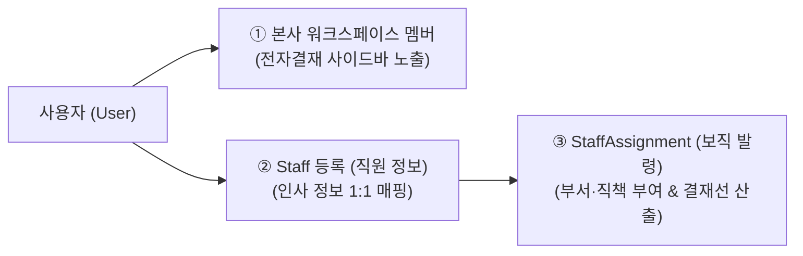
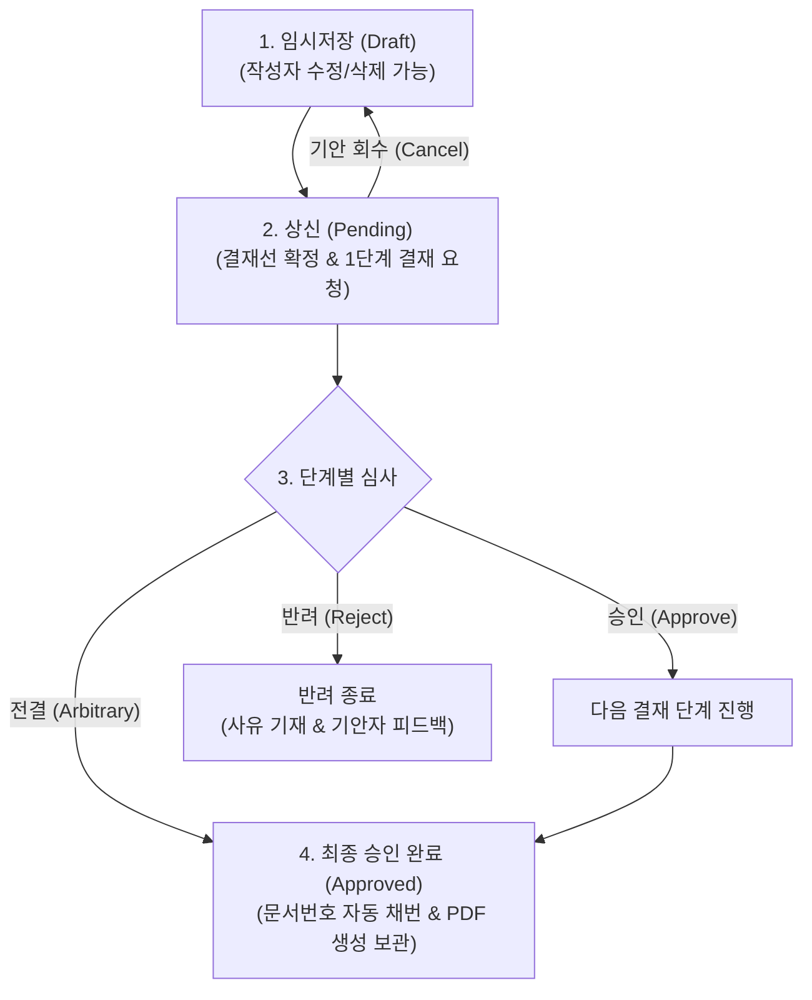

# 전자결재 시스템 개요

> **IBS 전자결재 시스템**은 기안 작성부터 부서 조직도 기반의 자동 결재선 산출, 전결 규정 평가, 다건 일괄 승인, 모바일/웹 크로스 플랫폼 결재, 공문 및 법정 효력을 갖춘 전자 서명 PDF 보관까지 원스톱으로 처리하는 통합 결재 플랫폼입니다.

## 1. 전자결재 시스템 특장점

* **조직도 기반 동적 결재선 (Route Builder)**: 수동으로 결재자를 찾을 필요 없이 기안자의 소속 부서와 직책에 따라 직속 팀장 $\to$ 본부장 $\to$ 대표이사 라인이 자동 산출됩니다.
* **금액별 조건부 전결 규칙 엔진**: 품의 금액에 따라 팀장 전결, 본부장 전결, 대표이사 결재가 실시간으로 자동 분기됩니다.
* **다건 일괄 승인 (Batch Approve)**: 결재 대기 문서가 몰리는 결재권자를 위해 웹과 모바일 앱 모두에서 체크박스를 통한 일괄 검토 및 원클릭 승인을 지원합니다.
* **17종 맞춤형 전용 양식**: 일반품의, 휴가/근태, 지출결의/구매, 계약/법무, 사업추진/프로젝트 의사결정 등 각 업무에 최적화된 서식을 제공합니다.
* **반응형 멀티 플랫폼 지원**: PC 웹 브라우저뿐만 아니라 Flutter 기반 모바일 앱에서도 실시간 결재 승인/반려/서명이 가능합니다.
* **문서 무결성 & 전자 직인 PDF**: 상신 및 승인 시점의 본문 해시(SHA-256) 검증과 회사 직인이 포함된 공식 A4 PDF를 자동 생성 및 보관합니다.

## 2. 사용자의 전자결재 이용 3대 필수 조건

일반 임직원이 전자결재 시스템을 정상적으로 이용하려면 아래 **3가지 조건**이 사전에 설정되어 있어야 합니다.

| 조건 | 구분 | 등록 모델 / 위치 | 효과 및 목적 |
| :---: | :--- | :--- | :--- |
| **1** | **본사관리 워크스페이스 멤버** | `work.Member` (워크스페이스 구분: `본사관리`) | `is_hq_staff: true` 권한 획득 $\to$ 사이드바에 `전자 결재 관리` 메뉴 노출 |
| **2** | **직원 정보 등록** | `company.Staff` (인사 관리 $\to$ 직원 정보) | 사용자 계정(`User`)과 실제 인사 정보 1:1 매핑 (직위, 입사일, 재직상태) |
| **3** | **보직/발령 등록** | `company.StaffAssignment` (직원 상세 $\to$ 보직) | 소속 부서(`Department`) 및 직책(`DutyTitle`) 부여 $\to$ 기안 보직 선택 및 결재선 추적 |

> **관리자 참고사항**:
> 신규 입사자 채용 시 위 3가지 단계를 순서대로 진행해 주셔야 하며, 부서 이동 시에는 소속 부서와 해당 부서의 책임자(`Department.manager`)가 올바르게 지정되어 있는지 확인해야 합니다.

## 3. 전자결재 기본 라이프사이클

1. **임시저장 (Draft)**: 기안 내용을 작성 중인 상태로, 본인만 조회/수정/삭제할 수 있습니다. (문서번호 미채번)
2. **상신 및 결재대기 (Pending)**: 기안자가 결재 요청을 전송한 상태로, 1단계 결재자에게 푸시 알림이 발송됩니다. (1차 결재 전까지 회수 가능)
3. **단계별 심사**: 결재자는 `승인`, `반려`, `전결`, `의견 등록`을 수행하며, 대기함에서 여러 건을 `일괄 승인`할 수 있습니다.
4. **최종 승인 (Approved)**: 최종 결재자가 승인하면 상태가 `완료`로 변경되고, 고유 문서번호(예: `BIZ-2026-0001`) 채번 및 보관용 PDF가 자동 생성됩니다.

## 4. 세부 매뉴얼 바로가기

전자결재의 세부 기능별 상세 가이드는 아래 매뉴얼을 참고하십시오.

* **[기안서 작성 가이드](/approval/draft)**: 보직 선택, 양식 작성, 첨부파일 및 결재선 미리보기
* **[조직도 결재선 산출 원리](/approval/route)**: 직속 상사 자동 추적 및 전결 규정 분기 규칙
* **[전자결재 문서함 안내](/approval/boxes)**: 대기함, 기안함, 완료함, 참조/공람함 활용법
* **[결재 처리 및 일괄 승인](/approval/action)**: 승인, 반려, 전결 및 다건 일괄 승인 실행 방법
* **[대결 및 권한 위임](/approval/delegation)**: 출장·휴가 시 부재 설정 및 대결자 지정
* **[17종 전용 서식 가이드](/approval/forms)**: 각 서식별 입력 항목 및 특화 기능
* **[전자 직인 및 PDF 보관](/approval/pdf-print)**: 공식 A4 인쇄 및 SHA-256 전자 서명 검증
