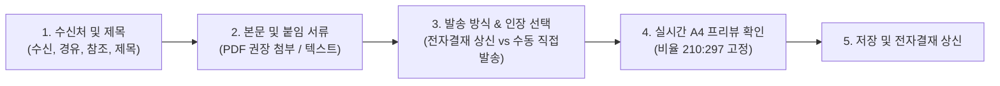

# 공문 발송 관리 (사용자 가이드)

> **공문 발송 관리**는 대외 기관, 발주처, 협력업체 등에 발신하는 공식 서한(공문서)을 표준 A4 서식으로 작성하고, 전자결재 품의 또는 직접 발송 절차를 거쳐 발송 대장에 체계적으로 등록·보관하는 시스템입니다.

- **메뉴 위치**: `전자결재 > 공문 발송 대장` (`/approval/official-letters`)
- **적용 대상**: 본사 기안자, 현장소장, 프로젝트 공무/공사 담당자 등 대외 공문 발송 업무를 수행하는 모든 사용자

## 1. 공문서 작성 및 실시간 A4 미리보기

공문 작성 화면은 왼쪽의 **입력 폼**과 오른쪽의 **실시간 A4 미리보기(Live Preview)**로 구성되어 있어, 작성 중인 문서가 실제 출력 시 어떻게 인쇄될지 즉시 확인하며 작성할 수 있습니다.

### 상단 서식 (4행 고정)
- **수 신**: 공문을 정식으로 접수하는 기관명 또는 법인명 (필수)
- **경 유**: 최종 수신처에 도달하기 전 중간에 경유하는 부서나 감리단 등 (없을 시 빈칸)
- **참 조**: 공문 내용을 참조해야 하는 직위나 부서 (예: `대표이사 귀하`, `공사담당자 앞`)
- **시행 일자**: 공문의 공식 발신 일자
- **제 목**: 공문의 핵심 내용을 간결하고 명확하게 기술 (필수)

### 본문 및 붙임(첨부) 서류
- **본문 내용**: 공문의 전문을 입력하며, 줄바꿈은 인쇄 시 그대로 반영됩니다. 문단을 구분하려면 빈 줄을 추가하십시오.
- **붙임(첨부) 방식 선택**:
  - **파일 직접 첨부 (권장)**:
    - 공문서 위변조 방지 및 수신처의 원활한 열람을 위해 **PDF 파일 형식** 첨부를 강력히 권장합니다. (필요 시 HWP, 엑셀, 이미지 등도 첨부 가능)
    - 파일별로 **붙임 명칭**(예: `사업계획서`, `설계도면`)과 **수량/부수**(예: `1부`, `1식`)를 직접 기입할 수 있습니다.
  - **텍스트 직접 입력**: 실물 서류를 인편이나 등기로 동봉하여 발송할 경우 등, 파일 없이 인쇄용 목록만 표기할 때 사용합니다.

### 발신 명의 및 인장(직인) 선택
- **전자결재 상신 발송**: 결재선 승인 완료 시 결재선의 기안자, 검토자, 최종 결재권자(대표이사/임원)의 직위와 성명이 공문서 하단 결재란에 자동으로 표기됩니다.
- **수동(직접) 발송**: 전자결재 없이 직접 발송하는 공문으로, 기안/담당자명, 담당 직위, 부서를 직접 입력합니다.
- **날인 인감(직인) 선택**:
  - `등록된 회사 인장 (전자날인)`: 선택 시 인장 이미지가 PDF에 자동 합성되어 출력됩니다.
  - `인장 미선택 / (직인생략 / 출력 후 실물날인)`: 일반 안내문 등 직인을 생략하거나, 출력 후 실물 인감을 직접 날인하여 발송할 때 선택합니다.

## 2. 전자결재 상신 및 승인 흐름

공문 작성 완료 후 **[전자결재 상신]** 버튼을 클릭하면, 공문 발송 품의서가 전자결재 시스템으로 자동 접수됩니다.

- **인장별 전결 규정 자동 연동**:
  - **대표이사 법인인감** 선택 시: 최종 승인권자가 반드시 대표이사로 구성됩니다.
  - **현장소장 직인/부서인감** 선택 시: 사전 등록된 인장 규정에 따라 현장소장/부서장 선에서 전결 승인 처리가 가능합니다.
- **최종 승인 완료**: 전자결재가 최종 승인되면 공식 문서번호가 확정 채번되며, 시스템 공식 PDF가 생성됩니다.

## 3. 공문 발송 및 PDF(스캔본) 증빙 관리 정책

공문이 승인되거나 발송 준비가 완료된 후 대외 발송을 처리하고 증빙을 보관하는 기준입니다.

### 전자 직인 PDF vs 실물 날인 스캔본 PDF
| 발송 방식 | 발송 및 증빙 처리 절차 |
| :--- | :--- |
| **이메일 / 전자팩스 발송** | 시스템에서 자동 생성된 전자 직인 PDF를 다운로드하여 상대방에게 전송하고, 해당 PDF를 시스템에 최종 발송본으로 유지합니다. |
| **등기우편 / 인편 직접 교부 (실물 날인)** | 인장을 미선택하여 출력한 후 **실물 도장을 직접 날인**하여 발송합니다. 발송 후 **실물 날인된 종이를 스캔(PDF)**하여 공문 상세 화면에서 `[실물날인 스캔본(PDF) 업로드/교체]` 기능을 통해 등록합니다. |

### ⚠️ 발송 완료 후 증빙 보호 정책 (중요)
- **발송 완료 처리**: 등기번호, 발송방법(이메일, 등기, 인편 등), 발송완료일시를 등록하면 공문이 **발송 완료** 상태로 전환됩니다.
- **PDF 재생성 전면 금지**:
  - 발송 완료된 공문서는 법적 대항력 및 증빙 무결성 유지를 위해 **수퍼유저를 포함하여 시스템 PDF 재생성이 무조건 전면 금지**됩니다.
  - 이를 통해 이미 실제 발송된 스캔본 증빙이 실수로 시스템 기본 양식으로 덮어씌워져 유실되는 참사를 원천 차단합니다.
- **스캔본 사후 교체 권한**:
  - 발송 완료 후 스캔본을 보완하거나 교체해야 하는 경우, 데이터 보호를 위해 **관리자(슈퍼유저/워크매니저)**만 교체할 수 있습니다.
