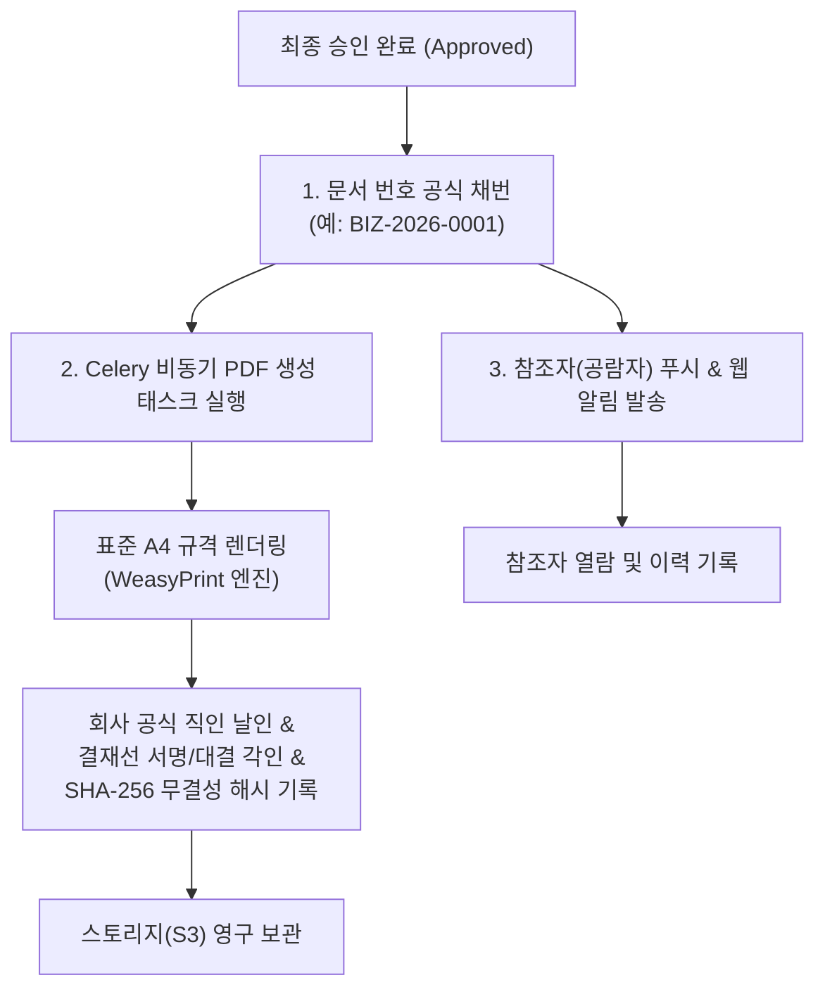

# 공람 및 PDF 전자 직인 출력 (Print & PDF)

> **IBS 전자결재 PDF 시스템**은 최종 승인된 문서에 대해 법적 증빙 효력을 갖춘 표준 A4 규격의 **공식 전자 직인 PDF**를 자동 생성하여 영구 보관하며, 참조자 공람 및 멀티 플랫폼 출력을 지원합니다.

## 1. 승인 완료 후 PDF 생성 및 공람 프로세스

## 2. 공식 전자 직인 PDF의 6대 구성 요소

생성된 PDF 문서는 사내 감사, 회계 결산 증빙 및 대외 관공서/거래처 제출용 공식 문서로 사용할 수 있습니다.

1. **공문서 표준 헤더**: 고유 문서 번호, 기안 부서, 기안자 직위/성명, 상신 일시, 최종 승인 일시, 보안 등급(1/2/3등급).
2. **전자 결재란 (서명 타임라인)**:
   * 기안자부터 중간 검토자, 전결권자, 대표이사까지 모든 결재자의 직책, 성명, 전자 서명/도장 이미지 각인.
   * 각 결재자의 승인 일시(`YYYY.MM.DD HH:MM`) 표기.
   * 대결 처리된 경우 **`[대결: 홍길동 (원 결재자: 김팀장)]`** 투명 표기.
3. **표준 본문 서식**: 17종 전용 서식에 맞춘 표, 품목별 공급가액/부가세 계산 그리드, 본문 내용 정밀 렌더링.
4. **증빙 첨부파일 목록**: 첨부된 증빙 파일명 목록 및 용량 표기.
5. **회사 공식 직인 (Company Seal)**: 대표이사 승인 및 전결 완료 시 회사 공식 직인 자동 날인.
6. **위변조 방지 해시 (Integrity Hash)**: 문서 상신 및 최종 승인 시점의 본문 데이터 무결성을 보증하는 **SHA-256 고유 해시값** 각인.

## 3. 공람 (참조자 열람 확인)

기안자가 작성 시 참조자로 지정한 임직원은 최종 승인 완료 후 문서를 공람합니다.

* **실시간 공람 알림**: 최종 승인 즉시 참조자들에게 `[결재 공람]` 푸시 알림 및 인앱 알림이 자동 발송됩니다.
* **열람 이력 추적**: 참조자가 문서를 조회하면 최초 열람 일시가 감사 로그에 안전하게 기록됩니다.
* **공람함 조회**: 참조 지정된 문서는 별도 필터링을 통해 언제든지 열람할 수 있습니다.

## 4. 웹 및 모바일 출력/다운로드 방법

### PC 웹 브라우저
1. **`결재 문서함`** 또는 **`기안 문서함`**에서 최종 승인된 문서를 클릭하여 상세 화면으로 이동합니다.
2. 우측 상단의 **`[PDF 다운로드]`** 또는 **`[인쇄]`** 버튼을 클릭합니다.
3. 브라우저 인쇄 창(`Ctrl+P` / `Cmd+P`)에서 용지 규격 'A4'로 즉시 출력하거나 PDF 파일로 저장할 수 있습니다.

### 모바일 앱 (Flutter)
1. 문서 상세 화면 하단의 **`[PDF 보기]`**를 탭합니다.
2. 앱 내 인라인 뷰어에서 확대/축소하여 문서를 검토할 수 있습니다.
3. 상단 공유 아이콘을 통해 모바일 무선 인쇄(AirPrint/Mopria)를 실행하거나, 이메일/메신저로 PDF 원본 파일을 공유할 수 있습니다.
