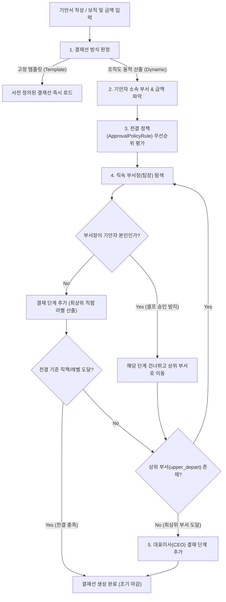

# 자동 결재선 및 전결 규칙 (Route Builder)

> **IBS 전자결재 시스템**은 부서 조직도 계층 구조와 회사의 전결 규정을 바탕으로 **최적의 결재 라인을 실시간으로 자동 산출(Route Builder)**하며, 예외 없는 셀프 결재 방지 및 직함 승격 알고리즘을 지원합니다.

## 1. 결재선 산출 흐름 및 알고리즘

### 4대 핵심 탐색 원리
1. **기안 보직(`StaffAssignment`) 출발**: 기안자가 복수 부서 겸직 중인 경우 선택한 보직의 부서에서부터 탐색을 시작합니다.
2. **셀프 승인 원천 방지 (Self-Approval Guard)**: 부서의 책임자가 기안자 본인인 경우, 결재선에 본인을 추가하지 않고 상위 부서(본부장, 실장)로 자동 건너뜁니다.
3. **최상위 직함 자동 승격 (Highest Role Promotion)**: 동일 인물이 팀장과 대표이사를 겸직하는 경우 결재 단계를 중복 생성하지 않고 단일 단계로 압축하며, 라벨을 **'대표이사 최종 승인'**으로 자동 승격 표기합니다.
4. **상위 부서(`upper_depart`) 재귀 순회**: 부서 레벨을 따라 본부장 $\to$ 총괄 부서장을 순차적으로 탐색합니다.

## 2. 금액별 조건부 전결 규칙 (Approval Policy Rule)

회사의 전결 위임 규정에 따라 특정 금액 이하의 품의는 대표이사까지 가지 않고 **팀장 또는 본부장 선에서 최종 전결**되도록 규칙을 설정할 수 있습니다.

### 전결 규칙 매칭 구조
* 시스템은 본문에 입력된 금액(`amount`, `total_cost`, `contract_amount` 등)을 실시간 추출합니다.
* 등록된 전결 규칙 중 우선순위(`priority`)가 가장 높은 매칭 규칙 1건을 즉시 적용합니다.
* 전결 조건에 해당하는 결재 단계에 도달하는 즉시 상위 부서 탐색을 종료하고 결재선을 단축합니다.

| 문서 유형 | 품의 금액 조건 | 최종 전결권자 | 시스템 동작 |
| :--- | :--- | :--- | :--- |
| **일반 업무 품의서** | 100만 원 이하 | `직속 팀장` 전결 | 팀장 승인 즉시 최종 완료 |
| **구매 품의서** | 1,000만 원 이하 | `소속 본부장` 전결 | 본부장 승인 즉시 최종 완료 |
| **지출 결의서** | 1,000만 원 초과 | `대표이사` 최종 승인 | 대표이사까지 필수 상신 |

> **실시간 디바운스 반영**:
> 기안자가 입력 폼에서 금액을 `500,000`원으로 입력하는 즉시 우측 결재선 프리뷰에 **"팀장 전결"**로 라인이 실시간 축소 표시됩니다.

## 3. 대표권 구분 및 특수 결재 처리

법인 등기 임원(`Executive`) 정보 및 대표권 형태에 따라 최종 결재선이 다르게 구성됩니다.

* **단독대표 (`sole`)**: 대표이사 1인이 최종 결재권자로 지정됩니다.
* **각자대표 (`each`)**: 복수 대표이사가 결재선에 포함되며, 이 중 **1인이 승인하면 즉시 전체 완료** 처리됩니다. (`OR` 조건)
* **공동대표 (`joint`)**: 등록된 **공동대표 전원이 모두 승인**해야 최종 완료 처리됩니다. (`AND` 조건)
* **대표이사 본인 기안**: 대표이사가 직접 기안한 문서는 상위 결재선이 존재하지 않으므로, 상신 즉시 `최종 승인` 및 채번 처리됩니다. (공동대표가 있는 경우 다른 공동대표의 승인 진행)

## 4. 고정 템플릿 결재선 (Route Template)

조직도 계층과 무관하게 법적/제도적으로 결재 순서가 고정된 양식의 경우:
* 관리자가 사전 정의한 고정 템플릿 결재선(`ROUTE_TEMPLATE`)을 적용합니다.
* 예: 주주총회 소집 품의 (기안자 $\to$ 법무팀장 $\to$ CFO $\to$ 대표이사 고정 순서)
