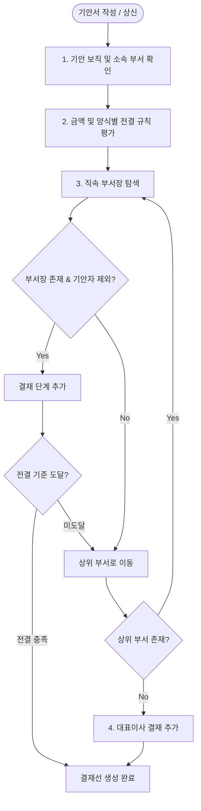

# 자동 결재선 및 전결 규칙

IBS 전자결재 시스템은 조직도 구조와 회사의 전결 규정을 바탕으로 **최적의 결재 라인을 실시간으로 자동 산출(Route Builder)**합니다.

## 1. 결재선 자동 생성 흐름

### 탐색 알고리즘 원리
1. **기안자 소속 부서(`Department`) 확인**: 기안자가 선택한 보직(`StaffAssignment`)의 소속 부서에서 출발합니다.
2. **직속 부서장(`Department.manager`) 추가**: 해당 부서의 책임자가 기안자 본인이 아닌 경우 1차 결재자로 지정합니다.
3. **상위 부서(`upper_depart`) 재귀 탐색**: 부서의 레벨을 따라 상위 본부장, 총괄 부서장을 순차적으로 결재 단계에 추가합니다.
4. **대표이사(`CEO`) 최종 승인**: 전결 규정에 의해 중간에 종료되지 않은 경우 회사의 대표이사 단계가 최종 결재자로 지정됩니다.

## 2. 금액별 조건부 전결 규칙 (Approval Policy Rule)

회사의 전결 위임 규정에 따라 특정 금액 이하의 품의는 대표이사까지 가지 않고 **팀장 또는 본부장 선에서 최종 전결**되도록 규칙을 설정할 수 있습니다.

### 전결 규칙 예시
| 문서 유형 | 품의 금액 조건 | 최종 결재자 (전결권자) | 비고 |
| :--- | :--- | :--- | :--- |
| **일반 품의서** | 100만 원 이하 | `직속 팀장` 전결 | 팀장 승인 즉시 최종 완료 |
| **구매 품의서** | 1,000만 원 이하 | `소속 본부장` 전결 | 본부장 승인 시 완료 |
| **지출 결의서** | 1,000만 원 초과 | `대표이사` 최종 승인 | 대표이사까지 필수 상신 |

> **시스템 동작**:
> 기안자가 본문에 금액(예: `500,000원`)을 입력하면 Route Builder가 이를 감지하여 결재선 미리보기에 **"팀장 전결"**로 라인을 단축하여 표출합니다.

## 3. 대표권 구분 및 특수 결재 처리

- **단독대표 / 각자대표**: 대표이사 중 1인이 승인하면 즉시 완료 처리됩니다. (`OR` 조건)
- **공동대표**: 등록된 공동대표 전원이 승인해야 최종 완료됩니다. (`AND` 조건)
- **대표이사 본인 기안**: 대표이사가 직접 기안한 문서는 별도 승인 단계 없이 상신 즉시 `최종 승인` 및 채번 처리됩니다.
- **겸직 임원의 직함 승격**: 팀장과 대표이사를 겸직하는 임원이 결재선에 포함될 경우 라벨이 '팀장' 대신 **'대표이사 최종 승인'**으로 자동 승격되어 단일 단계로 최적화됩니다.
