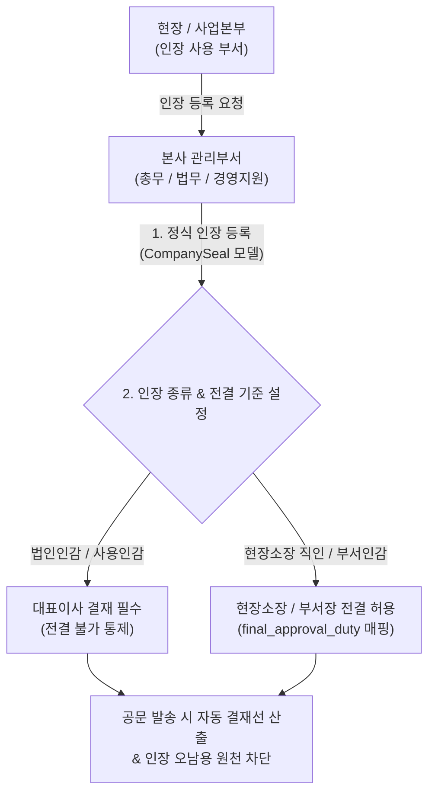

# 회사 인장 및 전결선 관리 (관리부서 가이드)

> **회사 인장 관리**는 본사 관리부서(경영지원본부, 총무팀, 법무팀 등)가 법인인감, 사용인감, 현장소장 직인, 전결권자 서명 등을 시스템에 정식 등록하고, 각 인장별 **허용 전결 자격(결재 규정)**을 사전에 설정하여 인장 오남용과 권한 월권을 원천 통제하는 관리자 전용 기능입니다.

- **관리 위치**: 
  - Django Admin 백오피스: `01. 회사 및 조직 관리 > 03. 회사 인장` (`/admin/company/companyseal/`)
  - 또는 `회사 정보` 상세 페이지 내 `회사 인장 (CompanySeal)` 인라인 목록
- **관리 주체**: 본사 인장 관리 부서 담당자, 최고 관리자 (`is_superuser`, `is_staff`)

## 1. 인장 관리 아키텍처 및 통제 원칙

회사의 도장과 서명은 대외적인 법적 권리의무를 발생시키는 핵심 자산이므로, 일반 사용자가 임의로 등록할 수 없으며 **관리부서의 정식 등록 절차를 통해서만 시스템에 편입**됩니다.

## 2. 인장 등록 시 필수 입력 항목 가이드

| 필드명 | 영문 필드 | 설명 및 설정 기준 |
| :--- | :--- | :--- |
| **회사** | `company` | 해당 인장이 귀속되는 소속 법인 선택 |
| **인장 종류** | `seal_type` | • `CORP_SEAL`: 법인인감 (대표이사 직인) • `USAGE_SEAL`: 사용인감 (토지매입/분양계약 전용 등) • `DEPT_SEAL`: 부서인감 / 현장 직인 • `OMIT`: 직인생략 |
| **인장 명칭** | `name` | 사용자가 쉽게 식별할 수 있는 명칭 (예: `대표이사 법인인감`, `토지매매계약 전용 사용인감 1호`) |
| **지정 용도/범위** | `purpose` | 해당 인장의 사용 범위 (예: `고성 아야진 토지매매계약 체결 전용`, `분양계약 및 옵션 전용`) |
| **인장 이미지** | `seal_image` | **배경이 투명한 PNG 형식(정방형 비율)** 권장 (PDF 인쇄 시 문서 배경과 자연스럽게 합성됨) |
| **보관 구분** | `custody_type` | • `internal`: 사내 보관 (본사 금고/현장) • `external`: 외부 교부 (토지용역사, 분양대행사, 법무사 등) |
| **실물 보관처/수임자**| `custodian` | 실물 도장 보관처 및 수임자 (예: `본사 재경팀 금고`, `(주)고성개발컨설팅 김실장`) |
| **사내 총괄 관리자**| `internal_manager` | 외부 교부 시에도 본사에서 교부/회수를 책임지는 내부 관리자 (`Staff`) |
| **유효/만료 기한** | `valid_from` / `valid_until` | 외부 용역 계약 기간에 따른 인감 교부 및 회수 예정 기한 |
| **전결 직책 자격** | `final_approval_duty` | **🌟 핵심 통제 필드**: 이 인장이 날인되기 위해 필요한 **최소 최종 전결 직책** 지정 • `현장소장`/`팀장`: 현장소장 승인으로 결재 종결 가능 • `미지정(빈칸)`: 대표이사까지 결재선이 반드시 상신됨 |
| **전결 부서 레벨** | `final_dept_level` | 예: `1`로 설정 시 본부장(1레벨) 승인으로 결재 종결 가능 |
| **사용 여부** | `is_active` | 폐기되거나 분실/회수된 인장은 체크 해제하여 사용 중단 처리 |

## 3. 현장소장 전결 공문 vs 대표이사 승인 공문 분기 메커니즘

단일한 공문서 양식(`OFFICIAL_LETTER`) 내에서도 관리부서가 지정한 인장의 전결 기준에 따라 결재선이 지능적으로 자동 분기됩니다:

### 1) 대표이사 법인인감 (`CORP_SEAL`) 등록 시
- `final_approval_duty`: **미지정(빈칸)**으로 보관
- **동작**: 기안자가 해당 인장을 선택하면 시스템은 자동으로 대표이사까지 결재선을 연결하며, **대표이사 최종 승인이 떨어지기 전에는 인장이 날인되지 않습니다.**

### 2) 현장소장 직인 / 부서장 직인 (`DEPT_SEAL`) 등록 시
- `final_approval_duty`: **`현장소장`** (또는 `팀장`, `본부장` 등 전결 가능 직책)으로 지정
- **동작**: 공문 작성자가 이 인장을 선택하여 상신하면, 결재선이 해당 현장소장 단계에서 자동으로 종결(전결)되어 대표이사에게 올라가지 않고 신속하게 처리됩니다.

## 4. 관리부서 실무 유의사항

1. **실물 인감 날인 스캔본 관리**:
   - 대외 기관 제출용으로 출력 후 실물 도장을 직접 찍어 발송하는 경우, 공문서의 인장은 `인장 미선택 / (직인생략 / 출력 후 실물날인)`으로 기안하도록 안내하십시오.
   - 발송 후에는 반드시 실제 날인된 종이를 스캔하여 **스캔본(PDF)으로 업로드**하도록 지도해야 대장 보존 무결성이 확보됩니다.
2. **발송 완료 후 증빙 보호**:
   - 발송이 완료된 공문서는 어떠한 경우에도 시스템 PDF 재생성(템플릿 덮어쓰기)이 차단됩니다.
   - 이미 발송된 공문의 스캔본을 불가피하게 교체해야 할 때는 일반 사용자 권한으로는 불가능하며, **관리부서(슈퍼유저/워크매니저)**가 내용 확인 후 직접 교체 처리해야 합니다.
