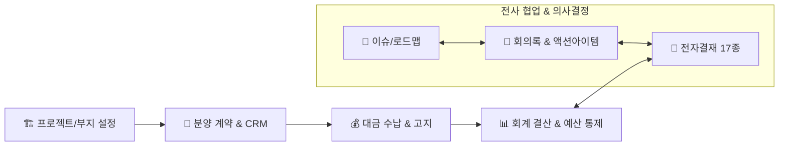

# IBS 워크스페이스 소개

> **IBS (Intelligent Business System) 워크스페이스**는 부동산 개발사업의 전 생애주기에서 발생하는 자금, 계약, 고객, 부지, 회계, 전자결재, 소송 등 핵심 데이터를 통합 관리하고
> 협업하는 **디벨로퍼를 위한 지능형 업무 플랫폼**입니다.

글로벌 협업 표준인 **레드마인 (Redmine)** 엔진과 체계적인 **데이터 파이프라인**을 결합하여, 단순한 데이터 기록을 넘어 모든 업무와 의사결정을 유기적으로 연결하고 자산화합니다.

## 시스템 핵심 아키텍처

IBS는 독립된 업무 영역을 하나의 맥락으로 연결하여 데이터 무결성과 신속한 의사결정을 지원합니다.

## 왜 IBS 워크스페이스인가?

- **친숙하고 강력한 협업 환경** - 레드마인 기반의 이슈 트래킹 및 회의록 연동으로 업무의 생성부터 완료까지 체계적으로 관리합니다.
- **도메인 결합형 통합 데이터 관리** - 부지, 상품, 계약, 수납, 회계가 단일 데이터 파이프라인으로 연결되어 데이터 불일치와 누락을 원천 차단합니다.
- **의사결정의 지식 자산화** - 회의 의제, 결정 사항, 전자결재 품의 이력이 실제 업무 (Issue)와 연결되어 조직의 영구적인 지식 자산으로 축적됩니다.
- **신속한 경영 의사결정** - 실시간 대시보드를 통해 사업 수지, 자금 현황, 리스크를 한눈에 파악하고 선제적으로 대응할 수 있습니다.

## 주요 기능 및 매뉴얼 안내

### 🎯 1. 업무 관리 및 협업 (Redmine Engine)

* **[워크스페이스](/work-manage/workspace)**: 전사, 본사 부서, 프로젝트 단위 협업 공간 구성
* **[회의록 관리](/work-manage/meeting)**: 회의 의제, 결정 사항, 후속 조치 (Action Item) 연동 자산화
* **[업무 및 로드맵](/work-manage/issue)**: 로드맵, 사용자 맞춤형 업무 할당 및 이력 추적
* **[캘린더 & 게시판](/work-manage/calendar)**: 마일스톤 일정 공유 및 부서 간 소통 포럼

### 📑 2. 전자결재 시스템 (Approval)

* **[기안 작성 및 17종 양식](/approval/draft)**: 일반품의, 지출결의, 계약/법무 등 최적화된 서식 제공
* **[자동 결재선 및 전결 규칙](/approval/route)**: 부서 조직도 기반 결재선 자동 산출 및 금액별 전결 처리
* **[결재 처리 및 위임](/approval/action)**: 웹/모바일 승인·반려 및 대결 (위임) 관리
* **[문서함 및 전자직인 PDF](/approval/boxes)**: 문서번호 자동 채번, 공람 및 법적 효력의 공식 PDF 출력

### 🏗️ 3. 사업지 및 마스터플랜 설정

* **[프로젝트 등록 및 설정](/project/)**: 프로젝트 기본 정보 및 기초 데이터 설정 관리
* **[상품 및 유닛 구성](/project/units)**: 동·호수 배치, 유닛 차수, 타입 및 층별 공급가 관리
* **[부지 정보 관리](/project/site-manage)**: 필지별 토지 소유 현황, 토지주 상담 및 매입 계약 관리

### 🤝 4. 분양 계약 및 고객 관리 (CRM)

* **[계약 등록 및 상세](/contract/)**: 계약자 정보 통합 관리 및 옵션 계약 관리
* **[동·호수 배치 현황](/contract/status)**: 분양 상태 시각화 및 분양률 실시간 집계
* **[계약 변경 관리](/contract/release)**: 권리의무 승계, 계약 해제 및 부적격자 처리

### 💰 5. 대금 수납 및 고객 고지

* **[수납 처리 및 집계](/payment/)**: 회차별 납부 일정, 입금 매칭, 연체료 자동 계산
* **[수납 고지서 및 SMS](/notice/bill)**: 맞춤형 수납 고지서 출력 및 알림 문자 발송

### 📊 6. 회계 자금 관리 및 사업 수지

* **[자금 출납 및 정산](/ledger/status)**: 계좌별 거래 내역, 본사/프로젝트 운영비 관리
* **[예산 통제 및 수지 분석](/project/budgets)**: 예산 대비 실제 집행 실적 (Actuals) 실시간 비교 및 캐시플로우 분석

### ⚖️ 7. 문서 보관소 및 소송 관리

* **[일반 문서 관리](/document/)**: 프로젝트별 중요 인허가 및 공문서 통합 보관
* **[소송 사건 관리](/document/legal-case)**: 소송 사건별 기일 관리, 판결 및 분쟁 처리 히스토리 관리

## IBS의 의미 및 지향점

* **IBS (Intelligent Business System)**: 단순한 데이터 기록 프로그램을 넘어, 비즈니스 데이터와 사람의 협업을 연결하는 지능형 업무 플랫폼을 의미합니다.
* **우리의 지향점**: 반복적인 수기 관리 업무를 자동화하여, 디벨로퍼와 본사 임직원이 사업의 본질인 **기획, 분석, 그리고 최선의 의사결정**에 집중할 수 있는 환경을 만들어 갑니다.

## 빠른 시작

* 처음 방문하셨다면 **[시작하기 가이드](/intro/getting-started)**를 통해 초기 설정 및 기본 사용법을 확인하세요.
* 프로젝트 현황을 한눈에 파악하는 방법은 **[대시보드 가이드](/intro/dashboard)**를 참고하세요.
