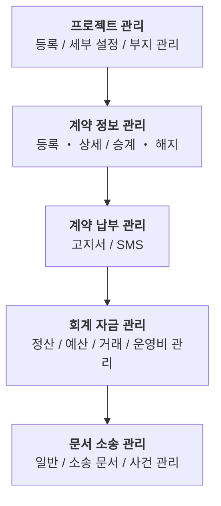

# 시작하기

> IBS Platform은 부동산 개발 프로젝트의 자금, 계약, 고객, 문서, 소송 데이터를 통합 관리하는 시스템입니다.
> 이 문서는 신규 사용자가 IBS Platform에 접속하고 기본적인 업무를 시작할 수 있도록 안내합니다.

## 이 문서의 대상

이 문서는 다음 사용자를 대상으로 합니다.

- 신규 입사자
- 프로젝트 담당자
- 회계 및 자금 담당자
- 시스템 관리자

## IBS Platform 한눈에 보기

### IBS의 역할

IBS Platform은 부동산 개발사업의 전 과정에서 발생하는 데이터를 하나의 시스템에서 통합 관리합니다.

### 주요 기능

- 프로젝트 기본 정보 설정
- 토지 매입 계약 관리
- 분양 및 임대 계약 관리
- 고객 및 수납 관리
- 일반 회계 및 자금 관리
- 예산 대비 실적 분석
- 문서 및 소송 관리

## 시스템 접속

### 접속 주소

> [https://ibs.dyibs.com](https://ibs.dyibs.com)

### 계정 생성 및 로그인

시스템 계정을 확보하고 접속하는 방법은 다음 두 가지가 있습니다.

#### 방법 1: 사용자 직접 가입 후 권한 요청

1. **직접 가입**: 접속 화면에서 본인이 직접 아이디와 비밀번호를 설정하여 가입을 진행합니다.
2. **계정 생성코드 입력**: 무분별한 가입 방지를 위해 가입 시 아래의 **계정 생성코드(Register Code)**를 반드시 입력해야 합니다.
    - **계정 생성코드: `dyibs-staff`**
    - *주의: 계정 생성코드는 사내 보안 사항이므로 외부 유출에 주의하시기 바랍니다.*
3. **권한 요청**: 가입 완료 후 시스템 관리자에게 해당 계정에 대한 서비스 접속 권한 승인을 요청합니다.

#### 방법 2: 관리자를 통한 계정 생성

1. **정보 제공**: 관리자에게 이메일 등 계정 생성에 필요한 정보를 제공합니다.
2. **계정 수령**: 관리자가 계정을 생성한 후 초기 비밀번호를 부여합니다.
3. **비밀번호 변경**: 부여받은 초기 비밀번호로 로그인한 후, 반드시 본인의 비밀번호로 변경하여 사용합니다.

### 비밀번호 변경

보안을 위해 최초 로그인 후 또는 관리자로부터 계정을 부여받은 후에는 반드시 비밀번호를 변경해야 합니다.

### 권한 신청

메뉴가 보이지 않거나 접근 권한이 없는 경우 시스템 관리자에게 권한을 요청합니다.

## 권장 사용 환경

### 브라우저

- Google Chrome (권장)
- Microsoft Edge

### 화면 해상도

- 최소 1920 * 1080

### 브라우저 설정

- 팝업 허용
- 쿠키 허용
- 다운로드 차단 해제

## 시스템 구성

### 기술 스택

| 구분             | 구성                    
|----------------|-----------------------
| Frontend       | Vue 3                 
| Backend        | Django REST Framework 
| Database       | PostgreSQL            
| Infrastructure | Kubernetes            
| Deployment     | Helm                  

## 화면 구성

## 업무 시작 순서

신규 프로젝트를 시작할 때는 일반적으로 다음 순서로 진행합니다.

### 1. 프로젝트 등록

- 프로젝트명
- 사업 유형
- 시행 기간
- 기본 정보 입력

### 2. 차수 타입 설정

- 계약 그룹
- 유닛 타입
- 층별 타입

### 2. 유닛 정보 등록

- 동 등록
- 호수 등록

### 2. 예산 정보 등록

- 수입 예산 등록
- 지출 예산 등록

### 3. 분양 조건 설정

- 납부 회차 등록
- 공급가 등록
- 계약금 등록
- 구비 서류 등록
- 옵션 품목 등록

### 4. 부지 정보 등록

- 부지 목록
- 소유자
- 계약 정보

### 5. 계약 등록

- 고객 정보
- 계약 정보
- 유닛 매칭

### 6. 수납 및 회계 처리

- 고객 납부 등록
- 입출금 등록
- 전표 생성

### 7. 문서 소송 관리

- 일반 문서 등록
- 소송 사건 등록
- 소송 문서 등록

### 8. 예산 및 보고서 확인

- 예산 대비 실적
- 계약 현황
- 자금 현황

## 빠른 시작 체크리스트

### 신규 프로젝트 생성

- [프로젝트 등록 가이드](/project/)

### 계약 진행

- [계약 등록 조회](/contract/)

## 사용자 권한

| 역할      | 주요 권한        
|---------|--------------
| 시스템 관리자 | 전체 관리        
| 사업관리 담당 | 프로젝트, 계약, 수납 
| 회계 담당   | 입출금, 예산      
| 임원      | 조회 및 보고서     

## 자주 묻는 질문

### 로그인이 되지 않습니다.

- 아이디/비밀번호 확인
- 계정 잠금 여부 확인
- 시스템 관리자 문의

### 메뉴가 보이지 않습니다.

- 권한 미부여 가능성

### 엑셀 다운로드가 되지 않습니다.

- 브라우저 팝업 차단 확인

## 도움 요청

### 시스템 관리자

- IT·디지털혁신팀

### 문의 유형

- 계정 생성 및 권한 요청
- 오류 신고
- 기능 개선 요청

### 요청 시 포함 사항

- 프로젝트명
- 메뉴명
- 오류 내용
- 화면 캡처

## 관련 문서

### 사용자 매뉴얼

- 프로젝트 관리
- 계약 관리
- 수납 관리
- 예산 관리
- 문서 관리

### 관리자 매뉴얼

- 사용자 권한 관리
- 코드 관리
- 설정 관리

### DevOps 매뉴얼

- 시스템 아키텍처
- Kubernetes 운영
- Helm 배포
- PostgreSQL 백업 및 복원

## 다음 단계

처음 사용하는 경우 아래 순서로 문서를 읽는 것을 권장합니다.

1. 프로젝트 관리
2. 계약 관리
3. 수납 관리
4. 예산 관리
5. 보고서

IBS Platform은 반복적인 관리 업무를 줄이고, 더 나은 의사결정에 집중할 수 있도록 돕는 부동산 개발 운영 플랫폼입니다.