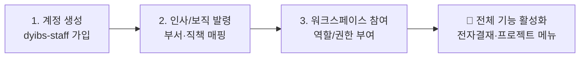

# IBS 워크스페이스 시작하기

> **IBS(Intelligent Business System)**는 부동산 개발사업의 전 과정을 '업무(Issue)'와 '데이터 파이프라인' 중심으로 관리하고 협업하는 디벨로퍼 전용 업무 플랫폼입니다.
> 
> 이 문서는 신규 사용자가 시스템에 접속하여 계정을 설정하고, 팀 워크스페이스에 참여하여 첫 업무를 시작하는 온보딩 과정을 안내합니다.

## 대상 사용자

* **개발/사업관리 실무자** - 부지 매입, 인허가, 공정 및 외주 협력사 관리
* **분양/영업 담당자** - 동호수 배치, 분양 계약 등록, 권리의무 승계 및 해약 관리
* **수납/재무 담당자** - 회차별 대금 수납, 연체료 계산, 자금 출납 및 사업 수지 분석
* **임원 및 의사결정자** - 전자결재 승인, 실시간 대시보드 및 지표 모니터링

## 시스템 접속 및 온보딩 3단계

IBS를 정상적으로 이용하기 위해서는 계정 생성 후 관리자의 **인사 정보 및 워크스페이스 권한 부여**가 필요합니다.


```mermaid
flowchart LR
    A[1. 계정 생성<br>dyibs-staff 가입] --> B[2. 인사/보직 발령<br>부서·직책 매핑]
    B --> C[3. 워크스페이스 참여<br>역할/권한 부여]
    C --> D[🚀 전체 기능 활성화<br>전자결재·프로젝트 메뉴]
```

### 1단계: 계정 생성 (회원 가입)
* **접속 주소**: [https://ibs.dyibs.com](https://ibs.dyibs.com)
* 메인 화면의 **[회원가입]** 링크를 클릭하여 아이디와 비밀번호를 등록합니다.
* 가입 시 사내 보안 코드인 **계정 생성코드 (`dyibs-staff`)**를 반드시 입력해야 합니다.

### 2단계: 인사 정보 등록 및 보직 발령 (관리자)
* 시스템 관리자가 **[인사 관리]**에서 사용자 계정과 실제 직원 정보(`Staff`)를 연결합니다.
* 소속 부서와 직책(`StaffAssignment`)을 지정받으면 **[전자결재 시스템](/approval/)의 기안 양식 로드 및 자동 결재선 산출**이 활성화됩니다.

### 3단계: 워크스페이스 초대 및 권한 부여 (관리자)
* 참여할 워크스페이스(본사 관리, 프로젝트 등)에 구성원(`Member`)으로 초대되고 역할(`Role`)을 부여받습니다.
* 권한 승인이 완료되면 사이드바에서 담당 프로젝트의 모든 실무 메뉴가 활성화됩니다.

## 기본 화면 구성 (UI Overview)

로그인 후 마주치는 화면은 크게 3개의 핵심 영역으로 구성되어 있습니다.

```
┌────────────────────────────────────────────────────────────────────────┐
│ [로고]  [회사/프로젝트 선택 ▼]              [🔔 알림] [🌓 테마] [내 프로필] │  ◀ 상단 헤더 바
├──────────────┬─────────────────────────────────────────────────────────┤
│ 📂 워크스페이스│ 📊 대시보드 (Dashboard)                                 │
│ 📑 전자결재    │                                                         │
│ 🏢 프로젝트관리│  ┌───────────────┐ ┌───────────────┐ ┌───────────────┐  │  ◀ 메인 작업 뷰
│ ⚙️ 관리자설정  │  │   내 업무     │ │   회의록    │ │ 분양/수납 현황│  │
│              │  └───────────────┘ └───────────────┘ └───────────────┘  │
│              │                                                         │
│ ◀ 좌측 사이드바│                                                         │
└──────────────┴─────────────────────────────────────────────────────────┘
```

1. **상단 헤더 바 (Header Bar)**:
   * **회사/프로젝트 선택기**: 작업 대상 회사 및 프로젝트를 원클릭으로 전환
   * **알림 (Notice)**: 나에게 할당된 이슈 변경, 결재 요청, 공지사항 알림
   * **테마 및 사용자 메뉴**: 라이트/다크 테마 전환 및 내 정보 수정
2. **좌측 사이드바 (Navigation Drawer)**:
   * **워크스페이스**: 업무(Issue), 회의록, 로드맵, 캘린더, 문서, 게시판
   * **전자결재**: 기안 작성(17종), 결재 대기/진행함, 완료/공람 문서함
   * **프로젝트 관리**: 부지 관리, 유닛 설정, 계약 관리, 대금 수납, 회계 자금, 소송 관리
3. **메인 작업 뷰 (Main View)**:
   * 개인 맞춤형 위젯 기반의 [대시보드](/intro/dashboard) 및 선택한 메뉴의 상세 업무 화면이 표시됩니다.

## 신규 프로젝트 초기 데이터 구축 5단계

새로운 사업지나 워크스페이스를 구축할 때는 다음 순서로 데이터를 설정하는 것을 권장합니다.

### 1단계: [프로젝트 기본 정보 등록](/project/)
* 사업명, 사업 형태(일반분양, 조합 등), 위치, 사업 기간 등 프로젝트 마스터 정보를 설정합니다.

### 2단계: [상품 및 유닛 구성](/project/units)
* 분양 대상 동·호수 배치와 타입별 전용/공급 면적, 층별 분양가를 등록합니다.

### 3단계: [분양 조건 및 예산 편성](/project/settings)
* 계약 회차별 납부 비율(계약금, 중도금, 잔금)과 연체/할인 이율을 설정하고, [사업 예산 항목](/project/budgets)을 구성합니다.

### 4단계: [부지 관리 및 기존 계약 이관](/project/site-manage)
* 사업 부지의 필지별 토지 소유 현황 및 매입 계약을 등록하고, 기존 수분양자 계약 및 수납 데이터를 이관 등록합니다.

### 5단계: [첫 회의록 작성 및 업무(Issue) 발행](/work-manage/meeting)
* 킥오프 회의록을 작성하여 결정 사항과 액션 아이템을 도출하고, 담당자를 지정하여 첫 [업무(Issue)](/work-manage/issue)를 발행합니다.

## 일일 권장 업무 루틴 (Daily Workflow)

* **09:00 (출근 & 대시보드 점검)**: [대시보드](/intro/dashboard)에서 오늘의 일정(캘린더), 나에게 할당된 업무, 결재 대기 문서를 확인합니다.
* **11:00 (회의 및 협업)**: [회의록](/work-manage/meeting)을 통해 의제를 공유하고, 결정 사항에 따른 후속 조치 업무를 등록합니다.
* **14:00 (실무 데이터 처리 & 결재)**: [계약 등록](/contract/), [수납 처리](/payment/)를 수행하고 필요한 지출/품의 건은 [전자결재](/approval/draft)로 상신합니다.
* **18:00 (퇴근 전 진척률 갱신)**: 진행한 업무의 진척률(`Done Ratio`)과 작업 로그를 갱신하여 팀원들과 진행 상황을 투명하게 공유합니다.

## 도움 요청 및 기술 지원

시스템 사용 중 문의사항이나 오류가 발생하면 아래 채널을 이용해 주세요.

* **사내 문의 게시판**: [IBS 기술지원 게시판](https://ibs.dyibs.com/#/work/project/ibs/forum/1)
* **담당 부서**: IT·디지털혁신팀
* **문의 요령**: 오류 발생 화면 캡처, URL, 재현 경로를 함께 기재해 주시면 신속한 처리가 가능합니다.
