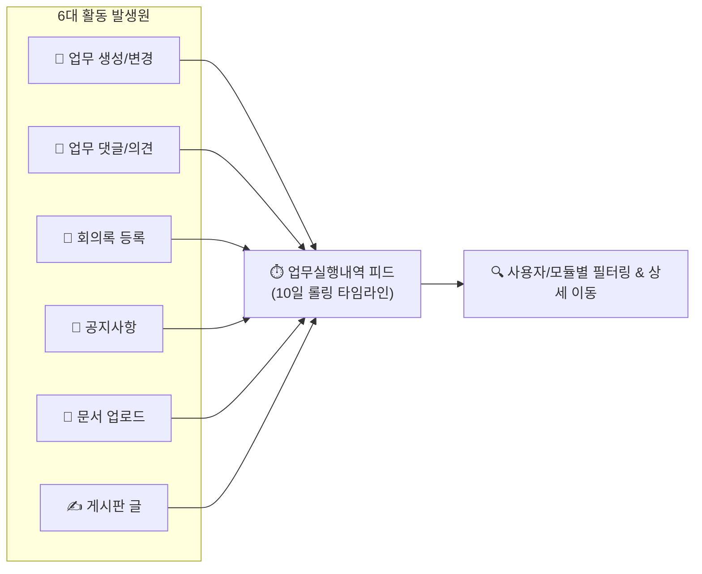

# 업무실행내역 (Activity Log)

> **업무실행내역** 페이지는 워크스페이스(또는 전사) 내에서 발생한 모든 업무 생성, 상태 변경, 회의록 등록, 문서 공유 등의 협업 활동을 시간 순으로 기록하고 모니터링하는 **실시간 활동 타임라인 피드**입니다.

## 1. 화면 개요

누가, 언제, 어떤 업무나 의사결정을 수행했는지 한눈에 파악할 수 있으며, 상세 페이지로 이동하지 않고도 핵심 내용을 파악할 수 있도록 **113자 마크다운 컨텐츠 요약**을 제공합니다.

기본적으로 기준일로부터 **최근 10일간의 활동 기록**을 일자별(`오늘` 또는 `YYYY/MM/DD`)로 묶어 제공합니다.

## 2. 주요 기능 안내

### 📅 10일 단위 기간별 조회 및 네비게이션
* **조회 기간 표시**: 상단에 현재 조회 중인 날짜 범위(`YYYY/MM/DD부터 YYYY/MM/DD까지`)가 이탤릭체로 표시됩니다.
* **기간 이동 버튼**:
  * **`[« 뒤로]`**: 현재 기준일로부터 10일 이전 과거 기록으로 이동합니다.
  * **`[다음 »]`**: 10일 이후 미래 기록으로 이동하며, 오늘 날짜를 초과하지 않도록 자동 제한됩니다.
* **기준일 직접 지정**: 우측 설정 패널의 **[10일 기록]** 캘린더에서 특정 일자를 선택하면 해당 날짜를 종료일로 하는 10일간의 기록을 즉시 조회합니다.

### 👥 사용자별 활동 필터링
* 우측 사이드바의 **[사용자]** 드롭다운을 통해 특정 팀원의 활동만 선별 조회할 수 있습니다.
* **`<< 나 >>`** 옵션을 선택하면 본인이 생성하거나 수정한 활동 내역만 빠르게 확인할 수 있습니다.

### 🗂️ 6대 활동 유형별 모듈 필터링
보고자 하는 활동의 종류만 선택하여 피드를 간소화할 수 있으며, 설정된 필터는 브라우저에 자동 저장되어 재접속 시에도 유지됩니다.

| 활동 유형 | 식별 아이콘 | 제공되는 주요 요약 정보 | 연관 매뉴얼 |
|:---|:---:|:---|:---|
| **업무** | <i class="mdi mdi-folder-edit"></i> | 업무 번호, 트래커, 제목, 변경 상태 및 **업무 설명 요약** (완료 시 녹색 아이콘) | [업무 관리](/work-manage/issue) |
| **의견** | <i class="mdi mdi-comment-text-multiple"></i> | 업무 번호, 제목 및 등록된 **댓글(Comment) 내용 요약** | [업무 이력](/work-manage/issue) |
| **회의** | <i class="mdi mdi-account-group"></i> | 회의 번호, 제목, 진행 상태 및 **회의 의제(Agenda) 요약** | [회의록 관리](/work-manage/meeting) |
| **공지** | <i class="mdi mdi-message-badge"></i> | 공지 제목 및 등록된 **공지 본문 요약(Summary)** | [공지 관리](/work-manage/news) |
| **문서** | <i class="mdi mdi-file-document"></i> | 문서 제목 및 **문서 본문 설명 요약** | [문서 관리](/work-manage/docs) |
| **글** | <i class="mdi mdi-text-box-multiple"></i> | 게시판 명칭, 게시글 제목 및 **게시글 본문 내용 요약** | [게시판 포럼](/work-manage/forum) |

> [!TIP]
> **유형 단독 선택(Pick Sort) 기능**:
> 체크박스 우측의 텍스트(예: `업무`, `회의`, `공지` 등)를 클릭하면 다른 체크박스가 모두 해제되고 **해당 유형 하나만 즉시 단독 필터링**되어 매우 편리합니다.

### 🌲 하위 워크스페이스 포함 조회
* 상위 워크스페이스에서 작업 중인 경우, 우측 패널의 **[하위 프로젝트/워크스페이스]** 체크박스를 활성화하면 하위 조직 및 서브 프로젝트에서 발생한 활동까지 통합 타임라인으로 확인할 수 있습니다.

## 3. 화면 이용 팁

* **마크다운 서식 미리보기**: 모든 활동 요약 문구는 마크다운 렌더링이 적용되어 굵은 글씨, 목록 등이 정돈된 형태로 깔끔하게 표시됩니다.
* **상세 페이지 원클릭 이동**: 활동 항목의 제목(업무 번호, 회의 제목, 문서명 등)을 클릭하면 해당 상세 페이지로 즉시 이동하며, 댓글 클릭 시 해당 댓글 위치(`#note-ID`)로 자동 스크롤됩니다.
* **작성자 프로필 조회**: 작성자 이름을 클릭하면 해당 사용자의 정보 및 활동 프로필 화면으로 이동합니다.
