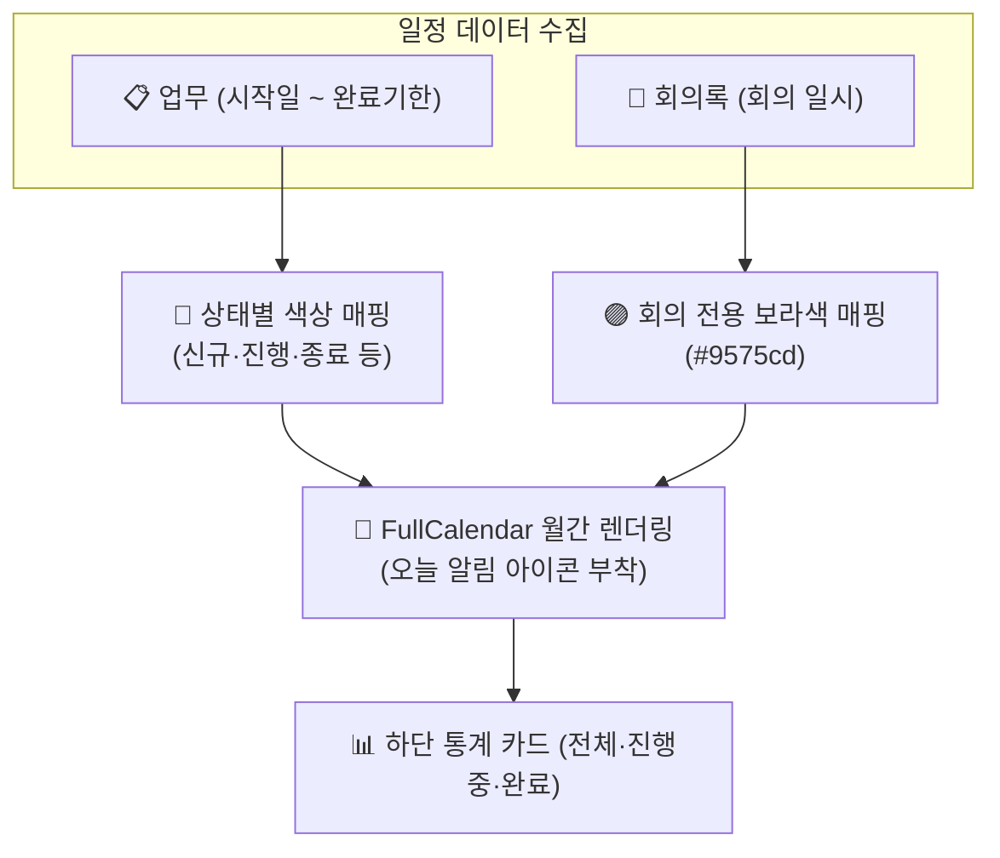

# 캘린더 (Calendar)

> **캘린더** 모듈은 워크스페이스 내에서 발생하는 모든 **업무(Issue)**의 시작·완료 기한과 **회의(Meeting)** 일정을 월간 그리드 위에 시각화하여, 전사 및 프로젝트의 타임라인을 한눈에 조망할 수 있는 종합 일정 관리 화면입니다.

## 1. 개요 및 2대 운영 모드

캘린더는 관리 범위에 따라 두 가지 관점으로 운영됩니다.

* **전사 통합 캘린더**: 상단 메뉴의 **[캘린더]**를 통해 접근하며, 본인이 참여하는 모든 워크스페이스의 업무와 회의 일정을 종합 모니터링합니다.
* **워크스페이스 캘린더**: 개별 워크스페이스 내 **[캘린더]** 탭으로 접근하여, 해당 사업지나 부서의 마일스톤과 세부 작업 일정에 집중합니다.

## 2. 주요 기능 및 일정 시각화

### 🎨 업무 상태 및 회의 구분 색상 (다크모드 대응)
일정 바(Bar)의 색상은 업무의 진행 상태와 회의 일정을 즉시 식별할 수 있도록 테마(Light/Dark)에 따라 최적화된 컬러로 자동 렌더링됩니다.

| 구분 | Light 테마 색상 | Dark 테마 색상 | 설명 |
|:---|:---:|:---|:---|
| **신규** | ● #e57373 | ● #b35c5c | 즉시 확인이 필요한 신규 등록 업무 |
| **진행** | ● #64b5f6 | ● #5c86b3 | 현재 수행 중인 활성 작업 |
| **검토** | ● #ffb74d | ● #b3915c | 피드백 및 승인 대기 중인 업무 |
| **보류 / 거절** | ● #90a4ae | ● #64748b | 일시 중지되거나 반려된 작업 |
| **종료** | ● #81c784 | ● #5cb377 | 완수되어 마감된 업무 |
| **회의록** | ● #9575cd | ● #9575cd | 공식 회의 일정 (보라색 고정) |

### 🔔 오늘의 일정 알림 아이콘
업무 타이틀 앞에는 **오늘(Today)**을 기준으로 마감 임박 상태를 직관적으로 경고하는 3대 상태 아이콘이 표시됩니다.

* <i class="mdi mdi-arrow-right-bold text-success"></i> **오늘 시작**: 오늘부터 일정이 시작되는 업무 (녹색 화살표)
* <i class="mdi mdi-arrow-left-bold text-danger"></i> **오늘 마감**: 오늘까지 반드시 완료해야 하는 데드라인 업무 (붉은색 화살표)
* <i class="mdi mdi-rhombus text-danger"></i> **당일 처리**: 오늘 하루 동안 착수하고 종결해야 하는 1일 과업 (붉은색 다이아몬드)

### 🔍 복합 필터링 및 저장 쿼리 (Saved Queries)
* **다차원 조건 검색**: 상단 검색바를 통해 워크스페이스, 담당자, 업무 유형(Tracker), 상태뿐만 아니라 **회의 카테고리**까지 교차 필터링할 수 있습니다.
* **저장 쿼리 사이드바**: 자주 조회하는 일정 조합(예: *"나의 이번 주 마감 업무"*, *"경영 회의 일정"*)을 사이드바에 저장하여 원클릭으로 재호출합니다.

### 📊 실시간 현황 요약 카드
캘린더 하단에는 현재 화면에 표시된 업무들의 실시간 통계 카드가 제공됩니다.
* **전체 건수**: 현재 월간 그리드에 필터링된 총 업무 수
* **진행 중 / 완료 건수**: 활성 업무와 종결 업무의 비중을 대조하여 이번 달의 목표 달성도를 평가할 수 있습니다.

## 3. 조작 및 연동 팁

* **원클릭 상세 이동**: 캘린더의 일정 바를 클릭하면 해당 **[업무 상세](/work-manage/issue)** 또는 **[회의록 상세](/work-manage/meeting)** 페이지로 즉시 이동합니다.
* **직관적인 타이틀 포맷**: 업무는 `[유형] 제목 (담당자)`, 회의는 `제목` 형식으로 표출되어 상세 페이지를 열지 않고도 핵심 주체를 파악할 수 있습니다.
* **오늘 위치 파악**: 현재 날짜는 상단 날짜 셀이 굵은 파란색 배지로 강조되어 전체 타임라인 속 오늘의 위치를 쉽게 인지할 수 있습니다.
