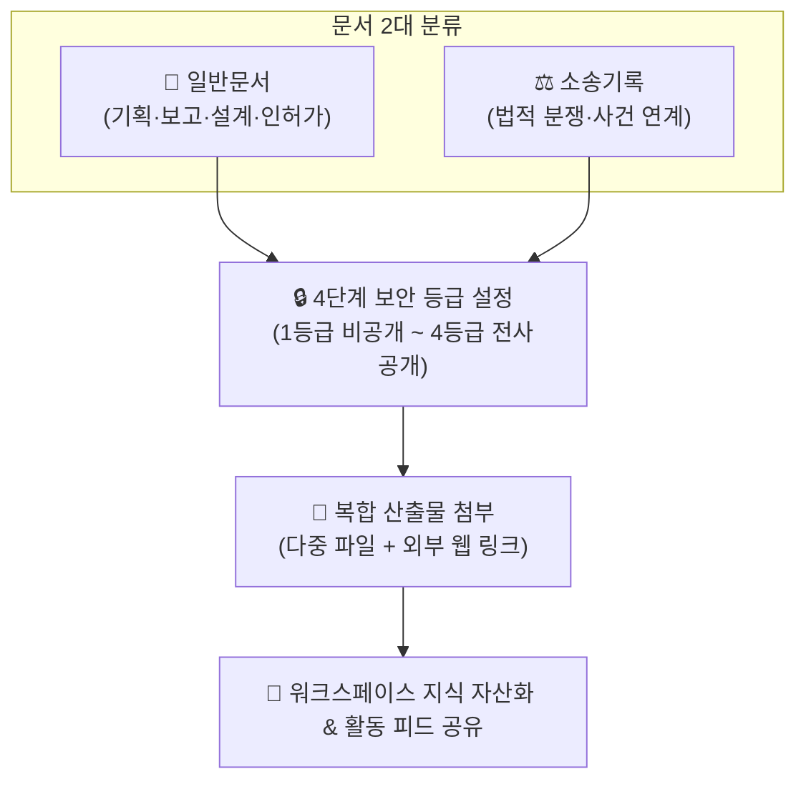

# 문서 관리 (Documents)

> **문서 관리** 모듈은 워크스페이스 수행 과정에서 발생하는 각종 보고서, 인허가 서류, 설계 산출물 및 법적 소송 기록을 4단계 보안 등급 체계에 따라 체계적으로 자산화하고 안전하게 공유하는 중앙 문서 보관소입니다.

## 1. 개요 및 2대 문서 유형

문서는 성격과 보안 목적에 따라 두 가지 탭으로 분리되어 독립적으로 관리됩니다.

* **일반문서**: 사업 기획서, 회의 보고서, 인허가 서류, 설계 도면 등 보편적인 프로젝트 산출물을 관리합니다.
* **소송기록**: 부동산 개발 및 회사 경영 과정의 법적 분쟁 기록물을 관리하며, 등록된 **소송 사건(Suitcase)**과 직접 연계하여 사건의 전후 맥락과 서면을 통합 열람할 수 있습니다.

## 2. 4단계 문서 보안 등급 체계

문서 등록 시 정보의 민감도에 따라 열람 범위를 정밀하게 통제할 수 있습니다.

| 등급 | 표시 배지 | 열람 권한 범위 | 적용 대상 예시 |
|:---:|:---:|:---|:---|
| **1등급** | <i class="mdi mdi-lock-outline text-warning"></i> **1등급 비공개** | 작성자 본인 및 최고 관리자(`work_manager`)만 열람 가능 | 대외비 계약서, 인사/감사 관련 민감 자료 |
| **2등급** | <i class="mdi mdi-account-group-outline"></i> **2등급 팀공개** | 작성자의 소속 부서(팀) 구성원만 열람 가능 | 부서 내부 검토용 초안, 팀별 예산안 |
| **3등급** | <i class="mdi mdi-folder-account-outline"></i> **3등급 프로젝트** | 해당 워크스페이스에 참여 중인 멤버 전체 열람 가능 | 현장 설계 도면, 사업지 인허가 공문 |
| **4등급** | <i class="mdi mdi-earth"></i> **4등급 전사공개** | 시스템에 등록된 모든 사원 열람 가능 | 사내 공통 양식, 취업규칙, 안전관리 지침 |

## 3. 주요 기능 안내

### 📌 상단 고정 (Pinned Documents)
* 필수 공람 문서나 표준 지침은 **고정(<i class="mdi mdi-pin text-danger"></i>)** 옵션을 설정하여, 최신 등록일과 무관하게 목록 최상단에 고정 노출할 수 있습니다.

### 📅 시행일자(발행일) 관리
* 시스템 등록일시와 별개로, 공문 발송일 또는 계약 체결일 등 실제 효력이 발생한 **시행일자(`execution_date`)**를 지정하여 연대기순 정렬 및 이력 관리가 가능합니다.

### 📎 복합 첨부 자료 지원 (파일 + 웹 링크)
* **다중 파일 첨부**: PDF, Word, Excel, 이미지 등 다양한 확장자의 산출물을 용량 제한 내에서 여러 개 첨부할 수 있습니다.
* **외부 웹 링크 첨부**: 대용량 클라우드 저장소(Google Drive, OneDrive) 링크나 전자결재 시스템의 관련 문서 URL을 직접 등록하여 연계할 수 있습니다.

### 🔍 카테고리 필터링 및 통합 검색
* **범주(Category)별 분류**: 기획, 인허가, 토지, 시공 등 사전에 정의된 카테고리를 클릭하여 원하는 분류의 문서만 즉시 필터링합니다.
* **본문 및 제목 검색**: 문서 제목뿐만 아니라 마크다운으로 작성된 상세 설명 본문까지 아우르는 통합 텍스트 검색을 지원합니다.

### 👁️ 열람 통계 및 자동 활동 로그 연동
* **조회수 트래킹**: 사용자가 문서를 조회할 때마다 실시간으로 조회수가 카운트되어 중요도와 활용도를 파악할 수 있습니다.
* **활동 로그 자동 발행**: 새로운 문서가 등록되면 [업무실행내역](/work-manage/activity) 피드에 `[문서]` 알림이 자동 게시되어 팀원들에게 실시간 공유됩니다.

## 4. 실무 활용 팁

* **마크다운 상세 요약 활용**: 단순 파일 업로드에 그치지 않고, 마크다운 에디터를 활용해 문서의 **핵심 요약(Executive Summary)**과 주요 의사결정 사항을 기재해 두면 파일을 매번 다운로드하지 않고도 내용을 신속하게 파악할 수 있습니다.
* **소송 사건 연계 활용**: 소송기록 탭에서 문서를 등록할 때는 반드시 연관 사건을 드롭다운에서 매핑하세요. 소송 사건 상세 화면에서도 관련 문서 목록이 자동으로 집계되어 법무 관리가 훨씬 수월해집니다.
