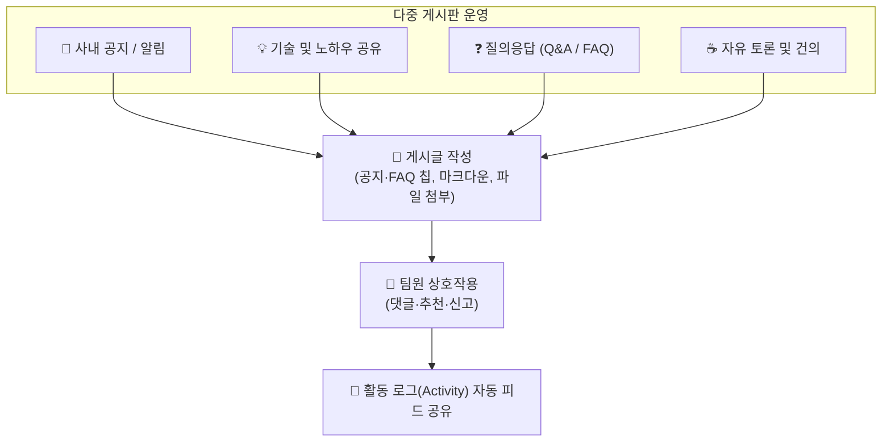

# 게시판 (Forum)

> **게시판** 모듈은 워크스페이스 구성원 간의 자유로운 의견 교환, 기술 및 노하우 공유, 사내 공지 및 FAQ(자주 묻는 질문)를 자산화하는 소통과 지식 관리의 허브입니다.

## 1. 개요 및 다중 게시판 아키텍처

하나의 워크스페이스 내에 목적에 따라 여러 개의 독립된 게시판을 개설하여 체계적으로 커뮤니케이션을 분류할 수 있습니다.

* **다중 게시판 지원**: 질문답변, 기술 자료실, 자유게시판 등 성격에 맞는 게시판을 자유롭게 구성합니다.
* **게시판 인덱스 허브**: 워크스페이스 게시판 메인 화면에서 개별 게시판의 **주제(토픽) 수**, **전체 글 수**, 그리고 **최근 등록된 게시물(작성자 및 경과 시간)**을 한눈에 조망할 수 있습니다.

## 2. 주요 기능 안내

### 📋 게시물 목록 및 상태 배지
게시글 목록에서는 다양한 시각적 배지를 통해 글의 성격과 최신 상태를 빠르게 식별할 수 있습니다.

* **공지 배지** (<i class="mdi mdi-bullhorn text-primary"></i> **공지**): 상단 고정 및 굵은 글씨로 강조되어 모든 구성원이 우선 확인해야 하는 중요 알림입니다.
* **FAQ 배지** (<i class="mdi mdi-help-circle text-success"></i> **FAQ**): 자주 묻는 질문과 답변으로 분류된 실무 가이드 글입니다.
* **카테고리 태그** (`[분류명]`): 게시판 내 세부 주제를 구분하여 표시합니다.
* **신규 배지** (`new`): 최근 등록된 새 글을 초록색 배지로 강조합니다.
* **댓글 카운터**: 제목 우측에 달린 댓글의 수 `(N)`가 실시간 집계되어 토론의 활성도를 보여줍니다.
* **조회수 트래킹**: 열람할 때마다 카운트가 누적되어 정보의 관심도와 파급력을 파악할 수 있습니다.

### ✍️ 게시글 작성 및 첨부 자료
* **마크다운 서식 지원**: 코드 블록, 인용구, 테이블, 굵은 글씨 등 다양한 서식을 지원하는 에디터를 제공합니다.
* **다중 파일 첨부**: 도면, 문서, 이미지 등 필요한 산출물을 여러 개 첨부할 수 있으며, 다운로드 전 파일 용량(KB/MB)이 직관적으로 표출됩니다.

### 💬 소통 및 인터랙션 도구
게시글 상세 화면에서 동료들과 유기적으로 상호작용할 수 있습니다.

* **추천 (Like)**: 유익한 정보나 공감되는 의견에 '좋아요'를 투표할 수 있으며, 내가 추천한 글은 활성화 스타일로 즉시 표시됩니다.
* **댓글(Comments) 스레드**: 본문 하단에서 의견을 나누고 질의응답을 이어갈 수 있습니다.
* **신고 (Blame)**: 사내 보안 지침에 위배되거나 부적절한 게시물을 관리자에게 신속히 신고합니다.

### 🔒 권한 통제 및 관리
* **작성자 전용 제어**: 본인이 작성한 글과 댓글은 언제든지 수정 및 삭제가 가능합니다 (`FORUM_OWN_UPDATE/DELETE`).
* **관리자 권한**: 워크스페이스 관리자는 모든 게시글의 편집 및 삭제, 공지 지정 권한을 가집니다.
* **활동 로그 연동**: 새로운 게시글이 등록되면 [업무실행내역](/work-manage/activity) 피드에 `[게시물]` 알림이 자동 게시되어 팀원들에게 실시간 공유됩니다.

## 3. 실무 활용 팁

* **FAQ 배지 적극 활용**: 업무 진행 중 반복되는 질문이나 온보딩 지침은 글 작성 시 **FAQ**로 등록해 두면 신규 입사자나 타 부서와의 협업 시 훌륭한 레퍼런스가 됩니다.
* **게시판 설정 연동**: 관리자는 [워크스페이스 설정 > 게시판](/work-manage/settings) 탭에서 새로운 게시판을 추가하거나 순서를 재정렬할 수 있습니다.
