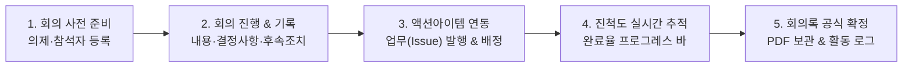

# 회의 관리 (Meetings)

> **IBS 회의 관리 모듈**은 워크스페이스(본사 관리, 부동산 개발 프로젝트 등) 내에서 진행되는 모든 회의의 의사결정을 자산화하고, 논의된 결정 사항과 후속 조치를 **실제 실무 업무(Issue/Task)로 직접 연결하여 추적**하는 통합 의사결정 플랫폼입니다.

## 1. 개요 및 의사결정 자산화 파이프라인

시스템 내의 모든 회의록은 특정 **워크스페이스**에 반드시 소속되어 관리됩니다. 회의에서 도출된 액션 아이템은 개별 업무(Issue)로 즉시 발행되어 완료율이 실시간으로 모니터링됩니다.

### 1.1 기본 접근 및 권한
* **회의 목록 접근**: 특정 워크스페이스 내부의 `[회의]` 탭 또는 상단 통합 메뉴의 `[회의]`를 통해 접근할 수 있습니다.
* **회의 생성 권한**: 워크스페이스 관리자(`workManager`) 또는 해당 워크스페이스의 참여 멤버에게 부여됩니다.
* **잠금보관 워크스페이스 제약**: 상태가 '잠금보관(종료)'인 워크스페이스는 신규 회의록 생성이 제한되며 기존 기록 조회만 가능합니다.

## 2. 회의록 목록 및 다차원 검색

전체 회의 히스토리를 테이블 형태로 조회하고, 우측 사이드바 필터를 통해 원하는 회의록을 신속하게 검색할 수 있습니다.

### 2.1 목록 테이블 구성
* **번호 (#)**: 회의 고유 식별 번호 (ID)
* **워크스페이스**: 회의록이 소속된 워크스페이스명 (통합 회의 메뉴 조회 시 노출)
* **상태 배지**: `준비`(1), `종료/완료`(2), `확정`(3), `취소`(4)
  * **확정 필요 경고 배지**: 회의가 완료(`종료`)되었으나 회의일 기준 **5일 이상 미확정** 상태인 경우 경고 배지가 표시됩니다:
    * *6일 ~ 10일 경과*: 주황색(`warning`) 경고
    * *10일 초과*: 빨간색(`danger`) 경고
* **카테고리**: 프로젝트별 회의 분류 (예: 주간미팅, 정기회의, 기술검토 등)
* **제목**: 회의 명칭 (취소 상태는 삭선 처리)
* **회의 일시**: 분 단위 일정 표시
* **작성자 & 참석자 수**: 최초 등록자 및 총 참석 인원(사내+외부)
* **PDF 다운로드**: 각 행 우측의 `PDF 출력` 아이콘(`mdi-file-pdf-box`) 클릭 시 상세 이동 없이 즉시 PDF 다운로드

### 2.2 우측 사이드바 필터링
* **회의 일시(캘린더)**, **회의 상태**, **카테고리**, **키워드 검색(제목 및 본문 통합 검색)**을 지원합니다.

## 3. 회의록 작성 및 수정 (Form)

회의록 입력 화면은 좌측의 **상세 본문 입력창**과 우측의 **메타 정보 설정창**으로 분리되어 직관적인 입력을 지원합니다.

### 3.1 좌측: 의사결정 자산화 본문
* **회의 제목**: 회의 명칭 (필수 입력)
* **회의 의제 (Agenda)**: 회의 전 사전 공유 및 논의할 핵심 안건
* **회의 내용 (Markdown 지원)**: 마크다운 에디터(`MdEditor`)를 통한 실시간 서식 편집
* **주요 결정 사항 (Decisions)**: 회의에서 최종 합의된 핵심 결정 내용 기술 (상세 보기 시 녹색 콜아웃으로 강조)
* **후속 조치 사항 (Action Items)**: 담당자별 완료 기한 및 To-Do 사항 기술 (상세 보기 시 주황색 콜아웃으로 강조)
  * **스마트 액션아이템 파서**: 체크박스(`- [ ]`), 불릿 기호(`- `, `* `), 번호 목록(`1. `) 형태로 후속 조치를 입력하면 시스템이 개별 실행 항목을 실시간으로 자동 감지하여 분리합니다.
* **파일 첨부**: 다중 파일 업로드 및 파일별 설명 입력 지원

### 3.2 우측: 메타 정보 설정
* **워크스페이스**: 귀속 대상 워크스페이스 지정 (기본 활성 워크스페이스 자동 바인딩)
* **회의 일시**: 일자 및 시간 선택 위젯(`DateTimePicker`)
* **카테고리**: 회의 분류 선택 (우측 `+` 버튼으로 모달을 띄워 즉석에서 신규 카테고리 생성 가능)
* **상태**: 진행 단계 지정 (`확정` 상태는 `MEETING_CONFIRM` 권한 보유 관리자만 선택 가능)
* **참석자 (사내)**: 사내 사용자 검색 및 멀티 칩(Chips) 다중 선택
* **기타 참석 (외부)**: 시스템 계정이 없는 외부인이나 협력사 참석자 텍스트 입력

> [!TIP]
> **회의 등록 시 후속 조치 업무 일괄 자동 발행**:
> 회의록 작성 시 후속 조치 본문에 액션아이템이 기재되어 있다면, 하단의 **`[회의 등록 시 후속 조치 업무 일괄 자동 발행]`** 체크박스가 활성화됩니다. 이를 체크하고 회의를 저장하면 회의록 생성과 동시에 각각의 후속 조치가 해당 워크스페이스의 [업무(Issue)](/work-manage/issue)로 자동 일괄 등록 및 연계됩니다.

## 4. 회의 상세 보기 및 관련 업무(Issue) 연동

회의록 상세 페이지는 회의 결과 공유뿐만 아니라 **실제 업무(Task)를 배정하고 진행 상황을 추적하는 협업 제어판** 역할을 수행합니다.

### 4.1 권한별 수정 및 삭제 제어
* **수정 권한**:
  * *미확정 회의*: 관리자, 작성자, 참석자(`MEETING_OWN_UPDATE`) 수정 가능
  * *확정된 회의*: 관리자(`MEETING_EDIT_CONFIRMED`)만 수정 가능
* **삭제 권한**: 미확정 시 관리자/작성자, 확정 후에는 관리자(`MEETING_DELETE`)만 삭제 가능

### 4.2 시각적 마크다운 및 콜아웃 렌더링
* 작성자/수정자 정보 및 상대 시간(경과 시간) 표시
* **주요 결정 사항**: 녹색 콜아웃(`Success Callout`)으로 시각적 강조
* **후속 조치 사항**: 주황색 콜아웃(`Warning Callout`)으로 후속 액션 리마인드

### 4.3 세부 액션아이템 추적 & 원클릭 업무(Issue) 발행
* **세부 후속 조치 체크리스트 카드**: 후속 조치 본문에서 파싱된 개별 항목들을 체크리스트 형태로 분리하여 표출합니다.
  * **원클릭 [업무 발행] 퀵 버튼**: 각 액션아이템 우측의 `[업무 발행]` 버튼을 클릭하면 해당 항목을 제목으로 하는 업무가 즉시 생성되어 회의와 연결됩니다.
  * **연계 업무 실시간 상태 칩**: 이미 업무로 발행된 항목은 연계된 업무의 상태 칩(진행, 완료 등)이 실시간으로 표시되어 처리 상황을 바로 확인할 수 있습니다.
* **완료율 프로그레스 바**: 회의와 연결된 업무들의 상태를 분석하여 **`완료 건수 / 전체 건수 (진행률 %)`**로 표시 (100% 완료 시 초록색 전환)
* **연결 업무 테이블**: 일련번호, 제목, 상태 칩, 담당자 표출 (제목 클릭 시 [업무 상세](/work-manage/issue)로 즉시 이동)
* **[관련 업무 추가] 모달**: 화면 이탈 없이 회의 상세에서 즉시 추가 업무를 수동 발행하여 회의와 매핑 가능

### 4.4 공식 PDF 출력
* 우측 상단의 **[PDF 출력]** 버튼을 통해 회사 표준 양식의 회의록 PDF 문서를 다운로드하여 공식 보고 및 영구 보관용으로 활용할 수 있습니다.

## 5. 캘린더 및 활동 로그 연동

* **[캘린더 연동](/work-manage/calendar)**: 등록된 회의 일정은 업무 캘린더에 **보라색 `[회의]` 배지**로 자동 표출됩니다.
* **[활동 기록(Activity) 연동](/work-manage/activity)**: 회의 등록 및 수정 히스토리는 워크스페이스 실행 기록 피드에 실시간 로깅되어 팀원 간 진행 상황이 투명하게 공유됩니다.
