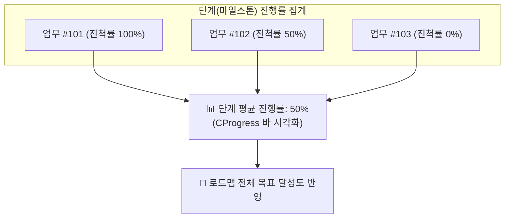

# 로드맵 (Roadmap)

> **로드맵** 페이지는 워크스페이스의 주요 마일스톤(단계/버전)별 진행 상황을 시각적으로 모니터링하고 관리하는 협업 대시보드입니다. 
> 프로젝트를 여러 마일스톤으로 나누어 각 목표 대비 현재 어느 정도 도달했는지 실시간으로 파악할 수 있습니다.

## 1. 개요

워크스페이스의 전체 일정을 큰 단위(단계)로 나누어 관리합니다. 각 단계에는 여러 개의 **[업무(Issue)](/work-manage/issue)**가 연결되어 있으며, 이 업무들의 완료 상태와 진척률이 집계되어 해당 단계의 전체 진행도를 결정합니다.

## 2. 주요 기능 안내

### 📊 단계별 진행도 및 통계 시각화
* **진행률 프로그레스 바**: 각 단계 카드 상단에 연결된 모든 업무의 평균 완료율(`done_ratio`)이 직관적인 녹색 게이지 그래프로 표시됩니다.
* **상태 요약 링크**:
  * **`업무 N 건`**: 해당 단계에 할당된 전체 업무 수를 나타내며, 클릭 시 해당 업무 목록으로 즉시 이동합니다.
  * **`N 건 완료 / N 건 진행 중`**: 완료된 업무 건수와 미완료 업무 건수를 분리 표시하며, 클릭 시 해당 조건의 업무 필터 목록으로 연결됩니다.

### 🔍 단계 상세 정보 및 업무 목록
* **단계 상세 이동**: 단계 제목을 클릭하면 해당 마일스톤의 상세 화면으로 이동합니다.
* **업무 목록 테이블**: 단계에 배정된 업무들의 번호, 유형(트래커), 제목, 담당자, 진척률이 표시되며, 완료된 업무는 취소선으로 구분됩니다.

### 🧭 우측 사이드바: 로드맵 설정 및 단계 색인
화면 우측 사이드바를 통해 복잡한 마일스톤 목록을 빠르게 제어하고 탐색할 수 있습니다.

* **유형(Tracker)별 필터링**:
  * 결함, 기능, 지원 등 특정 업무 유형만 체크박스로 선택하여, 해당 유형의 업무들로만 진행도를 재계산하고 목록을 필터링할 수 있습니다.
* **완료된 단계 포함 토글**:
  * `완료된 단계 포함` 체크박스를 통해 이미 종료된 단계를 목록에 함께 표시하거나 숨겨 현재 진행 중인 마일스톤에 집중할 수 있습니다.
* **단계 색인(목차) 및 원클릭 스크롤**:
  * 우측 패널 하단에 모든 단계의 이름과 진척률(`%`)이 목록으로 요약 제공됩니다.
  * 특정 단계를 클릭하면 메인 화면에서 해당 단계 카드로 부드럽게 자동 스크롤(`Smooth Scroll`)되며 하이라이트 테두리가 표시됩니다.

### ⚙️ 단계 관리 및 권한 통제
* **새 단계 추가**: 우측 상단의 **[새 단계]** 버튼을 클릭하여 새로운 마일스톤(이름, 설명, 시작일, 종료일)을 정의합니다. (관리자 권한 필요)
* **단계 정보 수정**: 각 단계 헤더 우측의 연필 아이콘(<i class="mdi mdi-pencil"></i>)을 클릭하여 단계 속성을 편집할 수 있습니다.
* **설정 연동**: 우측 상단의 더보기(`...`) 아이콘을 통해 [워크스페이스 설정 > 단계](/work-manage/settings) 메뉴로 원클릭 이동하여 전체 마일스톤을 일괄 관리할 수 있습니다.

## 3. 단계 상태(Status) 체계

각 단계는 목표 달성 과정에 따라 3가지 상태로 관리되며 카드 상단에 색상 배지로 구분됩니다.

| 상태 | 배지 색상 | 설명 | 업무 추가 가능 여부 |
|:---|:---:|:---|:---:|
| **진행 중 (Open)** | 파란색 | 현재 활발히 목표가 진행 중인 단계 | O |
| **잠김 (Locked)** | 빨간색 | 기한 도래 또는 잠정 동결되어 신규 업무 배정이 제한되고 진행만 추적하는 단계 | X |
| **닫힘 (Closed)** | 초록색 | 모든 업무가 완수되어 공식 종료된 마일스톤 | X |

## 4. 로드맵 메뉴 노출 조건

워크스페이스 상단 탭에서 **'로드맵'** 메뉴가 보이지 않는다면 다음 사항을 확인하세요.

* **등록된 단계(버전) 없음**: 워크스페이스에 등록된 단계가 하나도 없을 경우 로드맵 메뉴는 자동으로 숨겨집니다.
* **활성화 방법**: [설정 > 단계](/work-manage/settings) 메뉴에서 새로운 단계를 1개 이상 등록하면 상단 메뉴에 '로드맵' 탭이 즉시 나타납니다.
