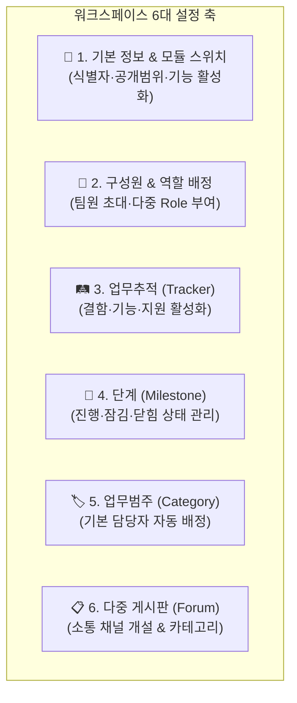

# 워크스페이스 설정 (Settings)

> **워크스페이스 설정** 페이지는 워크스페이스 관리자가 협업 공간의 기본 속성, 참여 인력의 역할과 권한, 업무 프로세스(트래커/범주/마일스톤) 및 게시판 환경을 총괄 구성하는 중앙 통제 화면입니다.

## 1. 개요 및 6대 설정 아키텍처

설정 화면은 상단 탭 인터페이스를 통해 6대 핵심 영역을 독립적이고 유기적으로 제어합니다.

## 2. 6대 주요 설정 탭 상세

### 🏢 1. 프로젝트 (기본 정보)
* **기본 속성 변경**: 워크스페이스 명칭, 설명, 고유 식별자(Slug), 상위 워크스페이스를 설정합니다.
* **모듈 ON/OFF 스위치**: 업무, 캘린더, 게시판, 문서 등 해당 워크스페이스에서 사용할 기능을 선택적으로 활성화/비활성화합니다. 비활성화된 모듈은 상단 내비게이션 및 설정 메뉴에서 자동으로 숨겨집니다.

### 👥 2. 구성원 (Member) 관리
* **구성원 초대 및 제외**: 워크스페이스에 참여할 사원을 검색하여 추가하거나 제외합니다.
* **다중 역할(Role) 배정**: 구성원별로 '업무관리자', '개발자', '보고자' 등 1개 이상의 역할을 복수로 부여하여 세분화된 기능별 권한(RBAC)을 적용합니다.

### 🛤️ 3. 업무추적 (Issue Tracking)
* **트래커(Tracker) 선택**: 해당 워크스페이스의 업무 성격에 맞는 작업 유형(`결함`, `기능`, `지원`, `작업` 등)을 체크박스로 활성화합니다. 활성화된 트래커만 업무 등록 폼에 노출됩니다.

### 📅 4. 단계 (Version / Milestone)
* **마일스톤 수립**: 사업 추진 일정이나 배포 버전을 생성하고 시작일/기한을 관리합니다.
* **3단계 라이프사이클 상태 제어**:
  * **🟢 진행 (`Open`)**: 활발히 업무가 진행 중인 상태. 새로운 업무 작성 시 이 단계를 목표 버전으로 자유롭게 지정할 수 있습니다.
  * **🟡 잠김 (`Locked`) - 기능 동결(Freeze)**: 기한이 도래했거나 검증(QA) 단계. **신규 업무 배정은 차단**되지만, 이미 속해있는 기존 업무는 계속 수정 및 종결 처리가 가능합니다.
  * **🔴 닫힘 (`Closed`) - 완수 종료(Released)**: 모든 과업이 완수된 최종 마일스톤. 신규 배정 및 기존 업무 재오픈이 금지되며, [로드맵](/work-manage/roadmap) 기본 뷰에서 자동으로 숨겨집니다.
* **진척도 모니터링**: 단계별 연결 업무의 완료율과 최근 등록된 주요 이슈 5건을 요약 모니터링합니다.

### 🏷️ 5. 업무범주 (Issue Category)
* **업무 그룹화**: 업무를 부문별(예: 기획, 설계, 인허가, 토지보상 등)로 구조화합니다.
* **기본 담당자(Default Assignee) 자동 배정**: 특정 범주에 전담 담당자를 미리 지정해 두면, **팀원이 업무를 등록할 때 해당 범주를 선택하는 즉시 담당자가 자동으로 채워져** 업무 배분 프로세스가 자동화됩니다.

### 📋 6. 게시판 (Forum) 설정
* **소통 채널 개설**: 질문답변, 기술자료실, 자유토론 등 용도에 맞는 다중 게시판을 신설하거나 수정·삭제합니다.
* **게시판 카테고리 구성**: 개별 게시판 내에서 글을 세부 분류할 카테고리를 정의합니다.

## 3. 편의 기능 및 운영 가이드

### 💾 마지막 작업 탭 자동 기억 (localStorage)
* 사용자가 마지막으로 조회하거나 작업하던 설정 탭은 브라우저의 **`localStorage`**에 자동 보관됩니다. 다른 페이지로 이동했다가 설정 화면으로 복귀하더라도 직전에 작업하던 탭이 그대로 열려 작업의 연속성을 보장합니다.

### 🔐 세분화된 권한 기반 메뉴 동적 노출
* 설정 화면의 탭들은 사용자의 권한(`workManager` 또는 개별 권한 코드)에 따라 접근 가능한 메뉴만 동적으로 노출됩니다. 일반 멤버는 권한이 없는 민감한 설정 탭(구성원 변경 등)에 접근할 수 없습니다.

### 💡 유연한 경량화 운영
* 워크스페이스의 목적에 따라 불필요한 모듈을 꺼두어 심플하게 운영할 수 있습니다. 예를 들어 단순 자료 공유 목적의 워크스페이스라면 '업무'와 '캘린더' 모듈을 끄고 **[문서]**와 **[게시판]**만 켜서 가볍고 직관적인 아카이브 공간으로 활용할 수 있습니다.
