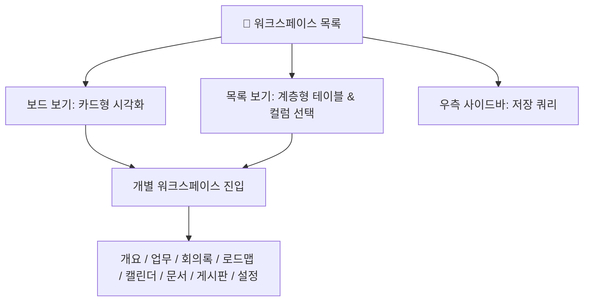

# 워크스페이스

> **워크스페이스 (Workspace)**는 부동산 개발사업, 본사 경영지원, 일반 협업 등 모든 업무와 회의, 문서, 로드맵을 통합 관리하는 **IBS의 최상위 협업 공간**입니다.

## 1. 화면 개요

워크스페이스 목록 화면은 사용자가 참여 중이거나 열람 권한이 있는 모든 워크스페이스를 **보드 (카드)** 또는 **목록 (테이블)** 형태로 제공합니다.

상단의 통합 검색 바, 필터 도구, 우측의 **저장 쿼리 (Saved Queries)**를 활용하여 원하는 워크스페이스를 신속하게 탐색할 수 있습니다.

## 2. 주요 기능 안내

### 🔍 워크스페이스 검색 및 조건 필터링

* **키워드 검색**: 상단 검색창을 통해 워크스페이스 이름 또는 식별자로 즉시 검색합니다.
* **상태 및 공개 필터**: 진행 중 (`진행`), 종료 (`잠금보관`), 공개 여부 (`공개/비공개`), 소속 멤버 여부 등의 세부 조건으로 필터링할 수 있습니다.
* **사용자 저장 쿼리 (Saved Queries)**: 우측 패널에서 자주 사용하는 검색 조건을 저장하여 원클릭으로 호출하거나, 권한 (`PROJECT_PUB_QUERY`)에 따라 전사 구성원과 공유할 수
  있습니다.

### 🖼️ 보기 방식 전환 (보드 / 목록)

상단 옵션 영역에서 원하는 뷰 방식을 선택할 수 있으며, 선택한 설정은 브라우저에 자동 보존됩니다.

* **보드 (Board) 방식**:
    * 각 워크스페이스를 독립된 카드로 시각화하여 주요 정보 (설명, 담당자, 하위 워크스페이스 수)를 빠르게 파악할 수 있습니다.
    * 반응형 레이아웃이 적용되어 화면 크기 (PC, 태블릿, 모바일)에 맞춰 카드 배열이 동적으로 최적화됩니다.
* **목록 (List) 방식**:
    * 워크스페이스 이름, 식별자, 생성일, 공개 여부 등을 정돈된 테이블로 제공합니다.
    * **계층 구조 시각화**: 상위 워크스페이스와 하위 (Sub) 워크스페이스의 종속 관계가 들여쓰기와 트리 구조로 명확히 표시됩니다.
    * **테이블 컬럼 선택자 (Column Selector)**: `[항목 선택]` 도구를 통해 표시할 테이블 컬럼을 사용자가 직접 구성할 수 있습니다.

### ➕ 새 워크스페이스 생성 (권한자 전용)

* 워크스페이스 생성 권한 (`PROJECT_CREATE`)이 부여된 역할 (Role)을 가진 사용자에게만 우측 상단에 **[새 워크스페이스]** 버튼이 노출됩니다.
* 일반 구성원은 초대받은 워크스페이스 내에서만 활동이 가능하며, 생성이 필요한 경우 관리 부서에 요청합니다.

### 🏷️ 아이콘 및 범례 안내

화면 하단에서 워크스페이스의 상태를 나타내는 범례를 확인할 수 있습니다.

* <i class="mdi mdi-account-tag text-success"></i> **내 워크스페이스**: 본인이 관리자 또는 참여 구성원으로 등록된 공간
* <i class="mdi mdi-bookmark text-info"></i> **내 북마크**: 자주 방문하여 즐겨찾기로 등록해 둔 공간
* 🔒 **잠금보관 (Archived)**: 사업 종료 또는 보관 처리되어 수정이 제한된 읽기 전용 공간

## 3. 워크스페이스 내부 주요 메뉴 안내

특정 워크스페이스를 클릭하여 진입하면 다음 8대 핵심 협업 도구를 이용할 수 있습니다.

1. **[개요 (Overview)]**: 워크스페이스 요약 정보, 서브 프로젝트 목록, 미해결 이슈 현황
2. **[업무 (Issues)](/work-manage/issue)**: 이슈 트래커, 상태별 업무 목록, 간트차트
3. **[회의록 (Meetings)](/work-manage/meeting)**: 의제 (Agenda), 의사결정 사항, 액션아이템 연동 관리
4. **[로드맵 (Roadmap)](/work-manage/roadmap)**: 버전 및 마일스톤별 달성률 추적
5. **[캘린더 (Calendar)](/work-manage/calendar)**: 마감일 및 회의 일정 달력 시각화
6. **[문서 (Documents)](/work-manage/docs)**: 워크스페이스 공유 문서 보관소
7. **[게시판 (Forums)](/work-manage/forum)**: 자유로운 의견 교환 및 질의응답 포럼
8. **[설정 (Settings)](/work-manage/settings)**: 워크스페이스 기본 정보, 멤버 관리, 모듈 활성화 설정

## 4. 이용 팁

* 전체적인 **상위-하위 워크스페이스 트리 구조**를 파악하고 싶을 때는 **'목록'** 방식을, 요약 정보를 훑어볼 때는 **'보드'** 방식을 권장합니다.
* 자주 방문하는 핵심 프로젝트는 카드 우측 상단의 **북마크 (별표/리본)**를 클릭해 두면 빠르게 접근할 수 있습니다.
