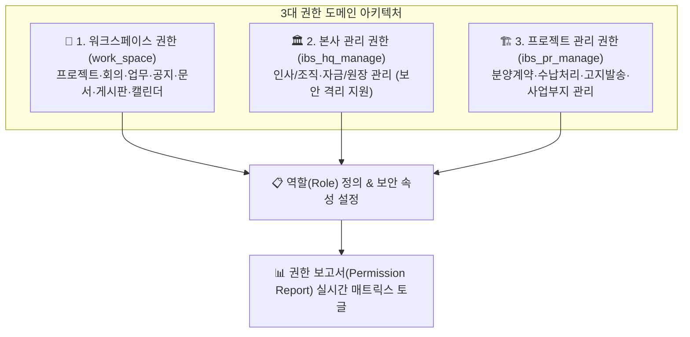

# 역할 및 권한 관리 (Roles & Permissions)

> **역할 및 권한 관리** 페이지는 시스템 관리자가 워크스페이스 및 본사/사업지 관리에서 사용하는 **역할(Role)**을 정의하고, 각 역할별로 수행 가능한 세부 **권한(Permission)**을 3대 비즈니스 도메인 매트릭스를 통해 정밀 제어하는 보안 센터입니다.

## 1. 개요 및 3대 권한 도메인 아키텍처

IBS는 비즈니스 영역과 보안 수준에 따라 역할과 권한을 **3대 도메인 범주**로 엄격히 격리하여 관리합니다.

## 2. 역할 (Roles) 탭

시스템에서 사용할 역할의 종류를 정의하고 기본 속성 및 보안 격리 여부를 설정합니다.

### 📋 역할 생성 및 속성 설정 (`RoleFormModal`)
역할 추가/수정 시 다음 7대 핵심 속성을 정의합니다:

* **이름**: 역할의 직무 명칭 (예: `본사 관리자`, `현장 PM`, `분양 담당자`, `협력업체` 등)
* **권한 구분 (카테고리)**:
  * **`워크스페이스 (work_space)`**: 일반 협업 모듈 권한
  * **`본사 관리 (ibs_hq_manage)`**: 본사 경영지원, 재경, 인사 직무 권한
  * **`프로젝트 관리 (ibs_pr_manage)`**: 부동산 개발 시행 사업지 직무 권한
* **보안 격리 역할 (`is_confidential`)**:
  * 최고 슈퍼유저만 다룰 수 있는 민감한 역할로 지정하여, 일반 관리자에게조차 해당 역할의 정보가 노출되지 않도록 완전 격리합니다.
* **부동산개발 프로젝트 기본 적용 (`is_for_dev_project`)**:
  * 체크 시 향후 개설되는 모든 부동산 개발 프로젝트에 기본 멤버 역할로 자동 상속됩니다.
* **업무 할당 가능 여부 (`assignable`)**:
  * 이 역할을 가진 사용자를 업무(Issue)의 '담당자'로 지정할 수 있는지 통제합니다. (단순 열람자는 체크 해제 권장)
* **업무 보기 권한 (`issue_visible`)**:
  * `모든 업무` / `비공개 업무 제외` / `직접 생성 또는 담당한 업무만` / `없음`
* **사용자 보기 권한 (`user_visible`)**:
  * `모든 활성 사용자` / `자신이 속한 프로젝트 구성원만` / `없음`

## 3. 권한 보고서 (Permission Report) 탭

정의된 각 역할에 대해 기능별 CRUD 세부 권한을 부여하는 **3단 아코디언 매트릭스** 화면입니다.

### 📊 3대 도메인 아코디언 구조
1. **워크스페이스 권한군 (`work_space`)**:
   * 프로젝트(생성/수정/삭제/모듈), 회의록, 업무(생성/수정/댓글), 공지사항, 문서(보안등급별 열람), 게시판, 캘린더
2. **본사 관리 권한군 (`ibs_hq_manage`)**:
   * 인사/조직 관리(`hr_work`), 본사 자금 및 회계원장(`ledger`)
3. **프로젝트 관리 권한군 (`ibs_pr_manage`)**:
   * 계약 관리(`contract`), 수납 및 청구(`payment`), 고객 고지(`notice`), 사업부지(`site`)

### ⚡ 실시간 반응형 권한 토글 (Auto-save)
* 각 역할과 권한이 교차하는 지점의 **체크박스를 클릭하는 즉시 비동기(`patchRole`)로 DB에 실시간 저장**됩니다. 별도의 '저장' 버튼을 누를 필요가 없습니다.
* 권한 수정은 전사 총괄 관리자(`workManager`) 권한을 가진 계정만 수행할 수 있습니다.

## 4. 권한 설계 모범 사례 (Best Practices)

* **최소 권한의 원칙**: 외부 협력사나 일반 직무에는 '비공개 업무 제외' 및 '직접 생성/담당한 업무'만 볼 수 있도록 가시성을 제한하십시오.
* **보안 격리 활용**: 임원진이나 감사 부서의 역할은 반드시 **`is_confidential`** 플래그를 설정하여 일반 워크스페이스 관리자의 임의 권한 조작을 방어하십시오.
* **빌트인 시스템 역할**: 시스템 기본 역할(1: 익명 사용자, 2: 일반 비회원)은 워크스페이스 멤버 배정에서 제외되도록 안전하게 격리 보호됩니다.
