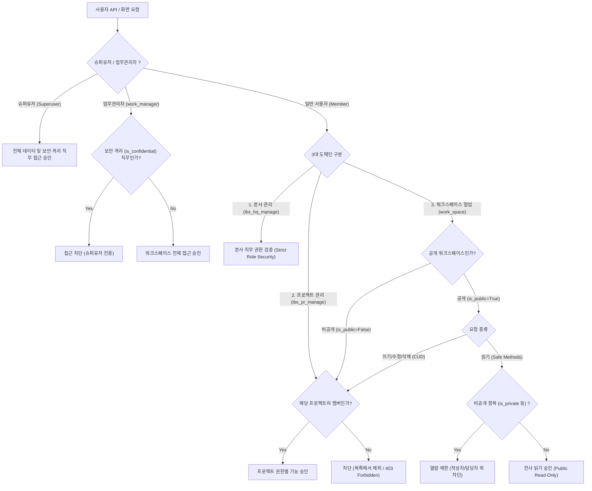

# 프로젝트 권한 & 도메인별 보안 정책 (Security Policy)

> 본 문서는 **IBS 건설 관리 시스템**의 워크스페이스 협업 도메인(`work_space`), 본사 경영 도메인(`ibs_hq_manage`), 그리고 부동산 개발 프로젝트 도메인(`ibs_pr_manage`)에 적용된 **역할 기반 접근 제어(RBAC) 및 행 단위 데이터 보안(Row-Level Security, RLS)** 정책을 정의합니다.

## 1. 개요 및 보안 아키텍처 원칙

IBS 시스템은 워크스페이스와 프로젝트를 중심으로 권한과 데이터가 관리됩니다. 워크스페이스의 공개 여부(`is_public`), 멤버십(`members`), 그리고 역할의 보안 격리(`is_confidential`)에 따라 데이터 접근 수준이 아래 흐름에 따라 결정됩니다.

## 2. 3대 도메인별 공개 및 접근 권한 상세 정책

### 🌐 2.1 워크스페이스 협업 (`work_space`) — 전사 읽기 개방 + 비공개 보호
전사 소통과 지식 자산화를 위해 **공개 워크스페이스의 일반 리소스에 대해서는 비멤버 직원에게도 기본 읽기(Read-Only) 권한을 전사적으로 개방**합니다. 단, 비공개 속성은 엄격히 보호됩니다.

| 모듈 / 리소스 | 공개 워크스페이스 정책 | 비공개 워크스페이스 정책 | 비공개 가드 (Private Guard) |
|:---|:---|:---|:---|
| **공지** (`news`) | 전직원 읽기 허용 (`news.read`) / CUD는 멤버 전용 | 멤버 전용 | - |
| **업무** (`issue`) | 전직원 읽기 허용 (`issue.read`) / CUD는 멤버 전용 | 멤버 전용 | 비공개 업무/댓글(`is_private`)은 작성자/담당자 외 **100% 차단** |
| **회의록** (`meeting`) | 전직원 읽기 허용 (`meeting.read`) / CUD는 멤버 전용 | 멤버 전용 | 비공개 회의록은 **100% 차단** |
| **게시판** (`forum`) | 전직원 읽기 허용 (`forum.read`) / CUD는 멤버 전용 | 멤버 전용 | 비밀글 및 숨김 항목 **차단** |
| **캘린더** (`calendar`) | 전직원 일정 조회 허용 (`calendar.read`) | 멤버 전용 | 비공개 업무 및 회의 일정 제외 |
| **활동 로그** (`logging`) | 전직원 활동 이력 조회 허용 (`activity.read`) | 멤버 전용 | 비공개 업무/댓글 연관 이력 **제외** |

### 🏛️ 2.2 본사 관리 (`ibs_hq_manage`) — 본사 직무 권한 & 보안 격리
본사 인사, 조직, 회계, 자금, 감사 직무는 워크스페이스 공개 여부와 무관하게 **해당 직무 역할(Role)이 부여된 인원에게만 접근을 허용**합니다.
* **보안 격리 역할 (`is_confidential`)**:
  * 인사 평가, 임원 급여, 대외비 자금 계좌 등 고도의 보안이 요구되는 직무는 `is_confidential=True`로 격리되어, 일반 워크스페이스 총괄 관리자(`work_manager`)에게도 노출되지 않으며 **최고 슈퍼유저만 열람 및 통제**할 수 있습니다.

### 🏗️ 2.3 프로젝트 관리 (`ibs_pr_manage`) — 엄격한 멤버십 통제 (Strict Member)
부동산 개발 프로젝트가 공개(`is_public=True`) 상태라 할지라도 **재무, 계약, 수납, 분양 유니트 및 부지 데이터는 엄격히 해당 프로젝트 멤버에게만 접근을 허용**하며, BOLA(IDOR) 악의적 API 파라미터 변조까지 백엔드 DB QuerySet 레벨에서 차단합니다.

| 도메인 / 메뉴 | 관련 모듈 / 리소스 | 공개 프로젝트 접근 정책 | 비공개 프로젝트 접근 정책 |
|:---|:---|:---|:---|
| **`프로젝트 설정`** | 프로젝트 기본정보, 예산(수입/지출), 동호수 유니트, 타입, 부지(Site), 부지계약 | **멤버 전용** | **멤버 전용** |
| **`계약 정보 관리`** | 차수, 분양 계약(`Contract`), 계약자, 양도양수, 해약 | **멤버 전용** | **멤버 전용** |
| **`대금 수납 관리`** | 차수별 분양가, 납부회차, 수납 내역(`ContractPayment`), 연체이율 | **멤버 전용** | **멤버 전용** |
| **`회계 자금 관리`** | 프로젝트 통장, 프로젝트 회계 계정, 캐시플로우 및 출금 거래 내역 | **멤버 전용** | **멤버 전용** |
| **`문서 소송 관리`** | 소송 사건(`LawsuitCase`), 소송 기록물, 4단계 보안등급 문서 | **멤버 전용** | **멤버 전용** |

::: info 문서 (`docs`) 모듈의 4단계 보안 등급 연동  
문서 모듈은 4단계 보안 등급 체계(1등급 비공개, 2등급 팀공개, 3등급 프로젝트, 4등급 전사공개)를 따르며, 법률 소송 기록물(`LawsuitCase`) 및 1~2등급 문서는 멤버십 및 소속 부서 가드를 추가로 적용하여 이중 격리합니다.  
:::

## 3. 구현 세부사항 (Implementation Details)

### 3.1 백엔드 Django REST Framework (DRF)
* **행 단위 보안 (RLS QuerySet)**:
  * `ibs_pr_manage` & `docs`: `queryset.filter(project__issue_project__members__user=user)` (비멤버 요청 시 빈 목록 반환)
  * `work_space`: `queryset.filter(Q(project__is_public=True) | Q(project__members__user=user))` + 비공개(`is_private=False` / 작성자 본인) 가드
  * `ibs_hq_manage`: 요청자의 역할 중 `is_confidential` 권한이 요구되는 경우 `user.is_superuser` 검증 필수 수행
* **오브젝트 권한 검증 (`ProjectPermission`)**:
  * ViewSet별 `@property required_permission` 코드를 기반으로 요청자의 역할(Role)에 할당된 권한 목록과 비교 검증

### 3.2 프론트엔드 Vue 3 / Pinia (`usePerms`)
* `usePerms` 컴포저블의 `can(code)` 및 `canProject(...)`:
  * 대상 워크스페이스가 `is_public === true`이고 요청된 권한이 **`*.read` (읽기 권한)**인 경우, 비멤버 직원에게도 `true`를 반환하여 권한 오류 팝업 없이 매끄러운 전사 읽기(Read-Only) UX를 제공합니다.