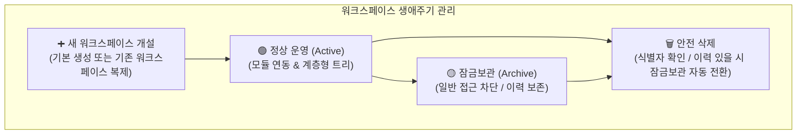

# 워크스페이스 관리 (Workspace Master)

> **워크스페이스 관리** 페이지는 시스템 관리자가 회사 내 모든 협업 공간(본사 관리, 부동산 개발 프로젝트, 기타 공간)의 계층 구조와 생애주기를 전사적 관점에서 총괄 제어하는 마스터 관리 대시보드입니다.

## 1. 개요 및 관리자 허브

개별 워크스페이스 내부의 [설정](/work-manage/settings) 메뉴와 달리, 전사 레벨에서 운영 중인 모든 워크스페이스를 한눈에 파악하고 신규 개설, 복제, 잠금보관(아카이빙), 안전 삭제를 일괄 처리합니다.

## 2. 워크스페이스 목록 그리드 및 시각화

전체 워크스페이스를 트리 계층과 상태 배지로 직관적으로 표현합니다.

### 🌲 계층형 트리 구조 (Depth Indentation)
* 상위 워크스페이스와 하위 워크스페이스의 상속 관계가 화살표(<i class="mdi mdi-chevron-right text-grey"></i>)와 들여쓰기로 시각화되어 본사-사업지 간의 지배구조를 파악하기 쉽습니다.

### 🏷️ 상태 및 식별 배지
* **내 워크스페이스** (<i class="mdi mdi-account-tag text-success"></i>): 로그인한 사용자가 구성원으로 참여 중인 공간 표시
* **비공개 워크스페이스** (<i class="mdi mdi-lock text-blue-grey"></i>): 초대된 멤버만 접근 가능한 보안 공간
* **북마크** (<i class="mdi mdi-bookmark text-info"></i>): 즐겨찾기로 등록된 워크스페이스
* **잠금/닫힘 상태**: 이미 마감되었거나 잠금보관된 워크스페이스는 전체 행이 회색 텍스트로 감쇄되어 활성 공간과 명확히 구분됩니다.

### 📋 컬럼 커스터마이징 (Column Selector)
우측 상단의 컬럼 선택기를 통해 그리드에 표출할 항목을 자유롭게 지정할 수 있으며, 설정값은 브라우저에 영구 저장됩니다:
* **제공 컬럼**: 이름(고정), 식별자(`Slug`), 설명, 상태, 홈페이지, 상위 워크스페이스, 공개 여부, 등록일, 수정일

### 🔍 잠금보관 항목 포함 검색
* 기본적으로 정상 운영 중인 워크스페이스만 조회되지만, 검색 옵션의 **'잠금보관 포함'**을 체크하면 과거 종료되거나 보관 처리된 워크스페이스까지 포함하여 검색할 수 있습니다.

## 3. 워크스페이스 생애주기 제어 (Actions)

각 행 우측의 더보기(<i class="mdi mdi-dots-horizontal"></i>) 메뉴를 통해 강력한 생애주기 제어 액션을 수행합니다. (관리자 권한 필요)

### ➕ 새 워크스페이스 생성 및 복사 (Copy)
* **새 워크스페이스**: 완전히 새로운 공간을 백지 상태에서 개설합니다.
* **워크스페이스 복사**: 기존 워크스페이스의 활성화된 모듈 구성, 이슈 트래커, 기본 설정을 그대로 복제하여 유사 사업지나 새 프로젝트를 빠르게 셋업할 수 있습니다.

### 🔒 잠금보관 (Archive) / 잠금보관 해제
* **잠금보관**: 사업이 종료되었거나 일시 중단된 워크스페이스를 '잠금보관' 상태로 전환합니다. 일반 구성원의 신규 접근 및 데이터 수정이 전면 차단되지만, 과거 데이터는 안전하게 보존됩니다.
* **보관 해제**: 필요시 원클릭으로 잠금보관을 해제하여 정상 운영 상태로 즉시 복원할 수 있습니다.

### 🗑️ 2단계 안전 삭제 및 이력 보호 정책
* **식별자 검증**: 실수로 인한 삭제를 방지하기 위해 해당 워크스페이스의 **고유 식별자(`Slug`)를 팝업창에 똑같이 타이핑해야만 [삭제] 버튼이 활성화**됩니다.
* **⭐️ 데이터 자동 보호 정책 (중요)**:
  * 업무(Issue), 회의(Meeting), 문서(Document) 등 단 1건이라도 활동 이력이 존재하는 워크스페이스는 물리적으로 완전 삭제되지 않고, **자동으로 '잠금보관' 상태로 안전 전환**되어 데이터 유실을 방지합니다.

## 4. 실무 운영 가이드

* **템플릿 워크스페이스 활용**: 표준 업무 프로세스(트래커, 범주, 기본 마일스톤)가 세팅된 '표준 템플릿' 워크스페이스를 하나 마련해 두고, 새 프로젝트 개설 시 **[복사]** 기능을 이용하면 일관된 협업 환경을 즉시 구축할 수 있습니다.
* **정기적인 아카이빙**: 완공되거나 청산된 프로젝트는 '잠금보관' 처리하여 목록을 슬림하게 유지하고, 검색 시 필요할 때만 '잠금보관 포함'으로 조회하는 것을 권장합니다.